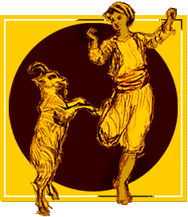
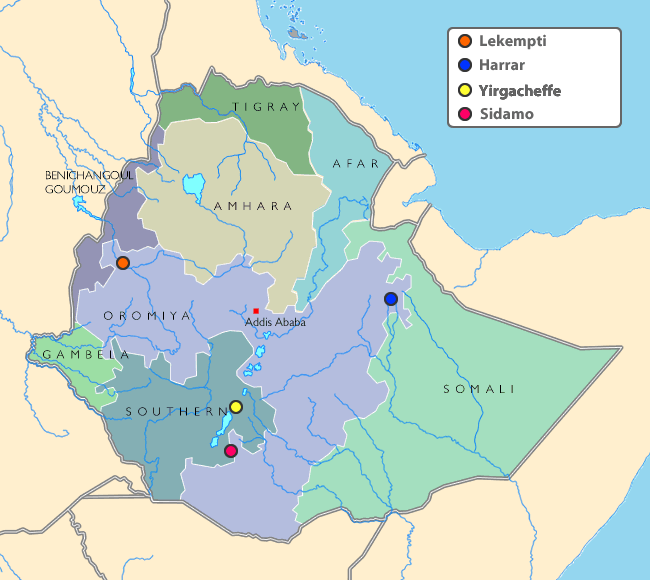
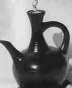

When most people talk about Ethiopia, they immediately think of coffee. Maybe you have heard that Ethiopia was the birthplace of coffee, or at least the discovery of it. We will discuss the Ethiopian lore of goat herder Kaldi, the Ethiopian coffee regions and all their wonderful flavors, and the Ethiopian Coffee Ceremony – still alive after hundreds of years.

Going back in time, The Ethiopian Kaffa region was the southwestern side of Ethiopia and its capital city was Jimma. The Ethiopian word for coffee is Bunna, Buni, or Bun. So you can see how Kaffa Bun, became Coffee Bean.

### Kaldi and His Goats

This is just one variation on the Kaldi story: More than a thousand years ago, Kaldi, an Abyssinian goat herder, saw his goats acting strangely. They were said to almost be dancing on their hind legs. Upon further investigation, he saw they were eating red cherries from some wild bushes. Intrigued, he tried some of the berries and soon knew why his goats were dancing about.

He gathered several berries, took them to his wife, and she proclaimed them from God. She sent him off to the monastery to see the monks. The head monk proclaimed them the work of the devil. Throwing them onto the fire, the monastery soon filled with the aroma of roasting coffee, and the monks came out of the woodwork to find the source.

These monks salvaged the coffee beans, and in an effort to stamp out the embers, the monks crushed them. In an effort to preserve them, they were placed in a large pitcher with hot water. The monks drank the hot brew that night and vowed they would drink the concoction every day. It seemed like a perfect remedy for those late-night devotion sessions.

There are other legends that go back even further, claiming that the berries were chewed on raw. While it would be nice to have one story that was historically accurate, the reality is probably that all stories contain a lot of fiction, sprinkled with a little truth. But why spoil such romantic tales?

  
*Kaldi*

### Ethiopian Coffee Regions

Today, there are many regions in Ethiopia that produce unique tasting coffees. They are all Arabica strains, just like the ones Kaldi found. No robusta here! They are sometimes wet-processed (usually called washed), and sometimes dry-processed (usually indicated by a “DP”). The dry-processed beans tend to be more fruity.

  
*Ethiopia Map*

The Ethiopian Harrar coffee region is becoming well-known for its fruity, blueberry aroma, as well as spice and licorice.

The Ethiopian Sidamo coffee region (where we get Yirgacheffes) is also well-known. Some notable examples are Sidamo, Idido Misty Valley (IMV), Lekempti, and your garden variety Yirgacheffe, also spelled Yergecheffe.

The Sidamo Dry Process (DP) is known for its fruit punch characteristics. The IMV is known for its raspberry and strawberry overtones. Lekempti can have mango, tangerine, citrus, and tropical fruit characteristics. Your standard Yirgacheffe is traditionally known for lemon and citrus.

### Ethiopian Coffee Ceremony

The Ethiopian Coffee Ceremony is part of Ethiopian Life, it is lengthy, and it is beautiful. A sign of hospitality and respect, a visitor is almost always invited to share in the ceremony, regardless of the hour.

Usually conducted by a lone young woman, typically in colorful traditional garb. First, the Jebena, (an oddly-shaped dark clay coffee pot) is placed in a bed of grass. The roasting is done in a pan over a wood or charcoal stove, along with the ubiquitous smell of incense. The Ethiopian coffee beans are stirred in the pan, while the chaff is being whisked away. Once roasted, the coffee Ethiopian coffee is ground in a pestle and mortar. It is then added to the Jabena with hot water and then strained several times through a fine filter. Some people roast very light and others roast darker.

  
*Jabena*

The resulting coffee is served in small teacups. The skilled woman can pour a stream of coffee from as much as 2 feet, into that tiny little cup. Much of the coffee in Ethiopia is served with sugar, but some rural areas actually serve it with salt. Either way, you will not find milk here. You may also be served some local snack food favorites to go along with your coffee.

The ceremony is actually not just for guests or special occasions. Generally, it takes place 3 times daily. It is like the western water cooler. A place to discuss the tritest, to the most serious. If you are invited inside a home to partake, there is a 3 cup rule. Drinking any less is considered impolite.

Making the coffee can take as long as 1 hour. Drinking it can be another hour as well. What a relaxing change from the “Get in, get out” mentality of Starbucks!

### Conclusion

Next time you see an Ethiopian coffee offered at your local Starbucks, maybe you can tell the Barista a thing or two about the origins of coffee – whether it be fact or folklore!
