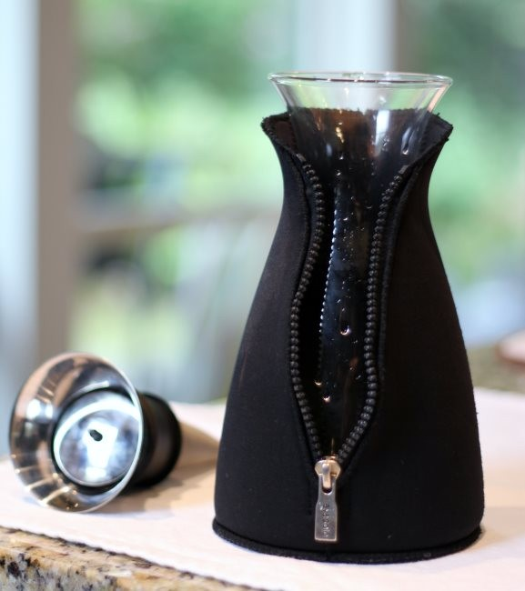
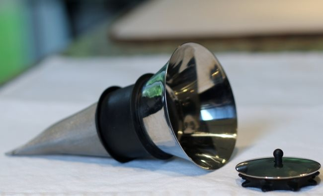
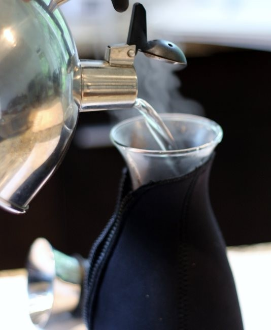
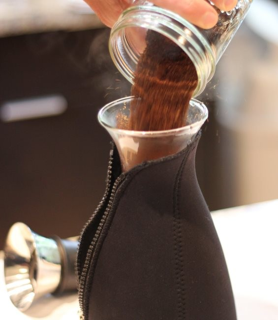
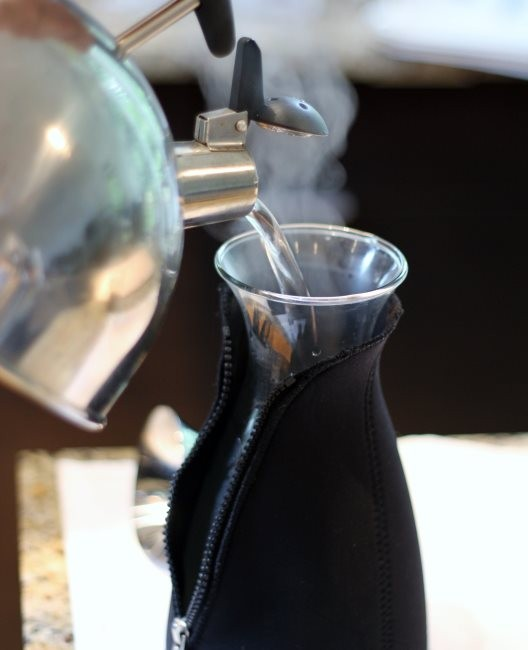
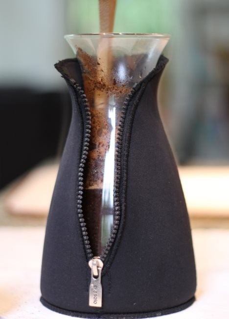
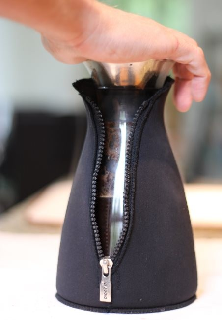
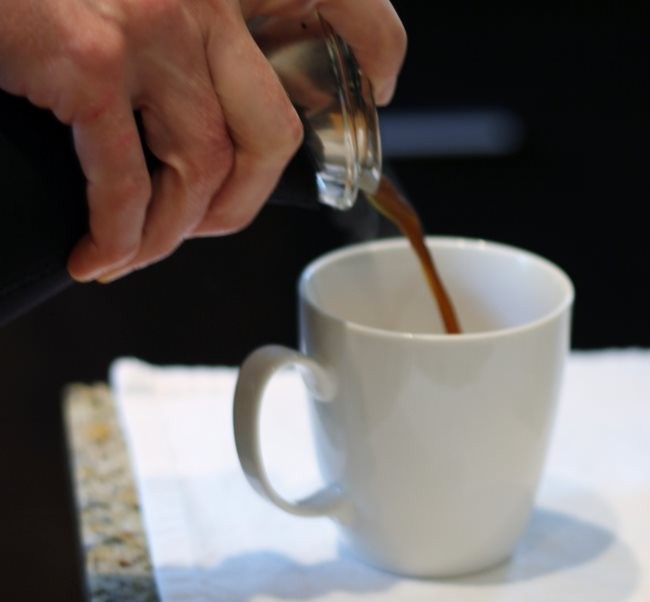

When I tell people that my favorite rich coffee brewing method—other than espresso—is the Eva Solo, they usually don’t know what I am talking about. The Eva Solo is also known as a Cafe Solo. What is the Eva Solo? It brews like an upside-down French press with a fine convex filter that descends into the brewing chamber. The glass brewing container resembles a [Chemex](http://ineedcoffee.com/chemex-coffee-brewing-history-and-tutorial/), but without the handle. It is covered with a thin neoprene cover that zips up like a sleeping bag.

  
*Eva Solo Coffee Brewer*

Until I discovered the Eva Solo, my primary full-immersion brewing method was the French Press. As much as I loved the rich flavor of the French press, there were times I wished it were just a little cleaner tasting—not paper filter clean, but something in between. The Eva Solo was exactly what I was looking for. It has all the rich flavor of a French press but is cleaner tasting.

Plus, it just looks and feels cool.

  
*Eva Solo Coffee Filter and Lid*

The Eva Solo is as easy to use as a French press. Let’s get started.

### #1 Rinse Eva Solo

Rinse the inside of the Eva Solo with warm water. This will remove any residual grounds from the previous brew and minimize temperature loss once we start brewing.

  
*Hot Water Rinse*

### #2 Add Ground Coffee

Grind coffee the same as you would for a French press. It will be on the coarse side. Since you won’t be pressing the grounds to the bottom, you can grind a little finer if you desire. Experiment with different grinds. I use a grind very close to the French press. The dosage is one tablespoon of coffee for each 4 oz of water. Pour ground coffee into the Eva Solo.

  
*Add Ground Coffee to Eva Solo*

### #3 Add Water

Heat water to a boil and then allow it to cool for 20-30 seconds before pouring it into the Eva Solo. Start your brewer timer. If you have an electric kettle that lets you dial in the exact temperature, set it for 202 F if it is a lighter roast and 198F if it is darker.

  
*Pour Hot Water into Eva Solo*

### #4 Stir Coffee

The Eva Solo comes with a plastic stirrer. I lost mine, so I use a wooden spoon. At the 1-minute mark, give the coffee a gentle stir.

  
*After 1 minute, stir the coffee.*

### #5 Secure Eva Solo Filter

Place the filter and lid securely on the Eva Solo.

  
*Secure the filter on the Eva Solo.*

### #6 Wait 4 Minutes and Pour

At the 4-minute mark, the coffee has finished brewing. Serve. Notice how I have one finger holding the filter back in the photo. Although the filter should be secure, I once had it wiggle free and land inside my coffee. It is better to hold it in place while pouring. Safety first!

  
*When pouring coffee from the Eva Solo, I advise holding the filter at the top with a finger. This is extra insurance in the event the filter isn’t secure.*

The Eva Solo website states that the neoprene cover can keep the coffee warm for up to 30 minutes. Ignore that tip. The brewing is still happening as long as the water and coffee grounds are touching. Once the 4-minute brewing cycle has been completed, pour all the coffee. You can always brew more.

What I like about the neoprene cover is it protects me from the glass. One, I don’t burn myself by touching the brewer’s side. Two, the neoprene cover provides some structural protection to the glass. Over the years, I’ve shattered a few French press brewers. I never expected that to happen with the Eva Solo, but if it did, at least the glass and coffee wouldn’t go everywhere. It’ll all be contained inside the zipper.

The only downside to the Eva Solo is the cost. You can find one on Amazon for just under $100 as of this writing. Is it worth it? For me, it is worth that price. I love mine. Also, the Eva Solo is far less popular than the French Press, making it a unique gift for coffee fans.

### Resources

[Coffee Brewing Guide](http://ineedcoffee.com/coffee-brewing-guide/) – Our collection of coffee brewing tutorials here on INeedCoffee.

[Coffee Grind Chart](http://ineedcoffee.com/coffee-grind-chart/) – A visual guide to getting the right coffee grind size.