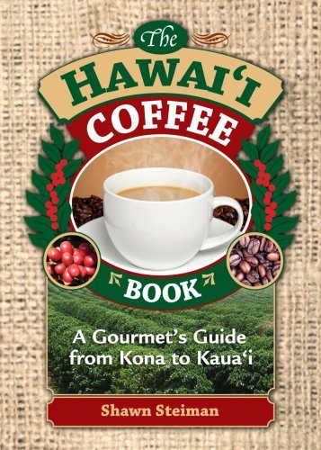

Recently, I received a copy of Shawn Steiman’s The Hawaii Coffee Book. It is a concise, colorful book on Hawaiian coffee. It covers a wide range of topics, from island coffee history to the coffee brewing process.

According to the book, Hawaii grew 5.7 million pounds of green coffee during the 2006-2007 growing season. Coffee is grown not only on the Big Island (Hawai’i – home of the Kona regions) but also on O’ahu, Maui, Kaua’i, and Moloka’i. Coffee growing on the other islands became more popular in the late 1980s as farms moved away from sugar cane.

  
*The Hawaii Coffee Book by Shawn Steiman*

Some of the topics covered in the book include:

-   **Island Guide**: The author posts maps of the coffee-growing regions for each island. If you enjoyed reading Chris Arnold’s article on [Hawaiian Coffee](http://ineedcoffee.com/hawaiian-coffee/) this section will be a perfect complement.
-   **Cupping, Roasting, and Grinding Overview**: Not specific to Hawaii, but these parts round out the book nicely.
-   **Resources**: This section lists all the coffee farms that offer tours and provides contact information, including Kona Earth, which is run by INeedCoffee contributor Gary Strawn. If you are interested in taking a tour of a coffee farm, this section offers a few options.
-   **Farming**: Growing, Harvesting, and Processing are covered in detail. The Wet, Dry, and newer Mechanical Demulching methods are explained. Mechanical demulching is the newest method and uses far less water than the traditional wet process.
-   **Hawaiian Coffee Professional Profiles**: Several important people associated with Hawaiian coffee are profiled throughout the book. There is a nice write-up of INeedCoffee contributor Andrew Hetzel (page 65).
-   **Recipes**: Several pages are devoted to award-winning recipes using Kona coffee. These include main courses, desserts, and drinks. There is even one that uses the porter brewed by Kona Brewing Company, which I was fortunate to visit during my 2004 trip to Oahu.
-   **Organizations**: Last month, we learned about the WWOOF (Willing Workers on Organic Farms) in the article [Coffee Internship on Kona Farm](http://ineedcoffee.com/coffee-internship-on-kona-farm/). This section covers that program and many others.
-   **Certification**: This portion of the book goes through Fair Trade, shade-grown, Direct Trade, and how those programs are being used in Hawaii.

This book was beautifully edited and has lots of great photos. The only thing I missed on the first read was some information explaining the taste differences between the various growing regions across the islands. When I went back, I noticed the varietal name was listed under the island profile, and a varietal tasting chart was listed at the end of the chapter. A single chart connecting the two might have been clearer.

Overall, Shawn Steiman’s The Hawaii Coffee Book was a good book that covered many distinct coffee-related topics in an easy-to-read, colorful manner. Once I get some Kona coffee, I’ll have a few recipes to test.

UPDATE (8/1/2008): The author, Shawn Steiman, contacted me regarding listing cupping notes for each island. He explained that the cup profile will vary for reasons like the roast profile, inherent differences between farms (not just islands), and how it was brewed. Too many variables are at play to attach tasting notes on an island or region basis. The descriptions of the varieties should be read with these differences in mind. Also, since taste is a personal experience, he adds, “unless a descriptor is very pronounced and obvious, I don’t like to tell people what they may find.”

### Resources

[Hawaiian Coffee](http://ineedcoffee.com/hawaiian-coffee/) – An island-by-island breakdown of Hawaiian coffee.

[Kona Coffee Confusion](http://ineedcoffee.com/kona-coffee-confusion/) – An article covering Kona Blends, Kona Style, and 100% Kona labeling.

***Disclosure:** The author of this article received this book in exchange for a review.*