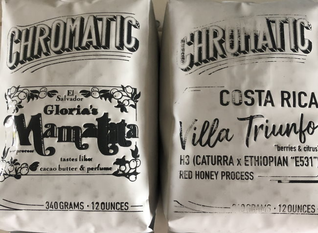

Prior to the COVID lockdowns, I loved exploring new coffee shops. It was my sport. I’ve been to hundreds of different coffee shops, mostly along the West Coast, from British Columbia to San Diego. During a six-month period in 2014, I visited almost 70 different cafes just in the San Francisco Bay Area. With the lockdown, I found a new way to explore coffee: the roasters.

This year, I have been traveling around the country with my web browser, exploring numerous great American coffee roasters. In this article, I want to share some of my favorites. I also want to share with the coffee roasters who might be reading the things I like and dislike about ordering coffee online. The ordering process for coffee is much better than it was just two years ago. Most excellent roasters now have top-notch secure e-commerce websites that simplify ordering coffee.

A few years ago, I compiled a list of tips for [finding a good coffee roaster subscription online](/guide-coffee-mail-order-subscriptions/). Those tips also apply to single purchases.

Before I tell you the coffee I tried, let me tell you what type of coffee I like. I prefer lighter-roasted single-origin coffee. I make almost all my coffee in the [AeroPress](/upside-aeropress-coffee-brewing-tutorial/) or as [cold brew in the Penguin](/make-concentrated-cold-brew-coffee-with-the-penguin-coffee/).

If you are a fan of dark roast coffee, my list may not be of much value to you. My advice for those who like coffee on the dark side is to take up home coffee roasting or find some really good medium roasts, as dark-roasted coffee goes stale quickly. See my article [Hacking Dark Roast – Tips on Brewing a Better Bold Coffee](/hacking-dark-roast-tips-on-brewing-a-better-bold-coffee/) for more guidance.

### How to Not Earn My Business

There are many great coffee roasters that I decided not to order from once I got to their website. The three pet peeves I have for coffee roaster sites are:

1.  The shipping information is not displayed clearly at the top of the website. When I get to a site, I want to see how many bags of coffee I need to order for free shipping. If I can’t tell the shipping cost until I build a shopping cart, I’ll bail and go to another site. Also, I’ll bail if I need to buy more than three bags. Ideally, I want free shipping on two bags. That seems to be common with many roasters these days.
2.  Not being 100% Secure. That means every page on the site must display a secure lock in the browser’s address bar. Many sites don’t load their page assets securely, so the lock appears with a line through it. It may still be secure, but it looks sloppy. I’m not entering my credit card number on a sloppy e-commerce site.
3.  Sub-12-ounce bags. With the exception of a clearly marked bag or a limited release, I’m not interested in supporting roasters that sell their wares in 250-gram bags. I know I am not alone on this point. *“When you make your 9 or 10-ounce bags look like 12 oz bags by using tiny fonts or hiding the ounces altogether, you may fool the customer once or twice, but you’ll lose their trust eventually.”*
4.  Sites that offer free shipping with a code, but you can’t find the page where you saw the code, so you spend more time figuring out how to earn the free shipping than ordering the coffee. The best e-commerce stores just offer free shipping at a certain dollar point. No silly codes are needed.

### My Favorite Mail Order Coffee Roasters this Year

My list is weighted towards West Coast roasters because I know the coffee scene better here. They excel at the lighter-roasted single origin that I prefer. I also discovered that West Coast roasters tend to have nicer, more modern websites.

#### California

-   Verve Coffee (Santa Cruz)
-   Temple Coffee Roasters (Sacramento)
-   Chromatic  Coffee (San Jose)
-   Dune Coffee (Santa Barbara)
-   Coffee and Tea Collective (San Diego)
-   The Boy & The Bear (Los Angeles)

#### Illinois

-   Intelligentsia Coffee (Chicago)

#### Michigan

-   Madcap Coffee Company

#### Oregon

-   Roseline Coffee (Portland)
-   Push X Pull (Portland)
-   Water Ave Coffee (Portland)
-   Bespoken Coffee Roasters (Corvallis)

#### Washington

-   Kuma Coffee (Seattle)
-   Olympia Coffee Roasting (Olympia)
-   Blossom Coffee Roasters (Vashon)

#### Wisconsin

-   Ruby Coffee Roasters (Nelsonville)
-   JBC Coffee Roasters (Madison)

### Finding More Roasters

I love this quest to explore the best coffee roasters in America. If you like my taste in coffee (lighter-roasted single origin), my love for free shipping, and have some more ideas for me to explore, check out my spreadsheet below. Note that some roasters in this article may not always offer free shipping. Most did at the time I ordered.

### Resources

[Coffee Roasters – Mail Order](https://docs.google.com/spreadsheets/d/1h-oqlqJ_G3UXuDSkdFHuEaCVuOXQOb68y2sduXQRTn4/edit?usp=sharing) – Google Spreadsheet

[My Guide to San Francisco Espresso (2015)](https://criticalmas.org/2015/01/guide-san-francisco-espresso-2015/) – My favorite coffee shops I discovered during my time in the Bay Area.

[Our Guide to Coffee Mail Order Subscriptions](/guide-coffee-mail-order-subscriptions/) – INeedCoffee article.
