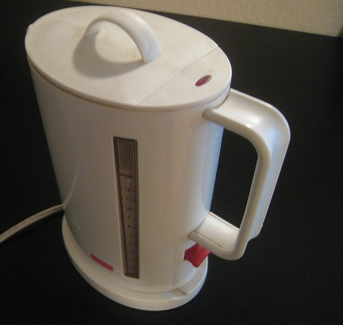
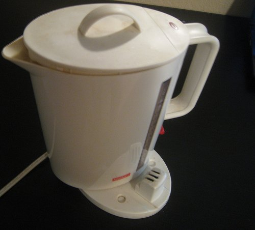

While researching a new electric kettle online, I stumbled upon the reviews of my current hot water heater: the Bodum 5410-03USA Mini Ibis Electric Water Kettle. Although there were various criticisms, the bulk of the complaints were related to the defective switch. I’ve owned one for years, and I knew exactly what they were talking about. I have an easy workaround.

First, let me describe the problem. After you finish using the kettle, place it back onto its holder. Only now do youn’t want to heat water, so you don’t want it to switch on. The switch should stay down. It doesn’t always stay down, and as some reviewers indicate, it goes into a flickering mode. Eventually, the switch gets worn out, and the kettle stops working.

  
*Don’t store your Ibis Electric Water Kettle like this when not used.*

If you want a long life out of your Bodum Cordless Electric Kettle, I advise keeping the kettle on the stand only when it is heating water. **Set it sideways when you aren’t using it.** Mine has lasted years. The one I donated to my office died quickly because people returned it fully on the stand when not using it. The switch eventually gave out, and it had to be thrown away.

  
*Store Ibis Kettle Sideways to extend its life.*

### Resources

[The Hamilton Beach Cool Touch Tea Kettle Review](/the-hamilton-beach-cool-touch-tea-kettle-review/) – This is the kettle I bought to replace my Ibis.

[Avoiding Plastic – 3 Stainless Steel Electric Kettle Options](/avoiding-plastic-3-stainless-steel-electric-kettle-options/) – An overview of 3 different tea kettle options.
