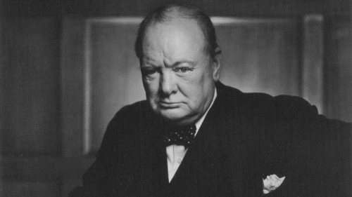
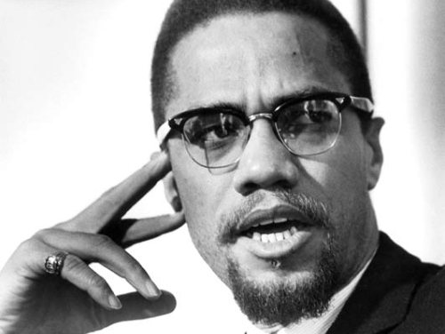

The following is a small collection of coffee related quotations from famous people.

Alexander Pope:

> Coffee, which makes the politician wise, And see through all things with his half-shut eyes.

Anne Morrow Lindbergh:

> Good communication is as stimulating as black coffee, and just as hard to sleep after.

T. S. Eliot:

> I have measured out my life with coffee spoons.

Lady Nancy Astor, Viscountess and Winston Churchill:

> If you were my husband, Winston, I should flavour your coffee with poison.

> If I WERE your husband, madam, I should drink it.

  
*Winston Churchill*

Erdos, Paul:

> A mathematician is a device for turning coffee into thereoms.

Turkish proverb:

> Black as hell, strong as death, sweet as love.

Oliver Wendell Holmes, Sr.:

> The morning cup of coffee has an exhiliration about it which the cheering influence of the afternoon or evening cup of tea cannot be expected to reproduce.

Mark Twain:

> After a few months’ acquaintance with European “coffee,” one’s mind weakens, and his faith with it, and he begins to wonder if the rich beverage of home, with its clotted layer of yellow cream on top of it, is not a mere dream after all, and a thing which never existed.

Coleman Dowell:

> It is extraordinary how the house and the simplest possessions of someone who has been left become so quickly sordid. . . . Even the stain on the coffee cup seems not coffee but the physical manifestation of one’s inner stain, the fatal blot that from the beginning had marked one for ultimate aloneness.

Malcolm X:

> It’s just like when you’ve got some coffee that’s too black, which means it’s too strong. What do you do? You integrate it with cream, you make it weak. But if you pour too much cream in it, you won’t even know you ever had coffee. It used to be hot, it becomes cool. It used to be strong, it becomes weak. It used to wake you up, now it puts you to sleep.

  
*Malcom X*

Jean-Bertrand Aristide, Haitian President:

> We shall prepare the coffee of reconciliation through the filter of justice. Through reconciliation, streams of tears will come to our eyes.

Henri Poincare, “Science et Methode”:

> For fifteen days I struggled to prove that no functions analogous to those I have since called Fuchsian functions could exist; I was then very ignorant. Every day I sat down at my work table where I spent an hour or two; I tried a great number of combinations and arrived at no result. One evening, contrary to my custom, I took black coffee; I could not go to sleep; ideas swarmed up in clouds; I sensed them clashing until, to put it so, a pair would hook together to form a stable combination. By morning I had established the existence of a class of Fuchsian functions, those derived from the hypergeometric series. I had only to write up the results which took me a few hours.

Abraham Lincoln:

> If this is coffee, please bring me some tea; but if this is tea, please bring me some coffee.