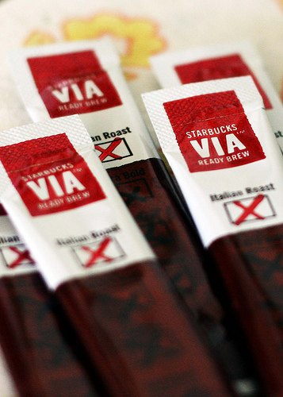
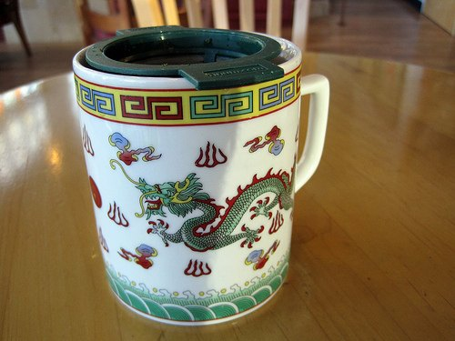

In February 2009, Starbucks launched its instant coffee called VIA. At that time, you could sign up to have a free sample mailed to you. Even though I [home roast coffee](http://ineedcoffee.com/roasting-coffee-in-a-popcorn-popper/), I have always suspected making a decent instant coffee might be possible. However, I feared Starbucks would fumble the project. But I had to know, so I completed the form to receive my sample VIA.

My free samples sat around my kitchen for months. Whenever I thought about trying them, I looked over at my outstanding coffee and couldn’t go through with it. *One day I would run out of the good stuff and then I would try the Starbucks VIA Instant Coffee.* That day never seemed to come because as soon as I’d run out of the good stuff, I’d head out and acquire more outstanding coffee.

Would I ever try the VIA?

  
*[starbucks via](http://www.flickr.com/photos/freakgirl/3421171862/) by Debbie R*

Then, I finally broke through my fear and tried the Colombian. I expected something horrific, but it wasn’t bad. It wasn’t good, either. It was OK. In other words, it exceeded my expectations. Would I ever buy (or take another free sample) while living in Seattle? Absolutely not. Would I consume a cup if I was in the middle of nowhere? Yes, I would.

Although Starbucks did a commendable job with the Colombia, I still feared the *Italian Roast* VIA sample. I’ll quit coffee before subjecting myself to that burnt blend.

In September 2009, Starbucks had the official national rollout of the Starbucks VIA Instant Coffee. Starbucks pushed the story that this was the economical alternative to cafe coffee. From *Starbucks unveils its instant brew* on CNN Money:

> Via is sold in packs of three cup-sized servings for $2.95 or $9.95 for a 12 pack. That makes for a cost of $1 per cup, which is Starbucks’ cheapest option.

This works out to between 82 and 98 cents a cup for bland coffee. Now, it is easy to beat this per-cup price via home roasting or even simple home brewing, but instant coffee shouldn’t be compared to the more labor-intensive methods of coffee preparation. People will drink instant coffee because it is portable and requires nothing more than hot water. To me, this sounds more like tea.

Coffee drinkers will often give me a furled eyebrow when I mention my love for quality tea. Then, I logically explain to them that tea is very much like coffee. Bad tea and bad coffee are everywhere, but quality exists with both beverages. **Canned coffee and bagged tea are the evil offspring of the** ***good stuff***.

  
*Jo Sencha Green Tea*

*My Jo Sencha tea came from Seattle’s Teacup. It cost $2.20 and held 3 steeps (73 cents per large mug). This is a high-quality Japanese green tea. Had I brewed it at home, the per-mug price would have been lower. Equipment required: a mug, a filter, and hot water.*

So, before my fellow coffee drinkers rush to buy the Starbucks VIA, consider trying some quality tea. A portable filter costs about $10, and tea will keep for about 6 months. Tea, even excellent tea, is often less expensive than mediocre coffee. Most tea also holds up to multiple steeps.

My solution is to keep quality coffee at home at all times. On those occasions when you travel and need to pack light, take some quality tea and a filter. You should be able to acquire hot water on the road. If you can’t, pack a kettle too. On really long trips into a hostile coffee territory, I could see bringing the Starbucks Colombia VIA. At home, never.

### Resources

[The History of Instant Coffee](http://ineedcoffee.com/the-history-of-instant-coffee/) – INeedCoffee article covering the origins of instant coffee.

[Next Generation Instant Coffee Reviews](http://ineedcoffee.com/next-generation-instant-coffee-reviews/) – A review of two modern, higher-quality instant coffees.

[Starbucks Coffee College](http://ineedcoffee.com/starbucks-coffee-college/) – That time I was invited by Starbucks to attend their college.