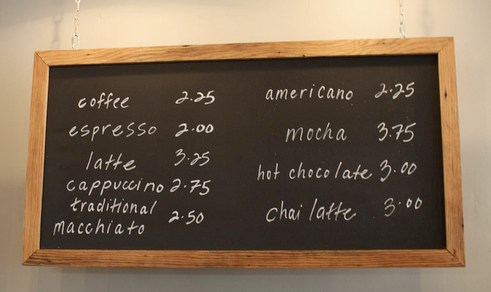
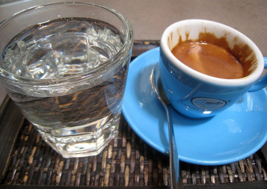

Ever been in the mood for a good espresso – a real espresso – and then been massively disappointed in the undrinkable swill served up to you? We’ve all been there. But no longer. From bitter (ha) experience, I’ve established four simple signs that you’re in a real espresso bar. Of course, there are always occasional exceptions, but stick with these and your chances of not wasting time and money will tremendously improve. Here we go.

### #1 Only one size of espresso is served.

The golden rule. If you see singles, doubles, triples, or (ugh) quad espressos offered – just walk away. Real espresso bars and baristas know that real espressos come in one size: double ristretto (but that rarely is and does not need to be indicated). Think of it like going to a wine bar. You don’t order a small or large wine – just a glass of wine. Same with espresso.

  
*Espresso Menu*

### #2 The drink menu is small and simple.

Coffee, Americano, latte, (traditional) macchiato, cappuccino, mocha, chai latte, or an espresso. That’s it. Sometimes a cafe will have fancy options like a cortado (smaller version of a latte) or a Gibraltar (espresso with a splash of steamed milk), but if they’re selling Almond Joy lattes, smoothies, or coffee milkshakes … no. Get Yelping. (It’s worth mentioning that some cafes with wretched espresso do a great cold brew.)

### #3 The food offerings are very limited.

As in, little more than pastries and biscotti. Espresso quality in a cafe is inversely proportional to the number of food offerings. If you see a robust menu of sandwiches, wraps, salads, vegan food, and gluten-free treats baked right in the cafe – well, it’s all probably very tasty. But the espresso will be undrinkable. Why? Because doing espresso right takes focus and dedication, and cafes devoting significant time to food and snacks are unlikely to pull consistently great shots. Occasionally, you’ll find a real espresso bar that also imports a wide selection of food from a local eatery, but it’s the exception, not the rule.

  
*Espresso and sparkling water*

### #4 The baristas use tampers and their hands to pack and smooth the ground espresso beans.

This shows they care about technique and craftsmanship. And of course, if the espresso isn’t served to you in a demitasse mug, on a saucer with a small spoon, and with a small glass of water – ah, my condolences. (Bonus points for baristas who serve espressos with sparkling water.)

### To recap

One size espresso. Small menu. Not much food. Tampers and hands. Simple as that. And don’t be tempted by fanciful cupping notes or siren songs about the exotic countries the beans came from – it doesn’t always mean the cafe has the equipment or the baristas to pull real espressos. Just look for the four signs and avoid the bitter taste of *fauxpresso* and wasted money.

Happy hunting, fellow snobs!

### Resources

[Espresso Tamping Visual Tutorial](/espresso-tamping/) – INeedCoffee tutorial.

[Things I Would Like to See Improved in Specialty Coffee](/improving-specialty-coffee/) – 6 ideas for making espresso bars better.

[Latte Lingo: The Vocabulary of Coffee](/latte-lingo/) – How to speak coffee at the coffee shop.
