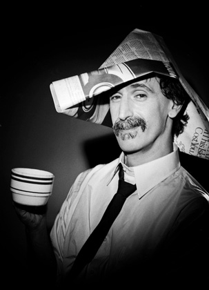

Interviewer: Is it possible to say where you get your musical influences from?  
Frank Zappa: Sometimes you get it from chicken. Sometimes from coffee.

Any history buff can effortlessly rattle off a long list of figures who were, given the advantage of our hindsight, ahead of their time, and whose thoughts and accomplishments were not appreciated until long after their anonymous deaths. Frank Zappa is not one of these people. His first major-label album was released in 1966, and from then until his death in 1993, he enjoyed stretches of commercial and critical success. Still, his vibrant presence on the web roughly seven years after his death, as well as steadily enduring sales of his albums on their Rykodisc label reissues, indicate that the 21st century would have been more receptive to his music and thought than the world he left and the three preceding decades. His anti-genre musical eclecticism and maverick strain of libertarian politics would have been much more at home in the present than they were during his lifetime.

Zappa had another attribute that would have fit in much better in the late ’90s and beginning of the 21st century: his coffee-drinking habits.

  
*The photo was taken in Frank Zappa’s home, in November 1988*

“To me, a cigarette is food,” said Zappa in his autobiography, The Real Frank Zappa Book. “I live my life smoking these things, and drinking the ‘black water’ in this cup here.”

Alas, my friends, this is not INeedCigarettes.com – we shall concentrate on the latter of the two aforementioned vices.

Many are ready to assume that Zappa followed the lead of the herd of fellow ’60s musicians in consuming a rich spectrum of drugs. His often trippy 1966 album Freak Out! was released a good year before the Beatles’ Sgt. Pepper’s Lonely Hearts Club Band set the industry standard for psychedelic rock. The bizarre lyrics and sometimes grotesque instrumental features on Freak Out! and subsequent albums led many a listener to believe that Zappa’s influences were chemical. However, Zappa’s eccentricities were not born of narcotic drugs; a Zappa feature in a 1976 ‘Suosikki’ Magazine article says it all:

Q: Do you have a drug problem?  
A: Yes, with coffee.  
Q: With coffee???  
A: I’m an absolutely sober person. I don’t consume alcohol. I don’t smoke weed. But I drink gallons of coffee.

### Coffee: A Driving Force

Even without the specific references to coffee drinking, it is apparent in Zappa’s lifestyle and his art that coffee was a driving force. His approach to making music was not the erratic one we might expect from a rock musician. Rather, he played with the ethic of a genuine workaholic.

Biographer/groupie/musician Nigey Lennon describes her baptism by dark roast in her book *Being Frank: My Time With Frank Zappa*. Upon her initiation into Zappa’s band, the Mothers of Invention, Lennon was permitted to play only after gulping down horrifyingly strong and dark coffee. When the rest of the Mothers had been similarly wired, the band was finally ready to begin its marathon jam sessions.

“I work as many hours a day as I can physically stand to,” he said during an interview with Don Menn for Guitar Player magazine. “The average is about 15 now.”

Little wonder that his fellow band members had to drink the most potent of coffee to keep up.

### The Hills Are Alive With the Sound of Coffee

Zappa’s love for coffee was not bound to the rehearsal room, as he drank it on stage as well. Coffee even made it into the recording studio, often home to noise creations by Zappa that challenged conventional definitions of ‘music’. For a man who spent his life seeing, smelling, and tasting coffee, it makes sound sense that he would eventually want to hear it, too.

“The other great noise was — there are two people in this group who play didgeridus,” Zappa recalled in an interview with Bob Menn in Best of Guitar Player. “One of them is the woman from Australia who is also the oboe player. And one afternoon, I imagined this awful sound that could be created if one were to take a didgeridu and play it into a partially filled coffee pot. And I asked her whether she would do it. She said yes, and let me say, it is truly nauseating. I was laughing so much I had to leave the room.”

Overachieving, overreaching, and overworking, Frank Zappa’s approach to his work and art is reflected in the incessantly wired world of coffee drinking America. INeedCoffee.com salutes him as a true coffee achiever.

### Resources

[How Did Elvis Like His Coffee?](http://ineedcoffee.com/how-did-elvis-like-his-coffee/) – Coffee profile of another musician.