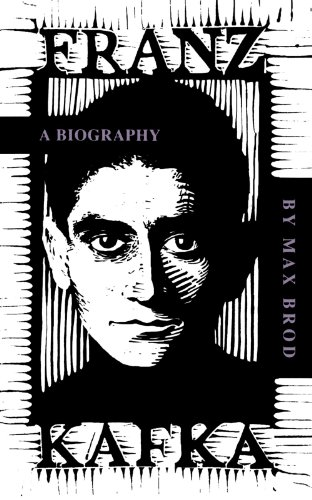

Prague cafe culture was a pivotal element of Kafka’s life and an inspiration to his writing. The characters in his novels and short stories are often coffee drinkers. Kafka’s writing often instills in the reader a jumpy and jittery feeling of having drunk one coffee too many. So what were Kafka’s coffee preferences? Did he take it with cream and/or sugar?

Unfortunately, the answer to this question remains elusive. Max Brod, Kafka’s friend, editor, and biographer, often describes Prague’s cafes but never mentions Kafka actually drinking coffee in **Franz Kafka: A biography**. As fused as Kafka’s name is with coffee culture, after several weeks of reading online and hard-copy biographies of Kafka, I can only venture an educated guess as to whether he drank our favorite beverage.

  
*Franz Kafka by Max Brod*

### A Steady Diet of Coffee?

Kafka’s dietary habits were a source of some concern for Brod., who says:

> Franz’s attitude to the ‘natural health methods’ and reform movements of a similar nature was one of very intense interest. . . . He always wore light clothing, even in winter, went for long periods without eating meat, and drank no alcohol.

Coffee is not mentioned here one way or the other, but given his aversion to other vices, coffee may well have been something else he avoided. Kafka’s acquaintance Rudolf Fuchs draws close to the issue without directly answering it, recalling:

> One hot afternoon I was accompanying \[Kafka\] through the old Eisen street. I stopped at a coffee stall and drank a lemonade, after first wiping the rim of the glass with my hand. Kafka watched me disapprovingly. ‘That won’t help you,’ he said.

While Prague holds an allure to the literati and coffee connoisseurs worldwide, Kafka felt confined and limited by his home city, and dreamed of quitting his government job and moving to Berlin. Late in his life, he finally made this dream a reality, but his timing could hardly have been worse, for both personal and historical reasons. His health began to fail rapidly, and Berlin underwent a postwar period of hyperinflation and scarcity. Kafka enlisted the help of his family to send provisions from Prague to his Berlin neighbors suffering the most during these depressing times. And while Kafka’s family consistently obliged, Kafka found these charitable offerings somewhat depressing.

> There \[a parcel\] lay in front of us, deadly serious, without the faintest smile in the shape of a slab of chocolate, an apple, or something of that sort, as much as to say, ‘Now live a few days longer on groats, rice, flour, sugar and coffee, then die as best you can, we can’t do any more for you.

Coffee, apparently, was not viewed as a luxury by Kafka at this time, but rather as a grim necessity.

### A Coffee-Rich Atmosphere

Whatever revulsion he would later feel towards coffee, Kafka seemed very comfortable in a coffeehouse atmosphere earlier in his life. Whether or not he was a coffee drinker, Kafka was a perfect embodiment of the Bohemian artist who gives coffeehouses an aura of intellect and artistry. Indeed, Kafka was in his element in Prague’s cafe culture, an environment that brought out the best in one of the century’s greatest writers.

Many of Kafka’s readers assume the man embodied the gloom and paranoia that permeate so much of his writing. But Brod, who knew as well as anybody, assures us otherwise.

> One felt well when one was with him, the richness of his thoughts, which he generally uttered in a cheerful tone, made him, to put it on the lowest level, one of the most amusing of men I ever met, in spite of his shyness, in spite of his quietness…\[H\]e liked a good, hearty laugh, and knew how to make his friends laugh too.

Marilyn Bender describes the personable and cafe-hopping Kafka in **Franz Kafka’s Prague: A Literary Walking Tour**.

> He made loyal friends in the Prague Circle of German-acculturated artists and intellectuals who hung out mainly in cafes and coffeehouses, and he enjoyed the city’s leisure attractions from theater to sports.

It was in the Prague cafe culture that Kafka experienced something of a religious awakening to his Jewish heritage. Brod says:

> I, for example, was a frequent member of the audience of the performances in the Cafe Savoy, and learned a lot there towards appreciating Jewish folklore. But Franz, after the first time I took him there, entered into the atmosphere completely. It was the same intense and creatively fruitful dogged determination with which he himself did everything.

Kafka tended to hold his own writing to impossibly high standards, and while the world would eventually grow to appreciate the greatness of his novels and short stories, Kafka rarely felt satisfied with his literary work. But in Prague’s cafe society, Kafka seemed to be most at ease in presenting his works. “At Baum’s, he read ‘**The Verdict**‘ to us and had tears in his eyes,” says Brod. “‘The indubitability of the story is confirmed.’ Those are strong words of self-conviction, rare enough in the case of Franz.”

In a similar vein, Bender mentions, “On the second floor of the Cafe \[Grand Hotel Europa\] in December 1912, Kafka read his newly composed **The Judgment** to an appreciative audience\[.\]”

Whether or not Kafka succumbed to the temptation to drink coffee, a coffeehouse atmosphere seems to have done wonders for his sense of self-confidence and appreciation for his own writing.

### A Literary Coffee Aroma

At the very least, coffee plays a cameo role in several of Kafka’s more prominent works. A faint coffee aroma wafts through **The Trial**, and indeed, coffee is one of the first things that protagonist Joseph K. loses during the course of his trial. Two warders surprise K. at his home one morning, inform him that he is under arrest, and intercept K.’s breakfast from the maid.

“‘That’s so, you can believe that,'” said \[warder\] Franz, not raising to his lips the coffee cup he held in his hand, but instead giving K. a long, apparently significant, yet incomprehensible look. Without wishing it K. found himself decoyed into an exchange of speaking looks with Franz, none the less he tapped his papers and repeated: ‘Here are my identification papers.'”

When Joseph K. finally does get to drink coffee, his lot is no better than it was during his early exchange with the warders. He is entirely preoccupied with his trial and the mysterious charges against him, and when talking to his maid, inadvertently makes her cry.

“He contented himself with drinking his coffee and leaving Frau Grubach to feel that her presence was burdensome,” wrote Kafka. Hot coffee is now cold comfort to K., who is able to eat his breakfast but is being further drawn into the ominous mechanism of his judgment.

In Kafka’s novel **Amerika**, the main character Karl meets a student who works at a store throughout the day and goes to school through the night.

“Oh sleep!” said the student. “I’ll get some sleep when I’m finished with my studies. I keep myself going on black coffee. A fine thing black coffee.” “I don’t like black coffee,” said Karl. “I don’t either,” said the student laughing. “But what could I do without it? If it weren’t for black coffee Monty wouldn’t keep me for a minute. I simply don’t know how I would get on in the shop if I didn’t have a big bottle like this under the counter, for I’ve never dared to risk stopping the coffee-drinking\[.\]”

Kafka never visited the United States, but from this scene in **Amerika**, it is clear that Kafka foresaw an All-American type of student, a workaholic, and a caffeine-driven busybody. The student drinks the coffee not for the love of it, but as a drug to keep himself fueled in a 24/7 cycle of activity. A 21st-century U.S. university campus, with a top-notch coffee vendor and students caffeinated into the wee hours of the morning, would probably not surprise Kafka.

### Conclusion

Kafka was neither achiever nor a slacker during his lifetime; rather, he was somehow both rolled into one. He embodies the idea of the coffeehouse literary giant because so much of his social world and his writing inspiration are grounded in the cafes of Prague. His characters could, on occasion, show a taste for coffee that foreshadowed the traits of real-world coffee drinkers decades later. And even though I am unable to ascertain whether coffee actually touched his lips, INeedCoffee salutes Franz Kafka as a coffee achiever.