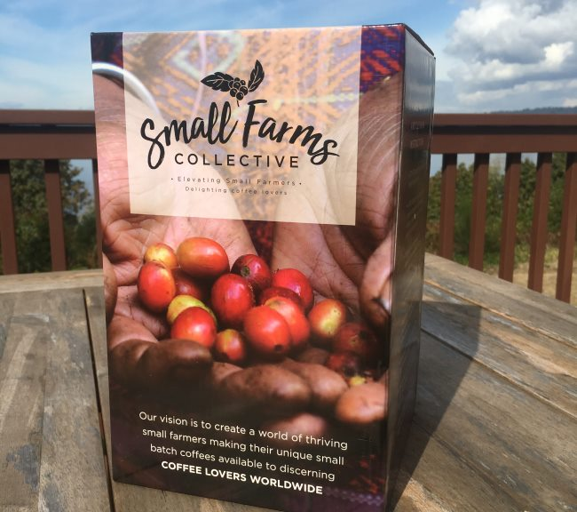
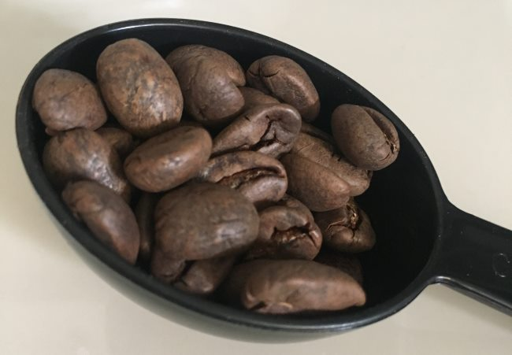
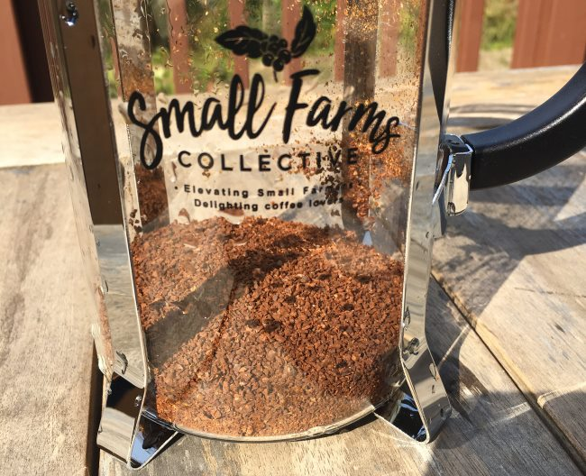
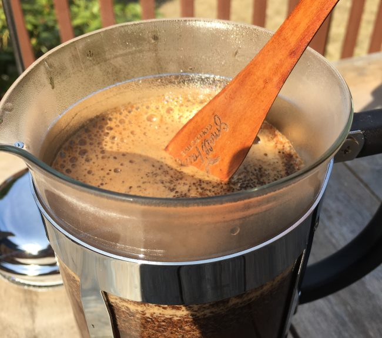

In this article, I’ll show you how to make French Press coffee while discussing the French Press Coffee Maker by Small Farms Collective.

*French Press Coffee Maker 32 ounces by Small Farms Collective  
*

### Inside the Box

The French Press Coffee Maker from Small Farms Collective comes with an extra filter, a coffee scoop, a wooden paddle for stirring the coffee, and, of course, the French Press itself. This French Press is made of glass with a metal frame.

The footer of the French Press does a nice job of supporting the glass. I usually prefer plastic bases because some other French Press models that use a metal frame footer can be unstable when you go to press down on the French Press, especially if you either added too much coffee or the grind was too fine. This footer was stable, which is good.

A scoop is included if you don’t want to weigh your coffee. Use one scoop of coffee for every 4 ounces of water. If you are interested in learning more about weighing coffee for the French Press, read [French Press Coffee Tutorial](/press-pot-tutorial/) for more information.

### #1 Add Coffee

I used eight scoops of coffee and 32 ounces of water for this brew. As with any French Press, the grind is coarse. You can see what that means on our [Coffee Grind Chart](/coffee-grind-chart/).

### #2 Add Hot Water

Using a kettle, add hot water to the French Press. I set my Bonavita kettle to 202°F. If you don’t have a kettle that lets you dial in the temperature, boil the water and then let it sit for 20 seconds or so before adding it to the coffee. Adding boiling water directly to coffee will extract some unpleasant flavors, which we want to avoid.

Add 4 ounces of hot water for every scoop of coffee you added.

### #3 Stir

When you use fresh coffee, often there will be grounds trapped at the top that are not in contact with the hot water. These grounds are not getting extracted. The trick is gently stirring them into the coffee without agitating the brew too much.

A spoon does the job, but Small Farms Collective made something better—a wooden paddle. The paddle did a better job stirring than anything I’ve used before. After using this paddle, I can’t return to using a spoon or a chopstick.

*The wooden paddle does a great job of breaking up “the foam” at the top of the French Press.*

### #4 Steep For 3-4 Minutes

The French Press is considered a full-immersion coffee brewer, as the coffee and the hot water are in contact throughout the entire brew cycle. Compare that to the pour-over or drip method, whereby the water passes through the ground coffee during the brew cycle. The result is a richer body.

Adjust the steep time to match how strong you like your coffee.

### #5 Press and Serve

The last step is to press the plunger slowly down inside the French Press and serve.

### 

### Summary

The French Press Coffee Maker by Small Farms Collective is a good budget glass French Press. The footer was solid, and I like the wooden paddle that ships with the brewer. The filter did an OK (not perfect) job of keeping loose grounds out of the bottom of my mug. If having a super clean cup is important to you, look into the French Press Tabletop by Planetary Design. But for a glass French Press, the amount of coffee sediment was equal to that of other glass models.

Small Farms Collective has made a good budget glass French Press that would be a good first French Press for any coffee fan.

### Resources

[French Press Tabletop Coffee and Tea Maker with Bru Stop Technology Review](/table-top-press-pot-review/) – French Press Review

[Buying a French Press – Picking the Right One](/buying-a-french-press-picking-the-right-one/) – INeedCoffee guide.

[French Press Coffee Tutorial](/press-pot-tutorial/) – Our updated coffee tutorial for the French Press.

[The Frieling French Press Review](/the-frieling-french-press/) – A fancy stainless steel French Press.

*Disclosure: INeedCoffee received a French Press from Small Farms Collective for this review.*
