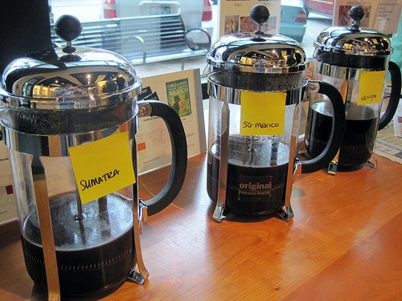

The retail specialty coffee industry is unique in that it attracts as many admirers of the product – coffee fanatics – as it does those who are looking for a lucrative business investment, probably more. It is human nature to focus on those things that are of greatest personal interest to us, and in the case of the coffee fanatic that is all things coffee!

So, for the good of your business, I ask you to put down that glossy espresso machine product brochure and step away from those roasted coffee samples and the tiny single-serving bottles of flavoring syrups. Let’s spend the next few moments talking about something even more important than the product, the critical business issues that will define your retail coffee business – I promise that it will be worth your time and that you can go back to the taste testing when we’re done.

A word of caution: this document is not intended to be a paint-by-numbers template to start a coffee shop. If you are one of the millions of proudly self-professed “Dummies” that requires a handbook in order to start your coffee business or learn Microsoft Windows, you had better stop reading now. There are plenty of books that cater to the DIY market segment of this industry; we aimed to do something a little different here – something a little more thought-provoking for those preparing to make a serious financial or emotional investment.

  
*French Press Coffee Tasting*

With alarming frequency, my associates and I respond to questions from new and prospective coffee shop owners, such as, “what sugar-free syrup tastes best?” or “should I pick the San Macaroni 5-group espresso machine or the La Spaghetti?” New entrants to the retail coffee industry tend to focus a large portion of their valuable time and resources on coffee shop gear, products, logo colors, and other minutiae that may affect the style or identity of a business, but in fact, do not define that business and are probably not the factors that will lead to its eventual success or failure; whereas it may be nice and even helpful to know which synthetic concoction gives your calorie counting and diabetic consumers the best sense of real chocolate in their cafe latte, the resulting drain of your time away from the real issues may commit your new coffee shop to failure, even before your shiny new La Spaghetti is out of the packing crate.

If you have already started your new shop and recognize the example questions above as being yours, don’t worry, it’s never too late to start fixing the items addressed within this document. For all others that may be considering starting a new coffee shop but have not yet taken action, we hope that the ideas listed herein will be helpful to give you some insightful reflection on the true issues that will impact your business so that you may continue to pursue your goals with a newfound sense of confidence.

### Is Starting a Coffee Shop Right for You?

Owning your own coffee business has mass appeal. Picture yourself as the proprietor of a successful coffee shop and just think of the many positive attributes that you associate with that image: freedom to make your own decisions, financial independence, respect from the local community, your family and staff, and the satisfaction of providing a sought-after product to your customers in a social environment that brings people together, just to name a few. Just smell that fresh coffee brewing! What could be better?

Let’s add a shot of reality to that idealized image for a more grounded perspective: picture working 14-hour days, 6 or 7 days a week, smell the unrelenting pungent scent of stale coffee on your clothing and in your hair, feel that painful steam wand burn on your index finger, see yourself driving to your shop at 5:30 am on a dark and cold Saturday morning when an employee calls in sick (again), imagine yourself pacifying the argumentative customer who insists a traditional Italian macchiato includes caramel, “like Starbucks does.” Oh no, what have I gotten myself into?

Surprisingly, many prospective coffee entrepreneurs feel that an undefined “something better” awaits them in the retail coffee business than in their current life, but do not necessarily stop to validate this point. Take inventory of both the benefits and drawbacks of retail business ownership prior to making a serious life change.

Immerse yourself into the industry before you make your leap. Interact with coffee shop owners in neighboring cities; join the Specialty Coffee Association of America and attend their annual conference; visit the online chat forums at the SCAA website, coffeeforums.com, and CoffeeGeek.com; read Roast Magazine, Tea & Coffee Trade Journal, and Fresh Cup Magazine. Take inventory of both the benefits and drawbacks of retail business ownership prior to making this serious life change.

Before you commit yourself to that new reality, make sure that you are basing your decision on facts and not solely on your desires and a well-intentioned misinterpretation of the facts – accept that there is a difference between what happens and what you want to happen. Every garage band from Seattle or Portland has the dream of a rock star lifestyle; a disciplined few practice their instruments the 4 to 6 hours each day necessary to be good musicians; the fewer still that become famous will understand that practicing 4 to 6 hours each day is part of the real rock star lifestyle – you had better enjoy it.

### Develop Your Business Plan and Define Your Goals

Would you get in your car and begin driving to a business meeting without first knowing 1) who you are meeting 2) where they are 3) how to get there and 4) why you are going to this meeting in the first place? The same should be true in starting your new business.

Without a careful definition of what you hope to accomplish by starting your new business, it is highly unlikely that you will reach your goals; even if you were to reach those goals, you may never even know. Even where financial motives are not your sole intent, be aware that there is some reason that you are starting a retail coffee shop instead of, say, a bed & breakfast or graphics design firm, or even staying at your current dead-end job. Define what it is that you hope to achieve, and how you intend to achieve it; even though you will encounter unexpected roadblocks along the way, you will always have your destination in mind and be able to find another route.

The best way to do this is by carefully developing your business plan. By now, you may have heard that you will need one and may have even started developing one. For those who have: congratulations! You have taken the first steps to define your business.

Many people view the business plan as a necessary document that you will need in order to obtain a loan, secure investors, or in many cases, lease commercial property: those people are half right. The full truth is that your business plan is more than a document, it’s an exercise designed to help you organize your ideas and communicate them effectively to any affiliated party, but the most important reader is you.

Sure, you can purchase a ready-made plan from any of a thousand sources these days: online from various websites, your local bookstore, and even your office supply warehouse – it is our recommendation that you do not do this, or at least use these store-bought term papers as an example of what can be accomplished and how rather than what you should write. Someone else’s term paper may a shortcut to getting the grade that you want, but remember, this is your business and you will need to run it; wouldn’t you rather be armed with the experience of understanding how and why your concept and supporting data was created?

Use the resources available through the Small Business Administration and the assistance of the Service Corps of Retired Executives, and when you need guidance specific to the retail coffee industry, call on your new friends that you have met through SCAA events, online forums, cooperative owners of neighboring businesses or the experience of a business consultant to assist you.

After all of the work that you have devoted to creating the vision of your new business, you may find this next piece of information upsetting: you’re not done. In fact, **you will never be finished with the business plan**. Rather than lock the original document away in a tomb or time capsule over which future generations will marvel with wonder, keep it up-to-date with current events and refer to it quarterly to stay focused and on goal. The very best business plans that have been written are still being written and will continue to be updated to meet the changing goals of its authors, changes to the business, and the conditions that affect that business. Remember who is the real audience of this exercise; the only person that you ultimately impress or disappoint is you.

### Plan Your Startup and Operating Budgets Wisely

By this point, you may have noticed that the title of this document may very well have been “top reasons that coffee businesses fail,” had it been written from a different perspective. This same theme rings true with our #3 entry: Plan Your Startup and Operating Budgets Wisely, or essentially, have enough capital. Starting any new retail coffee business is neither easy nor inexpensive, and as the old adage implies it does take money to make money. But what is enough?

According to the Small Business Administration, 50% of small businesses fail in the first three to five years. Studies show that the top two reasons for failure are management inexperience and insufficient capital.

As you consider your budget planning portion of your business plan, it is reasonable that you should expect that your required opening bankroll or credit access will total in the hundreds of thousands of dollars rather than tens for the model “average” coffee shop in America today; just how much will depend on you and your plans. The actual value will vary greatly from business to business and will be affected by the scope and complexity of your intentions, local market conditions, as well as, your access to resources that others may need to contract separately, and vice versa.

While determining the capital equipment portion of your budget, be mindful of the role that each of these tools plays in allowing you to generate your revenue and assign them an appropriate level of priority. Prioritizing the importance of tools in your shop will help to make those detailed purchase decisions easier in the future (is it really such a good idea to purchase your espresso machine, the primary income-producing tool of your business, second hand on eBay?), as well as, acting as a solid indicator of which items should be included in your operating budget for routine maintenance expenses.

If you are not experienced in developing a budget, there are many resources available at your disposal as were mentioned in the category of immersing yourself in the industry. However, when you prepare your budget, we recommend that you be conservative with your income projections and generous with your expenses. By having enough cash on-hand to not only meet your initial capital expenses but also your complete operating expenses for a minimum period of one year, you will maximize your chances of success during the formative stages of your business; any less and you will not be giving you or your business the full opportunity it may need to establish itself in the community.

In the event that you make the determination that your available funds are well below your reasonable expectations of what will be necessary to succeed, by all means, find another source of funding or quit while you are ahead. Entering into a business venture that is undercapitalized greatly increases the chances that the business will fail. Sure, there is always a chance that you will “get lucky” and everyone has his or her own tolerance for risk, but such ventures are invariably some type of investment in either your spiritual or financial advancement – a smart investor knows how to manage risk.

### Choose Your Location Based on Value, Not Price

As the term value implies, you should not only search for a location taking into consideration the costs that you will pay but also what you receive in return for that cost.

**Pop Quiz**

Which of the following locations makes more money?

1.  1,500 Sq. Ft @ $10 Sq. Ft location that attracts 150 customers daily; or
2.  $20 Sq. Ft location of the same size that attracts 300 customers daily; or
3.  Both make the same amount.

Pencils down! (Sorry, got a little carried away there).

If you said “B,” you’re right – very right. In this scenario, that extra $1,500 you commit to paying each month generates approximately $13,000 in additional gross income (after the cost of goods sold!) each month at reasonable coffee shop product prices and conservative profit margins (~65%). Even if that higher customer volume requires more staff hours and other increased demands such as electricity and water, the vast majority of that $13,000 will end up in your pocket at the end of the month: that’s good value for your investment dollar.

So how exactly are you supposed to estimate the number of customers that may visit your business? Some traditional texts estimate that the average retail coffee shop is frequented by .2% to 1% of proximate vehicle traffic (higher for pedestrian traffic). As the law of averages goes, this estimate is pretty reasonable. For the best accuracy, you will need to take make adjustments accounting for local area demographics, visibility of the location, traffic patterns (in addition to volumes), accessibility, and competition – this is best done with the assistance of a professional. If you have nearby competitors, it is always a good idea to take a seat in their shop or parking lot and count the volume of customers they serve at varying times of the day and days of the week.

We recommend that rather than take the best guess on any single number you should create projections for conservative (low customer volume), moderate (reasonable volume), and aggressive (high customer volume) scenarios. Develop your response to each of these situations and be prepared to act; you will find that the stress and uncertainty often associated with the financial planning of a new business will be significantly reduced when you have a pre-developed response policy that is understood and ready to execute.

### Know Your Coffee and Espresso

Before starting any business, it is advisable that you fully understand (and ideally, enjoy) the product that you intend to offer. The specialty coffee industry has enjoyed such stellar growth in modern times and received so much positive publicity, that sometimes the one thing that the new coffee shop owner seems to overlook is, well, the coffee! Coffee, you say?

What could be so difficult to understand about making coffee: it’s a bean, grind it, mix it with hot water and you’ve got a high margin drink… right? Well, perhaps, but only in the sense that wine is “old grape juice in a bottle.” The danger in the specialty coffee industry is that most people do not realize that coffee and its resulting beverages exhibit a similar level of complexity as is found in fine wines, cheeses, olive oils, kinds of vinegar, and foods; interestingly, many experts in the coffee field have interests in these other areas.

Take, for example, water: water is over 98% of the coffee that you will serve. It is shocking to us how many new coffee shop owners give little or no thought to their water source, specifically, the current and optimal levels of total dissolved solids, mineral hardness, alkalinity (pH), silica, iron, and chlorine in their water. Imbalanced water will completely alter the flavor of any coffee or tea and can destroy valuable equipment. When you truly understand coffee, you will recognize all of the elements that are part of coffee and of the beverages that you will serve and give them the due attention that is required.

Just as if you were starting a winery or fine dining restaurant, you should strive to gain a level of competency with coffee such that you have the ability to not only create standard traditional beverages correctly but can build and abstract upon those recipes and preparation techniques to create signature beverages that will be the unique hallmark of your brand.

We recommend that you start with the basics. Although it would be nice to travel around the country or around the world to sample the best that this industry has to offer, it is not necessary.

As suggested back in step #1, immersing yourself in the local and regional coffee culture is a great way to quickly educate yourself on what coffee is truly intended to be; attend conferences, sign up for educational classes or events offered by any of a number of outstanding local artisan coffee roasters around the country. Be sure to sample as many different variations as you can as there is a great deal of personal interpretation that goes into drink preparation; do not base your business solely on the offerings of a major chain shop in your region -you have the ability to do better.

### Know Your Market

Know Your Customers

A clear definition of your intended customer type(s) must be known in order for you to effectively design many aspects of your business, from your product, your marketing campaigns, and interior designs to the strategies you will use to combat competitors. The more you know about the people who will walk into your shop and use your product, the more effective your efforts will be in attracting and retaining repeat business.

Ask yourself: who is (are) the customer(s) for my business? Yes, we realize that these are coffee drinkers, but what else do we know about these people? What is their background? Are they on their way to or from work? School? An attraction or event? How old are they and what are their tastes in style, food, and music? What are social issues of particular concern to these people?

Tailoring your business model to the most likely sources of local business is a smart approach. Consider the coffee shop at the base of an office building with steady pedestrian traffic of white-collar workers: understanding the approximate demographic, traffic patterns, and interests of these people will allow you to creatively apply ideas to your business (perhaps, a meeting area for private conferences away from the workplace) and products (such as quick lunch snacks for the captive in-house audience or office bundle packages of to-go brewed coffee) that will help to ingrain your business as part of the office culture. This approach would be similar, with entirely different results, in a location that is, for example, directly across from a high school or college or a drive-thru along a busy interstate highway.

A targeted understanding of your intended consumer will also help you to effectively market your business in those places and use the methods of communication that will be most effective; for example, direct mail to a surrounding residential community may not be effective in areas where the majority of your intended consumers are commuters from elsewhere – it is always more cost-effective to take a finely targeted approach to reach your individual market segments (no matter how many there may be) rather than the “shotgun” approach of throwing out a broader and weaker message to a wide audience.

### Know your Competition

Do you think that your only competitor is that big-name coffee chain store around the corner? Think again.

Your competition is everywhere around you and in places that you may not expect, from the local restaurant, fast food business, movie theater concession stand, convenience store, ice cream parlor, mega-retailer, gas station, and even your consumer’s own home! With all of the potential competition from sources of coffee and other beverages like sodas and ice cream frozen drinks, it is very important that you project a consistent image meeting the needs of your identified target consumer.

Objectively review every possible outlet for coffee and competing products within a geographic territory that is appropriate for your region (including but not necessarily limited to sodas as there are regional variations of competing products) meeting each of the standards of performance that will define your business in the eyes of the public, namely:

-   **The convenience of a coffee shop location** – How easy is your product to access? Are there barriers that would prevent a consumer from visiting the coffee shop, such as an inconvenient unprotected left turn from his or her normal morning commute? Also in this category, consider the standard of “speed of service” (which is sometimes separated into its own category). We believe that there is an appropriate expected speed of service defined for each type of coffee shop location, differing greatly from a sit-down retail location to a drive-thru. Be sure that the speed of service does not present an inconvenient obstacle for the customer.
-   **Consistency of the experience** – This is arguably the most important of the four criteria identified here and the central foundation of any brand. Studies have shown repeatedly that consumers prefer a product that is known to be “acceptable” rather than risks an unknown product that may be either “exceptional” or “poor”; more than anything else, a customer wants to know what to expect from a coffee shop. The anxiety generated by an inconsistent experience (product & service) may be enough by itself for a consumer to avoid a coffee shop altogether.
-   **Quality of the beverage** – This criterion is regularly grouped with the term “value,” but we suggest that you be careful not to do this and instead focus solely on the resulting taste. Identifying the true quality of the resulting beverage will allow you to establish an objective review of your beverages versus your competition and then educate your patrons accordingly to accurately recognize not only “what” identifies a quality specialty coffee beverage, but “why” it is that way. Taste is subjective and each individual will prefer different styles of drink, roasts, and varietals or blends of coffee; however, we find that even the uneducated palate will prefer a better quality beverage even if they cannot explain why. With a product as complicated as coffee, it is sometimes difficult to separate real value from what is the “perceived value” or the value associated with what uneducated customers assume is associated with a product, normally resulting from marketing techniques (this coffee is very expensive, so it must be good!); we suggest that you cut through all of that and first identify the true quality of your own product and that of your competitors, then build a marketing and price strategy to optimize the perceived value of the product.
-   **Cleanliness of your coffee shop** – This is the most simple criteria to judge and subsequently maintain to excel beyond your competition. Regardless of whether a business is geared to an informal crowd of bikers and teenagers or pinstripe gray-suited diplomats, everyone prefers a clean environment. Remember that cleanliness does not sacrifice your ability to personalize your space or inhibit free expression; never confuse a clean environment with a sterile one.

For each of these criteria, outline all of the potential target customer demographics that are shared between your business and your competition to gain an objective overview of where the market potential exists either in a new market niche left open by gaps in competitor performance or in direct competition with an existing supplier.

### Invest in Your Barista

Your employees are the face and best representatives of your business; they will interact with your customers, prepare your beverages and monitor the safety and well-being of your investment. There are several workforce models that may be applicable to your business, ranging from the food service model of unskilled workers hired at low wages to “press the buttons” to the fine dining model of premium customer service personnel akin to a tuxedo-clad Maître and skilled artisan Baristas manning your espresso machine, much like an award-winning chef in the kitchen; there is a situation that is appropriate for each kind of approach.

It is not our intent to argue the effectiveness of any model with this recommendation to invest in your employees – it is our intent to recommend that with any model, you should choose the best possible candidates for their position and compensate them accordingly.

The best approach in any situation is to hire the best people and give them the training, support, and compensation (monetary or otherwise) that they need to be comfortable and grow with their position. Thousand percent employee turnover rates may be common in minimum wage fast-food restaurants but consider what real cost this has on the small retail business: product inconsistencies resulting from inexperienced staff, exorbitant recurring training costs for all of the new hires, poor employee morale resulting from low wages and the personalities that low wages attract and most importantly, how these staff members interact with your regular customers – generally not well, and those that are able to develop a customer rapport are not likely to remain with your business for long as better paying opportunities to develop elsewhere.

Technology tools are available to reduce the skill level required of your people to perform their jobs – take, for example, super-automatic espresso machines that perform all of the steps of a trained Barista, from grinding the whole bean coffee to extracting the espresso shots and even dispensing frothed milk, all at the press of a single button. As helpful as these devices may be, we caution you to use technology as a tool and not a crutch; whereas technology is helpful to assist your employees, not all problems can be solved with the application of technology alone in the name of cost savings.

We recommend by attracting enthusiastic potential employees with stable job histories and good references looking for a long-term position you may spend more out-of-pocket in the short term, but that the returns you receive in reliable job performance, increased sales, and decreased training costs will far outweigh the upfront investment.

Stable candidates are generally influenced not solely by monetary compensation, but also through the sort of support workplace that fosters advancement and other benefits, such as medical insurance coverage; be certain to work with your payroll professional or human resources leasing company in order to develop a packaged offering that reflects the type of candidates that you wish to have representing you and your business.

### Pay Yourself First

Very often, individuals and even partners starting a new coffee shop leave stable long-term employment with predictable salaries in unrelated fields to become their own boss. It is tempting for the new owner acting in favor of their new business to reinvest 100% of all available capital, including their own salaries back into the fledgling business. Even though this concept is well intended, we recommend that you will be doing your business a greater service by ensuring that your own personal financial worries are set aside when you come to work. Drawing at least a minimal salary for yourself that satisfies you and your family’s basic needs will ultimately be far better not only for you but also for your business.

By paying yourself a salary – even when times are tight – you will retain the ability to make smart business decisions in the true best interest of your business, rather than fold to the pressures of short-term hardships under the stress of immediate personal financial concerns. All of us have been in the situation of regretting a decision that seemed to satisfy our urgent immediate needs, but may have sacrificed some benefit for our future; in the context of your business, having a clear head, free of personal financial worries can help you to avoid financially damaging or potentially fatal mistakes.

For many good reasons that you should discuss with your licensed attorney and accountant, every retail coffee shop should be established as its own legal entity separate and distinct from you.

The coffee shop may be yours, but it is not you – this may seem obvious and even comically unnecessary at a first glance, but trust us that this distinction can be lost by the best and brightest working under extreme stress for long hours in the sole and total pursuit of a goal.

Never lose sight of the fact that the business is a vehicle intended to reward you for your acceptance of financial risk and your intelligent hard work. Even in the event, you are independently wealthy or otherwise comfortable with your own personal financial wants, consider paying yourself a minimum wage for the hours you work in order to create the mental separation between owner and business.

Have fun with your coffee shop, design it, manage it and personalize it as your own – just be careful to not lose your identity to the business, as this will only create problems for you and inhibit your ability to make potentially difficult but necessary decisions for the good of both owner and business.

### Have an Exit Strategy

Planning how you intend to leave is as important as planning to start. Consider where you want to be in 5, 10, and even 20 years: how do you see yourself and your business changing in that time? What will your role be in that business? Do you really want to be the 70-year-old behind the counter serving drinks at an owner-operated coffee shop? Maybe you do, which is just fine.

Give serious consideration to how you will be involved in the future of your business and for how long, we recommend developing an exit strategy that will allow you to leave before you have to leave. Popular exit strategies include planning to sell the business in part or whole to an unrelated party or a business partner, aggressive expansion whether by franchising, private capital investment, or public offering, leaving the business as an inheritance to provide for your children or the inevitable default method for inaction, death.

Be mindful of the fact that the preferred timing and method of exit will vary greatly for each person; whereas some coffee shop owners enjoy the secure routine of personally managing their business 6-7 days a week, others may prefer to leave that task to others and search for new location opportunities, new business challenges (perhaps wholesale coffee roasting) or something entirely unrelated to coffee that poses a new and exciting entrepreneurial challenge.

Be aware of which personality type yours is and plan ahead accordingly with the advice of your attorney and accountant. The plans you make now for your eventual departure from the business will dramatically affect the convenience of your departure, whether for you or your heirs.

*Photo by* [*Tim Wright*](https://web.archive.org/web/20180911013254/https://unsplash.com/@timdwright)

### Choose Good Business Advisors

I am sorry to disappoint any readers that may expect this is the section where we recommend that you hire Cafemakers to help you with all of your needs – it is not and we are not. This is, however, the section in which we strongly recommend that you seek outside advice in any area that may not be your field of expertise, including but not limited to: business management, human resources & training, negotiation, insurance, real estate, accounting, interior design, and legal matters, to name a few in no particular order of priority.

In short, there is someone out there that has learned from the mistake you are about to make – taking advantage of that information can mean the difference between your success and a costly failure. Although the consequences are less extreme in the case of a business advisor, interior designer, or trainer versus, for example, your attorney, the independent ability of an outside professional to remove themselves from the emotional haze of a complicated situation and help you take sound action in your best interest, which is generally well worth the investment.

Even if training or accounting happens to be the specialty of your current profession, it can certainly not hurt to learn from and improve upon the experiences of others in that field as it pertains to this new venture. Ironically, people tend to seek outside counsel most often in those areas in which they are already familiar and have come to respect the complexity of the discipline – the same attention should be paid to the areas you are unfamiliar with; never assume that an unfamiliar topic lacks complexity as it is usually the extreme opposite.

Be certain to place emphasis on the expert guidance for:

-   **Legal advice:** and I cannot stress this matter too greatly, engage a qualified and licensed attorney to assist you in all matters relating to the formation of your business, developing and protecting your brand, and major commitments, such as, leasing property or equipment and in any conflict that creates potential liability for you and your business interests. Never depend on your “best guess” or the collaborative responses of coffee shop owners to a free public bulletin board service regarding legal issues. Failure to correctly prepare or defend yourself in many aspects of business represents a credible threat to your livelihood – choose your attorney or attorneys with care; ideally, ones focused on the area of practice directly related to your immediate concern. For example, you will likely find that you will need a different attorney for matters of intellectual property, such as, applying for or defending a trademark that you would for the organization of your company structure or defense of a slip and fall lawsuit.
-   **Accounting:** You need only look as far as recent headlines on the collapse of Enron, MCI WorldCom, and others to understand the importance that the role of accounting plays in modern business. The recording and interpretation of your accounting data by Generally Accepted Accounting Principles (GAAP) is not only a good idea to understand the true state of your financial well-being, but it will also help you to avoid the sort of accounting irregularities that may put you in jail.

Fun Accounting Fact: Did you know that despite years of notoriety, it was a conviction on the criminal charge of tax evasion that eventually put infamous mobster Al Capone in Federal prison? True. A skilled accountant can advise you on the best way to legally make the best use of your income and expenses, take advantage of tax breaks and incentives, as well as plan strategies for long-term financial goals. Bookkeeping may not seem to be a very thrilling task and is considered by many to be an afterthought or necessary evil of doing business, but never forget: in business, the way you report your financial information is nearly as important as the financial information itself.

-   **Insurance:** Work with your business insurance advisor to determine what types of coverage are applicable to you and your business. Just like you, we are not fond of the underlying argument “I’ll bet you $500 that our business burns to the ground this year,” but nevertheless, in the event that the unthinkable happens, that policy will be the best investment that you ever make, with premiums amounting a small fraction of the cost of recovery from that disaster – just think, you could be one of the “lucky ones” that get most of their money back and has an opportunity to start again. Beyond physical damage to property, be ever mindful of the potential liability that exists in this litigious American society – like it or not, simply letting your customers in the front door may make you responsible for their negligent and irresponsible behavior (not to mention that of your employees). As the owner or a partner in your business, also do not forget to protect yourself, your partners or investors, and your family. What would happen to each of you in the event that you are permanently disabled or even killed? A wide variety of insurance products exists today that is designed to protect all of the above so that an unfortunate event for you or your company does not become the final event.

Despite the best assurances and intentions of your friends, neighbors, and customers, they cannot protect you as your attorney, accountant, and insurance agent can in times of dire need. It does not go far enough to say that your paid advisors are some of your best allies in business; they are your ONLY allies in business.

### Document Everything

A complete and easy-to-understand set of plans for your business is the underlying foundation of a consistent customer experience. Maintaining a clear and concise written set of your business-specific operating procedures is helpful to train new employees, setting guidelines that maintain consistency among your entire workforce, and will also produce a template that will allow you to duplicate your success and expand your brand to new locations.

Your operating procedures are the valuable intellectual property of your business; they define everything from how to greet a customer and the number of espresso shots in a 12 oz cappuccino to your nightly cleaning chores. The more detail that is described in each step of your processes and procedures, the less flexibility remains unclear and open to interpretation by your management and employees; resulting in fewer deviations from the intended experience.

Develop both an employee training manual that includes step-by-step instructions for the actions that must be taken by your employees as they perform their jobs and a separate managers’ guide that includes additional detail and other management functions, such as hiring or discharging new employees. As an interesting side effect of this process is that you will learn more about your business; you do not really know what is “missing” from your procedures until you attempt to document them as a stand-alone text.

Once all of your procedures have been recorded, do not simply lock them away in a vault to act as a time capsule for some future civilization to discover; return to them regularly and make updates that reflect changes in menus, new tasks, or the other new things that you have learned to make your business better. If your plans are to someday license or franchise your concept to others or even to start a new location elsewhere, these documents will be the essential starting blueprints that will save you time and money.

### Strive for Continuous Improvement

One comment that we have heard regularly from those luminaries of the coffee industry that have been at the top of their profession for 20+ years is that there is always something new to learn about coffee. We suggest that if you run out of new ideas or are unable to otherwise some way to improve yourself or your business that it may be best to move on to something new. This is a suggestion that we not only recommend for our clients but a pledge that we fully intend to honor ourselves.

Consider the Japanese principles of Kaizen, a philosophy of management dedicated to continuous improvement, which is largely credited with the success of Japan’s competitive position in the world market. Kaizen, coming from the words “renew the heart and make it good,” means improvement – improvement not only in the bottom line financial health of a company but also the small improvements in home life, social life, and working life. Alone, these gains may seem small and insignificant, but over time total up to big gains in your performance, personal satisfaction, and quality of life. It’s the little things that are necessary to add up to big things.

Not surprisingly, it is those companies that are most actively involved in performance improving events, organizations, and seminars that not only have the best-tasting beverages but also have the most dramatic financial successes.

It is not solely a coffee shop’s participation in organizations like the Specialty Coffee Association, World Barista Championships, the Barista Guild, and others that make a company successful; rather, we believe it is the type of company that actively pursues its own improvement that sees these associations as opportunities for the company and employee betterment – the companies that seek these opportunities are the ones we find to be most successful in business.

Make the quest for continuous small improvements in knowledge and performance part of your company culture rather than focusing solely on your profit and loss statement. Not only will you find your business to be a more enjoyable and rewarding adventure, but also will be more likely to find the financial success that you seek – in that environment, everyone wins.

### Resources

Specialty Coffee Association – Formerly the SCAA (Specialty Coffee Association of America)

[World Barista Championships](https://wcc.coffee/) – official site

*Coffee in Montreal photo by [Luke Chesser](https://unsplash.com/@lukechesser)*
