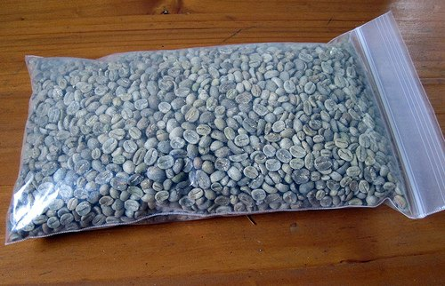

Although coffee is one of the most heavily consumed drinks on the earth, many people know generally little about what factors that can determine the difference between a great cup of coffee and a mediocre one. This guide will help clear up the basics of choosing and buying coffee.

How is coffee bought on the Internet any different than the coffee at the grocery store two blocks away?

There are many differences between the coffee bought online and the coffee bought at grocery stores. Generally, the grade of coffee bought online is higher than that at grocery stores, however, the most significant factor that separates grocery store coffee from that bought online is the freshness.

### Freshness

Coffee degrades quickly after it has been roasted. The optimal time to drink coffee is 2-5 days after roasting, however, if coffee is stored right, the flavor will stay relatively well for almost two weeks. After three weeks the coffee flavor has been ruined for the most part. Therefore any coffee bought on a shelf, since it has probably been sitting there for weeks already, will usually have a poor flavor. No matter what kind of airtight containers the coffee is shipped in, after roasting the coffee flavor will degrade within a matter of weeks.

### Unroasted

Unroasted coffee will stay very fresh for months, which is making it a great choice for those who are very serious about the coffee they drink. Since you can roast coffee in a variety of ways (including a [popcorn maker](http://ineedcoffee.com/roasting-coffee-in-a-popcorn-popper/)), many people have switched to buying unroasted coffee.

  
*2 pounds of unroasted coffee*

### The Bitter Truth

So last time I went down to the store and bought some nice fancy Kona coffee, however it tasted no better than the regular coffee I have been buying over the years.

Coffee regulations in the United States only require manufacturers to specify that they are selling 100% coffee. This allows coffee manufacturers to blend 10% of an expensive type of Kona coffee with a much cheaper grade and advertise is it as Kona Coffee. This not only spoils the reputation of Kona coffee, but it is a very dishonest trick. Therefore when you buy international coffee, make sure they specify that it is 100% from the country and crop advertised. For more information on this point, read [Kona Coffee Confusion](http://ineedcoffee.com/kona-coffee-confusion/).

### Other Buying Tips

-   Exposure to oxygen ruins a coffee’s taste much quicker when the coffee is ground. Therefore we recommend that you either buy small quantities of ground coffee or buy whole bean coffee and ground your own. Try to only grind about as much as you are going to use to help keep your coffee tasting fresh.
-   Great coffee does not always cost a fortune. When searching for gourmet coffee, you will definitely come across specialty Kona blends or rare African coffees that will undoubtedly cost more than $30 a pound. Although this coffee is usually amazing coffee, there are many great coffees for 1/2 the price that tastes nearly as great as these high-dollar blends. The main reason for this specialty coffee costing so much is that it is usually from a very small region, and has a very popular name and reputation. There are many blends that are lesser-known, that have superb flavors themselves. Search around and don’t be afraid to try new coffee.
-   Buy from coffee shops. Although this seems like common sense, there are many people that buy coffee from shops online that also sell all sorts of goods from sporting goods and clothing. Buying from a coffee shop usually ensures that the people selling the product know a lot about coffee, as well as how to please the customer they are catering to.

### Beginner’s Guide to Unroasted Coffee

Roasting one’s own unroasted coffee ensures not only the freshest coffee but the cheapest gourmet coffee available. Those who love the very expensive coffee should consider home-roasting, as unroasted coffee usually can cost as little as 1/2 the price of roasted coffee, which in a short time can pay off the initial cost of a coffee roaster.

For those who have never tried it, it usually will cost around 130-165$ for a roaster that will do all work for you, which is normally what you should start with. Some roasting experts use stovetop popcorn makers or other similar devices, however, they are not recommended unless you know what you are doing, for you can easily ruin the coffee.

It usually takes about 1/2 hour to roast enough for several pots of coffee, so it is not a terribly time-consuming process.

### The Tastes of the World

International regions tend to share similar tastes, aromas, and other characteristics. I will classify the major regions into four groups: Central America, South America, Africa, and Indonesia.

### Central America

Central American coffees are generally light-bodied (the body refers to the thickness or feeling in the mouth). These coffees actually feel ‘lighter’ in your mouth than the heavier Indonesian coffees. They are usually said to have a crisp or bold taste, which refers to the somewhat sharp punch of Central American coffees and relatively high acidity. Some examples or highlights include:

-   Costa Rica Reserve Coffee
-   Jamaican Blue Mountain ‘Wallenford Estate’
-   Mexican ‘Spirit of the Aztec’ Coffee

### South America

A close relative (literally and figuratively) to Central America, our South American countries tend to have slightly heavier bodies than Central American coffee, with slightly peculiar aromas and overtones. They share the same crips bold taste, and generally still share the high acidity. Some examples or highlights include:

-   Colombia Supremo Coffee
-   Brazil Santos Coffee
-   Bolivia Colonial Caranavi Organic Coffee

### Africa

The origin place of all coffee, Africa has unique coffee with sweet, fruity, spicy, and exotic flavors. This coffee is often sought by coffee experts due to its unique aromas and overtones, however, those new to flavors may find some of them odd-tasting. The only way to really get a feel of them is to try them, and some examples or highlights include:

-   Ethiopian Yirgacheffe Coffee
-   Kenya AA Coffee
-   Zambia Terranova Estate Coffee

### Indonesia

Indonesian coffee has a long finish, a very heavy body, full flavor, and low acidity. There is not much gourmet coffee produced in that area; the coffee grown there is highly prized for its taste and smooth finish. Although gourmet beans are rare, this coffee usually remains at a relatively low price due to its low popularity.

-   (Indonesia) Sumatra Mandheling Coffee
-   (Indonesia) Sumatra Dark Roast ‘Black Satin’ Coffee
-   Yemen ‘Arabian Mocca’ Coffee