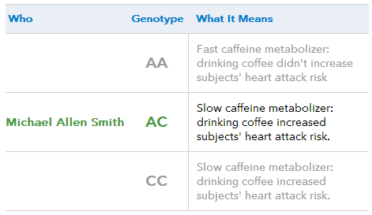

If you read my article [5 Coffee News Stories That I Never Want To Read About Ever Again](/5-coffee-news-stories-that-i-never-want-to-read-about-ever-again/), you already know that I am tired of hearing about the health benefits of coffee. My main complaint is that we all respond differently to coffee, and that our response to coffee can change as we get older. What is observed with most people in a health study may have no relevance to you as an individual. The only data that matters is your own.

For the past two years, I have tracked my daily coffee consumption and sleep quality score. I outlined this project in the article The Quantified Coffee Drinker, but I wanted more data.

I wanted to learn if I was genetically predisposed to certain chronic illnesses. I also wanted to learn more about how my body metabolizes caffeine and if I could determine how healthy coffee was for me based on my genetics. So, I ordered a genetic test from 23andMe. Years ago, this would have cost thousands of dollars and taken months to analyze. Today, you get a test for $99 plus shipping and will have your results in about 8 weeks.

### Do the Healthy Benefits of Coffee Apply to You?

According to a WebMD article _titled “Health Benefits of Coffee” by Jonathan L Gelfand, MD, coffee has been reported to help with the most common conditions:_ Type 2 Diabetes, Heart Disease, Parkinson’s, and Alzheimer’s.

Instead of jumping into the strengths or weaknesses of the studies used, I’d like to propose an alternate way for coffee drinkers to assess how much coffee helps or doesn’t help them prevent these serious health problems. If a coffee drinker had an elevated risk for an outcome that could be helped by coffee, continuing to drink or even drinking more might be a wise path. However, if a coffee drinker is not genetically predisposed to an illness that coffee consumption is to provide benefit, then assuming coffee yields an additional protective shield may be a false assumption. Lastly, if one’s genes signal issues with coffee consumption, then reducing or eliminating coffee might produce the best health outcome.

### My 23andMe Data

The vast amount of data _23andMe_ collects is amazing. For this article, I will focus on the data related to coffee. For a more detailed review of the service, check out my personal blog post, [23andMe Results](https://criticalmas.org/2013/04/23andme-results/).

I wanted to know if I was at risk for any of the chronic illnesses that coffee has been reported to help lower the risk for. Here is my data.

Condition

My Risk

Typical Risk

Score

Coronary Heart Disease

36.8%

46.8%

Decreased Risk

Type 2 Diabetes

16.8%

25.7%

Decreased Risk

Alzheimer’s Disease

4.9%

7.2%

Decreased Risk

Parkinson’s Disease

1.9%

1.6%

Typical Risk

My genetic data shows me that I am not at an increased risk for the ailments that coffee is reported to show benefits for. Now, will drinking coffee lower my risk even more? We don’t know. The health studies I’ve read do not break this information down. My interpretation of this information is that since my risk level is not elevated for these four conditions, the need to consume coffee to lower my risk factor would have far less benefit than someone genetically predisposed.

### Caffeine Metabolism

Going back to my original statement, we all respond differently to caffeine. There is a genotype that can predict how well you can metabolize caffeine. From the _23andMe_ website:

> Caffeine is primarily metabolized by the liver enzyme cytochrome P450 1A2 (CYP1A2). The form of the SNP rs762551 a person has determines how fast CYP1A2 metabolizes caffeine. In this study, **people with the slower version of the CYP1A2 enzyme who also drank at least two to three cups of coffee per day had a significantly increased risk of a non-fatal heart attack.** The study found that fast metabolizers, on the other hand, may have actually reduced their heart attack risk by drinking coffee.

Am I a fast or slow metabolizer of caffeine?

  
_I am a slow metabolizer of caffeine._

As a slow metabolizer of caffeine, my risk of heart attack is significantly greater when drinking two or more cups of coffee per day. That isn’t good.

### Is Coffee Healthy For Me?

This test told me that I shouldn’t be overly worried about the ailments that coffee is supposedly protective against because my risk factor is either already decreased or typical of the average population. It also told me how my body processes caffeine might make two or more cups of coffee bad for me. The sweet spot for my coffee intake might be one cup a day.

I hope you remember this article the next time someone shares a link about how wonderfully healthy coffee is. Coffee can be healthy for some and bad news for others. We are all different. The only data that matters is our own.

Since getting my results, I have gradually reduced my daily consumption to 2 cups of coffee. In addition to having my genetic test, I have been tracking my coffee intake and sleep quality for over two years. I have found that I start to feel worse when my coffee levels are too high (3 or more cups a day) for a few weeks.

If you are a health-conscious coffee drinker and are interested in determining the optimal amount of coffee, I recommend the _23andMe_ test.

### References

[23andMe Results](https://criticalmas.org/2013/04/23andme-results/) – Personal blog post reviewing my results of the _23andMe_ test.

Health Benefits of Coffee – WebMD article by Jonathan L Gelfand, MD (article no longer online)
