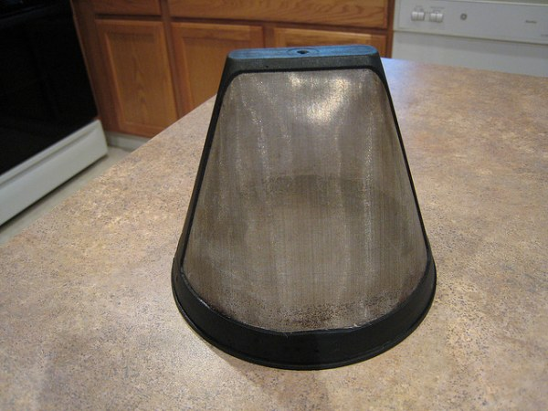

In the [first part](/good-to-the-last-drip-part-1/) of this series, I discussed the basic principles needed to make a good cup of coffee. In this portion, I will be talking about the things to consider when making an auto-drip maker purchase.

Many of the machines that you will find in the stores look highly efficient. Some of them have a grinder, espresso maker, and a drip-maker all rolled into one convenient device which will save money and counter space. DO NOT BE FOOLED. Remember, machines are mechanical and will thus wear out over time. The problem with machines that do many things is that one part will wear out before another does. It is very rare that the whole machine will fail at the same time.

Supposing your coffee maker has a grinder and an auto-drip maker, what happens if the grinder fails? Do you buy a new grinder? If you do, then the machine that once saved you counter space is now taking up more space than it would have if you bought them separately in the first place! So-called ‘deals’ like this are usually put together using inferior components together under the disguise of a good deal. You deserve better. Each component you purchase to make coffee should be specifically designed for that purpose and not thrown together in a haphazard manner. Not only does this save you trouble in the long run, but it also allows you to upgrade individual components as you see fit. If you suddenly believe you have a need for a $100+ grinder, then you can do so and not leave behind a useless grinder attached to your drip pot. The bottom line is that you should keep machines separate.

### Filter Basket Designs

There are two basic designs when it comes to the filter basket. The first is the basic flat basket filter, which is probably the most commonly used. The other is the cone-shaped filter. This is a relatively new design. As for which one you should look for, it is up to you, but I will recommend that a cone-shaped filter is better designed for overall extraction and purpose.

  
*Coffee Cone Filter*

### Cone Coffee Filter

The flat basket type filter has one basic design flaw — it is completely flat, and there is but one tiny hole in the center of the basket that the coffee is supposed to drain through. Roofs are angled, swimming pool drains have a depression directing water flow, and bathtubs are slightly angled toward the drain. Why filter baskets are designed contrary to this is beyond me. The real problem: poor extraction and the dreaded “plugged” filter effect. This is where the coffee can’t drain as fast as the hot water is entering the basket and as a result, hot coffee sludge comes pouring out of the basket sending grounds into the carafe and all over the countertop. It is a horrible experience indeed and one to be avoided at all costs.

In addition to better drainage, the cone filter offers better extraction. Since all the water is angled toward a common point, the oils and flavor are extracted more evenly than in the flat basket approach.

Krups, Braun, Capresso, Melitta, and many others favor the cone filter while Mr. Coffee, Bunn, and others choose the flat basket approach. Go for the cone unless you can afford a Bunn.

### Filter Type

You’ve been reading INeedCoffee for a while now, and you are familiar with the debates over the effects of drinking paper-filtered coffee vs. the gold filter method. What are you to do? The decisions you make about your health are up to you. Assuming taste is the focus, however, there are a couple of other considerations worth mentioning.

**Gold filter advantages:**

1.  **Reusable.** I have had a gold filter going on for 7 years now. That is quite a long lifespan and it shows no sign of dying anytime soon. Initially, this is more expensive, but you will both save money and save on the waste you contribute to landfills.
2.  **Richer taste.** Since there is no paper in which to trap oils, these flavorful oils will find their way into your cup. The result is a richer taste than you will get when using paper filters.

**Paper filter advantages:**

1.  **Smoother taste.** While the gold filter allows oils into your cup, it also allows tiny bits of ground coffee to flow through as well. A paper filter won’t do this.
2.  **Easier cleanup.** A gold filter requires that you now have one more piece of equipment that you will need to keep meticulously clean. With paper, you can just toss the whole thing into the trash or compost bin.

### The Coffee Maker Grid

The following grid is not all-encompassing but lists several of the more commonly available auto-drip maker choices that are available. My recommendation is to create a grid-like this while doing your shopping and make the comparisons for yourself. Use this merely as a starting point.

Machine

Water Filter Available?

Water Temp (1-10)

Price Range USD

Cone or Flat Filter

Mr. Coffee

No

6.5

$10-20

Flat Basket

Krups

Yes

9.5

$30-50

Cone

Braun FlavorSelect

Yes

9

$20-40

Cone Filter

Bunn Home

No

10

$30-100

Flat Basket

### Conclusion

Hopefully, this guide will be useful in choosing a good coffee maker for you. By learning the principles involved in making great coffee, you should be able to ask better questions of your salesperson when making your purchase. And if, after extensive searching, you find that the perfect machine has yet to be invented — create it. People will come.
