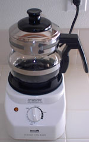
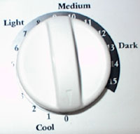
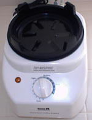
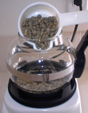
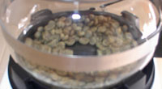
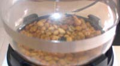
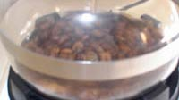
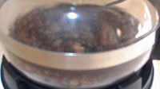
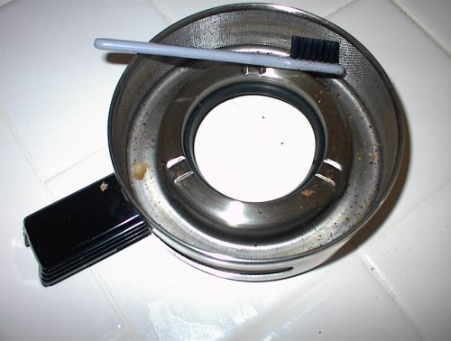

Before Hearthware developed the popular [Precision Roaster](http://ineedcoffee.com/home-roasting-with-the-hearthware-precision/), they created the Gourmet Roaster. Like the Precision, the Gourmet is an indoor coffee roaster that can roast 1/2 cup of green coffee beans at a time. It is also very easy to operate and can make excellent-tasting coffee with minimal effort.

  
*The Hearthware Gourmet*

### Differences

The Gourmet roasts slightly faster than the Precision but is a bit louder. If you need a quiet roaster, this is NOT the one for you. The Gourmet has a manual dial to initiate roasting and the cooling cycle.

  
*The Gourmet Dial*

### Setup

Owners of the Hearthware Gourmet won’t need any help operating this equipment. For those considering a purchase, let’s walk through a roasting cycle. The first step is to lock the glass roasting pot onto the power base. The pot has four tabs that glide into grooves on the power base.

  
*The base of the Hearthware Gourmet Coffee Roaster*

Pour 1/2 cup of green coffee beans into the roasting pot. Don’t overfill the pot; the beans could roast unevenly or burn.

  
*Pour green coffee beans into the coffee roaster.*

You are ready to roast once you have the lid securely on top of the roasting chamber. Turn the knob to your desired roast. Note that the label Medium is a 10. To me, this yields a very dark roast. Most roasts will do better in the 6 to 9 range. However, one shouldn’t merely trust your initial knob setting. Once the roast hits your desired sweet spot, you can and should force the cooldown. The knob isn’t clear on exactly what number initiates the cool-down. It is just below the number 3. When the beans are perfect, turn the knob to just under the three setting.

### Roasting

  
*Start of coffee roast.*

  
*The coffee roast moves from yellow to brown.*

  
*The coffee roast is getting darker.*

  
*The coffee roast is now completed.*

### Finish and Cleanup

Once the cool-down has been completed, you can collect your coffee. For coffee tip storage, read [Coffee Storage](http://ineedcoffee.com/coffee-storage/) by Ryan Jacobs. After the coffee is safely stored, the next step is cleaning the equipment. Between each roast, you will need to remove the chaff. Open the lid on the chaff collector and dump out the chaff. Using the small toothbrush attached to the back of the power-base, brush out any chaff clinging to the inside.

  
*After it has cooled down, clean out the chaff collector before the next roast.*

### Conclusion

At the time of this writing (August 2001), Hearthware is having a close-out sale on this model. What used to sell for $120 is now going for $45. This deal will not last forever. I encourage anyone interested in home-roasting coffee to take advantage of this sale. You will not find a better coffee roaster at this price.