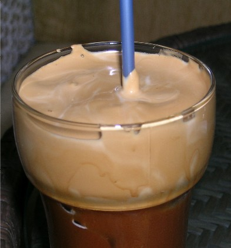

Below you can find the recipe for the Greek Frappe. It is the most popular coffee in Greece for the last 30 years.

This recipe makes enough for one serving.

-   1 1/2 tsp instant coffee (Nescafe Original red label is the most popular brand)
-   1 1/2 cups cold water
-   Sugar
-   Milk
-   Ice cubes

  
*Greek Frappe*

In a shaker or blender mix together 5 Tbs water, coffee, and sugar to taste.

Shake contents for about 30 seconds or blend for about 10 seconds. The result should be simply foam.

Pour into a tall glass and add the ice cubes. Add remaining water and milk to taste. Put in a straw. Milk and sugar are according to taste. It is not obligatory to add them.

### Resources

[The History of Greek-Style Frappe](/the-history-of-greek-style-frappe/) – Some background on this popular drink.
