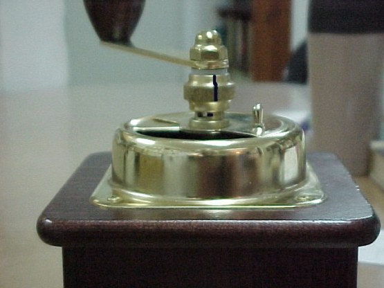

**Would You Drink A Beer That Was Opened a Week Ago?**

Imagine walking into a supermarket on a hot summer day and picking up two six-packs of beer (or cola for you caffeine addicts) to last you the next week (or so). Now, when you get to the checkout counter you have a great idea. Rather than hassle with those little pull-tabs and trying to yank them to open the darn can, why not have the checkout girl do it for you? Wow! Save the hassle at home and you won’t have to worry about those pull-tabs messing up your house.

At the counter, the checkout girl is more than happy to oblige. As you begin sipping that first beer on the way out, you realize what a great idea it was. At home in the evening, you decide to have a beer. The thought of struggling to open the can used to be dreadful. Now, you only have to open the refrigerator door, pull out a pre-opened can and enjoy.

Alas! Although the beer is cold, it has a dead, flat taste.

### Moral of the Story

Don’t unlock flavor until it is time to drink your beverage. The same is true for coffee. Don’t get tired of grinding your own coffee. Return to the daily grind and enjoy the taste of fresh coffee.

Every time you buy fresh coffee beans and ask the checkout person at the coffee shop to grind your beans you are opening up the “flavor cells” and causing your beans to begin losing their flavor rapidly. The purpose of grinding the beans is to create a larger surface area that will release the flavor and oils into the surrounding hot water. If coffee is prematurely exposed to air, it “breathes”, leaving less and less flavor for the brew, when the water finally hits the bean.

I was startled when a friend of mine in San Francisco asked two proprietors of Peet’s Stores what percentage of customers ask for ground beans. I thought that in the heart of US Coffee Culture Land the vast majority bought whole beans and ground them at home. Surprisingly, the answer from the Peet’s guys was that 2/3 to 3/4 of all purchases were for pre-ground coffee. This means that the vast majority of coffee drinkers (except those who buy ground coffee daily) are sacrificing one of the most crucial elements contributing to the taste of a cup of coffee.

### Why we don’t grind

What are the reasons people don’t daily grind their own coffee at home?

1.  Those grinders make such a racket.
2.  There is always such a mess to clean up.
3.  A decent grinder costs too much.
4.  Why waste the time?
5.  A grinder is another contraption that takes up space on the counter.
6.  The grind in the coffee shop is more “professional” than what I can do at home.
7.  Can’t you just store pre-ground coffee in the refrigerator or freezer?

### The Journey

I made the journey from pre-grinding to grinding my own. It was perhaps the most important decision I made since I decided to buy quality Arabica coffee. And it WAS a journey because I had to come to grips with the six points listed above, some of which have a bit of truth to them.

In the process of finding the right grinder for me, I read a lot of grinder reviews online. In many of the reviews, people make note of the noise, use of counter space, or the mess (due to static that causes the grinds to fly out and cover everything in sight). Originally, I thought that a good grinder, which would overcome most of these problems, would be a major investment of money upfront (even before worrying about maintenance). Eventually, I found that was not the case, but I’ll share that part of the story later.

### Moisture is Bad

At first, I thought that I could just store pre-ground coffee in the refrigerator or freezer. Over time, I learned that storing coffee in the fridge or freezer results in an inferior-tasting coffee. I found that moisture can seriously affect the coffee. This is especially true when dealing with pre-ground beans, which have a lot of surface area. The condensation of moisture from removing and returning the coffee to the freezer ruins the coffee. In my quest to find the best-tasting home-brewed coffee possible, I had to take a step forward.

### Whirly Blade Grinders

First, I bought a whirly blade grinder. It was small, so it did not take up much counter space. It was also a fairly inexpensive machine. Basically, there is a spinning blade inside a single compartment. The beans sit in the compartment and are chopped up.

Grinding my own beans at home allowed me much more flexibility. I could change my bean blends for different brewing methods. Add to that the joy of the ritual of making a cup of coffee — seeing the whole bean, hearing it getting crushed, and releasing the smell of fresh coffee beans. This was very satisfying.

I found that the coffee was much fresher and tasted much better when I ground my own beans, but this type of grinder had some major drawbacks:

1.  The cleanup job after each use was a pain.
2.  The noise in my small apartment drove everyone else batty.
3.  The grind was very uneven.
4.  The coffee grounds heated up slightly during the process (releasing/wasting some of the flavors).

### Burr Grinders

I decided to take a step forward. I scanned the Web and found that there is a superior type of grinder called a “burr” grinder. Burr grinders are better than spinning blade grinders because the bean goes through the grinder only one time. The beans are loaded into one compartment, proceed through a blade mechanism, and the grounds are then dispersed into a second compartment. This produces a more even grind.

### Which Burr Grinder?

I did a lot of investigation about various burr grinders. There is a large price range. They go from affordable home grinders to industrial grinders that are very expensive. Virtually all that I found were electric, which meant that they were going to be too noisy for my household. I decided to get some expert advice.

### Zassenhaus

I had the chutzpah to drop a note on the subject to Christopher Schaefer. His reply was:

> Have you investigated hand-cranked German coffee mills? (such as a Zassenhaus) They provide a wide variety of grind styles suitable for all coffee brewing devices (even home pump-driven espresso machines) and are efficient when used intelligently. They are quiet, although it does take an investment of effort to grind for larger quantities of coffee.

  
*Close-up view of the Zassenhaus coffee grinder.*

Actually, I had already heard of the Zassenhaus from the pages of David Bayer and Sweet Maria’s. After a little more investigation and deliberation, I decided to buy a Zassenhaus. If you are interested, you might want to look at the reviews on CoffeeGeek.

### Zassenhaus Advantages

My family used to complain about the noise of the electric grinder, but the Zassenhaus grinder is practically silent. Every morning I grind what I need for breakfast, without waking anyone else. And I find that this grinder doesn’t create much of a mess. The grinder itself looks great on the counter; I think that it adds character to the kitchen. It is such an interesting machine that my family members want to take turns grinding the coffee themselves.

There is no hassle in taking it down, and I think that adjusting the machine to grind for my evening stovetop espresso is easy. Maintenance is also minimal (see the link to the instruction sheet). Furthermore, several people have reiterated the claim that the Zassenhaus grinder will last long enough to be passed from one generation to another. It is made of hardwood and its mechanisms are guaranteed for 10 years.

### Related Resources

[David Bayer’s Zassenhaus Hand Mill article](https://www.math.columbia.edu/~bayer/coffee/#B "Zassenhaus Hand Mill ")
