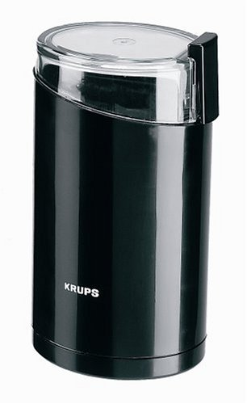

Why bother to find the freshest roasted beans if you are going to throw the flavor away at home? That’s what you do if you grind your beans well beforehand. It is tempting. You have the beans, and it only takes a few minutes to grind them into a nice, aromatic powder. But as the days pass, the cup’s flavor begins to fade.

The scientific explanation is oxidation, a natural process that begins as soon as you open each bag of roasted beans and expose them to the air. Ground beans offer exponentially more surface area than beans alone, so by grinding ahead of time, you accelerate **the oxidation of the entire bean.**

To maximize flavor in the cup, refrain from grinding until the last possible moment. Some coffee makers have built-in grinders, so as soon as the bean is ground, the brewing begins. If you have a stand-alone grinder, we suggest positioning it near your coffee maker. Prepare everything else ahead of time, and then, at the last moment, grind your beans and start brewing.

  
*Krups Blade Coffee Grinder*

### Tips for Griding Coffee at Home

1.  Keep the grinder clean.
2.  Never grind pre-flavored beans.
3.  Grind just prior to brewing.
4.  To achieve a more consistent grind, gently shake the apparatus while grinding.
5.  Use the correct size for your equipment. Burr grinders allow you to pre-select the proper grind.

With blade grinders timing is critical. Follow the guidelines below for the best results. Each blade grinder is different, so adjust accordingly.

-   Coarse Grind for French Press for 5-10 seconds.
-   Medium Grind for electric drip or most Pour-Over methods is 10-15 seconds.
-   Fine Grind for espresso machines grinds approximately 30 seconds.

Of course, in matters of taste, there is no one recipe for success. Experiment with your equipment, timing, and ingredients to satisfy you.

### Resources

[Best Coffee Grinders Under $100](/best-coffee-grinders-100/) – Reviews of 4 different affordable coffee grinders.

[Coffee Grind Chart](/coffee-grind-chart/) – Once you have your grinder, use this article to help you find the right grind size.
