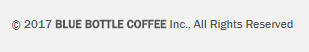

There are countless options when it comes to buying a coffee mail-order subscription. In this post, I will list a few coffee roasters that excel at roasting coffee and operating a subscription service. I will also provide some tips to help you find other roasters should the ones listed below not meet your needs.

A good coffee subscription needs to, first and foremost, be an excellent roaster. Then, the coffee roaster needs a secure web server with easy-to-configure subscription options. I want to be able to control the following options:

-   Roast level
-   Origins or blends
-   Grind size (if needed)
-   Quantity per shipment
-   Frequency of shipping
-   Duration of subscription

Surprisingly, not all quality coffee roasters have this figured out.

### Tips for Finding a Good Coffee Roaster Subscription Online

I’ve been using the following tips for years and never ordered a coffee I didn’t enjoy.

#### #1 Find the Best Coffee Roasters

When I want to try out new coffee roasters, I first visit [Coffee Review](https://www.coffeereview.com/). Unlike the coffee reviews you see on blogs, which tend to be overly kind, Coffee Review follows a strict coffee-tasting protocol. Coffee roasters submit their coffees, and the best ones get their reviews shared on the site. Coffee Review is an amazing resource.

When you get to Coffee Review, skim the reviews at first. You don’t want to fall in love with a coffee or roaster yet because there is a decent chance that, although they do an excellent job roasting coffee, they can’t run a secure website. Jot down a few roaster names before we go to the next step.

The only downside to this advice will be for readers outside the United States. Coffee Review mostly reviews coffee from roasters in North America. Another way to find excellent regional roasters is to search Google or Bing with the keyword Sprudge. Sprudge is a top resource for discovering new coffee roasters and cafes. *Example: “[sprudge Los Angeles](https://www.google.com/search?q=sprudge+los+angeles&rlz=1C1CHBF_enUS714US715&oq=sprudge+los+angeles&aqs=chrome..69i57j69i64.5365j0j7&sourceid=chrome&ie=UTF-8)“.*

#### #2 Is the Roaster’s Website Secure?

A secure website will only be accessible via HTTPS and have a lock.

Some websites have half their site unsecured and then process the order checkout on a secure server. I would advise against shopping with these roasters or any business that leaves half their site unsecured. Besides being sloppy, there are too many cases where your name and address are passed unsecured to the order processing system. Your credit card will be fine, but you shouldn’t be forced to enter any personal info, be it a name, address, or email, on an insecure website to complete an order.

There are also cases where the main site is secure, and the store section isn’t. As you navigate from the home page to checkout, keep your eye on the corner of your browser to confirm the server is still secure.

*This is unfortunate, as Temple is a great coffee roaster.* 

There is no reason for the customer not to have their entire shopping experience on a secure server today.

Another clue to look for on the website is whether the current year is displayed in the footer. That is an indicator that the site is more likely to be maintained. All software requires periodic updates. As a customer, you cannot know if they are maintaining their ordering system, but you can peek at the footer.

 

*I took these screenshots on June 21, 2017. One is updated, and one is a decade old. Which ordering system will you trust your credit card with more?*

#### #3 Review the Offerings and Shopping Cart Options

Our list is probably pretty small now, so picking a roaster for your coffee mail-order subscription will be easier. My advice now would be to search for what is most important to you. For me, it will be a combination of available varieties and prices. I prefer single-origin coffee over blends and lighter to medium roasts over dark.

Also, keep an eye out for the size. **Not every bag of coffee is 12 or 16 ounces.** At the time of this writing, Coava Coffee out of Portland sells bags of coffee for $15. But those bags are just 250 grams. That is less than 9 ounces! Meanwhile, Water Avenue Coffee is selling its 12-ounce Roaster Choice bags for $15 a few blocks away. Both are equally great roasters, but at the same price, I’ll take the extra 3 ounces of coffee with Water Avenue.

### Some Picks For Coffee Mail Order Subscriptions

If you don’t want to do the research described above, here are a few excellent coffee roasters. Your entire shopping experience will be secure.

#### #1 Blue Bottle Coffee – Oakland, CA

Blue Bottle Coffee has one of the best online coffee ordering systems, and its coffee is also outstanding. I had their Single Origin coffee subscription for a year, and I loved every bag I received. Inside the box, they will include a card about the coffee. Blue Bottle has created a 10-question quiz to help guide you to a coffee you like.

-   Blue Bottle Coffee

#### #2 Paradise Coffee Roasters – Ramsey, MN

I found Paradise Coffee several years ago when I was a more active home coffee roaster. I started buying their green coffee beans and then their roasts. For years, Paradise Coffee has received outstanding scores on Coffee Review for their single-origin offerings and some of their espresso blends. Paradise Coffee is also taking the lead on seeking specialty robusta coffee, which you will hear more about in the coming years.

-   [Paradise Coffee Roasters](https://paradiseroasters.com/)

#### #3 Atlas Coffee Club – Austin, TX

Atlas Coffee Club uses a travel theme to provide Single-origin coffees worldwide. Each coffee is shipped with a postcard from the region. Their subscription checkout allows you to customize the number of bags, how often you will receive the shipment, roast level preference, and grind size from a single easy-to-follow screen.

I had three of their coffees and enjoyed them all. The Colombian was great on the AeroPress, and the Ethiopian made an excellent cold brew.

-   [Atlas Coffee Club](https://atlascoffeeclub.com/)

#### #4 Bows & Arrows Coffee, Victoria BC

I wanted to include an option for our readers in Canada since shipping across borders can be expensive. When I visited Victoria in 2013, I was amazed by the excellent coffee from Bows & Arrows. Since then, I’ve had their coffee several times in cafes here in Seattle.

-   Bows & Arrows Coffee

### How Fresh is Mail Order Coffee?

All the roasters mentioned in this article have ordering systems that ensure the coffee is shipped fresh.

-   Blue Bottle Coffee – 24 hours maximum between roasting and shipping.
-   Paradise Coffee Roasters – Roasting 3 times per week. Orders shipped the same day.
-   Atlas Coffee Club – *“When you order it, we roast it and ship it!”*
-   Bows & Arrows Roasters – Roasting 3 times per week. Subscriptions were sent out on Monday.

### More Advice For Ordering Coffee Online

Some roasters will entice you to buy more coffee at once to save on shipping. Of course, this saves money on shipping. The downside is that the coffee will go stale before you can consume it all.

I advise buying lighter-roasted coffee on large orders, as it stays fresher longer than dark-roasted coffee. Also, buying large quantities is a good option for making cold brew, as older coffee tends to shine when cold brewed. Another idea is to combine orders from friends and family.

And I almost forgot, although all coffee roasters will grind coffee for you, I strongly advise getting your own grinder. The beans will stay fresh much longer.

### Resources

[Why HTTPS Matters](https://web.dev/articles/why-https-matters) – Google article making the case for all sites to be secure.

[Coffee Review](https://www.coffeereview.com/) – An outstanding resource for discovering coffee roasters.
