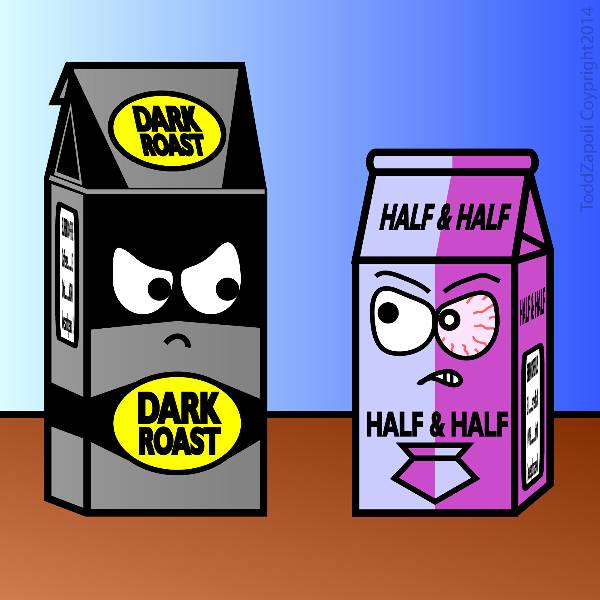
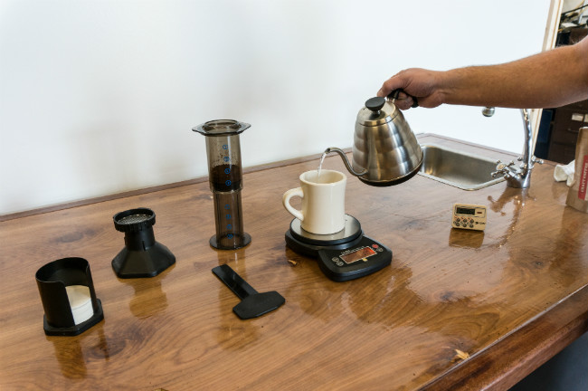

There was a time when I liked the taste of dark-roasted coffee, but over the years, that roasty, bold flavor that I used to enjoy began to taste bitter and ashy. Recently, I decided to revisit my old dark-roasted friend to see if we could improve our relationship.

I wanted to solve the riddle of why I used to like dark-roasted coffee but now consider it vile. At first, I thought it was because I had developed a better palate. Maybe my flavor expectations for coffee were now much higher? That would explain why I strongly prefer medium and light-roasted coffee, but not why I actually grew to dislike dark-roasted coffee.

It was an interesting journey, and I discovered a lot. Here are some of the tricks I learned for making better dark roast coffee.

### #1 Freshness is More Important

One of the most common questions asked about coffee is: How long will these beans stay fresh? You might hear a week, two weeks, or more. Coffees roasted dark enough to be labeled French Roast, Italian Roast, or Spanish Roast tend to go stale very rapidly—not weeks, but days.

When coffee is roasted well into and even beyond the second crack, the structure of the coffee bean is more fragile and porous. This greatly shortens the window of freshness. I talked with one Seattle roaster who told me a dark French roast coffee might start to taste flat in as little as four days—four days from roast. You can try to seal the coffee as best as you can to preserve and extend freshness, but a heavily roasted coffee will age faster.

If you enjoy coffee on the dark side, hack #1 is buying smaller volumes of coffee more frequently from a local roaster. If you buy from a grocery store, look for a recent roast date on the bag. Grocery stores will put the old bags in front of the fresh ones, so you may need to reach back for the fresh stuff. **Never buy a dark-roasted coffee without a roast date on the bag. Assume it is stale.** If you can’t find a super fresh dark roast at the grocery store, go for a medium-dark coffee. It will keep longer and still have enough body to please your dark side.

The time of my life when I most enjoyed dark roasted coffee was when I first started [home roasting](http://ineedcoffee.com/roasting-coffee-in-a-popcorn-popper/). I’d roast up something dark, let it sit for one day, and then start brewing with that coffee. After many years of home coffee roasting, I discovered that the darker roasted coffees tasted better on days 2-5. Then I noticed a quality drop-off. By day 8, if any coffee were left, I would throw it away. If you are a true dark roast coffee fan, I recommend exploring home coffee roasting. We have many [home coffee roasting articles](http://ineedcoffee.com/section/roasting-coffee/) on INeedCoffee to get you started. By roasting yourself, you can ensure that your coffee is always fresh and that you roast just enough for your needs, so there is little or no waste.

*From [Inanimate Objects Comics #44](http://ineedcoffee.com/inanimate-objects-comics-44/)*

### #2 Reduce Brewing Temperature

The standard advice regarding brewing temperatures is to brew just off a boil, usually between 195-205 F (or 90.5-96.1 C). This advice implies that your coffee will taste good as long as you are in the range. But there is more to the story. Lighter roasted coffees do well at the higher end of that range, and darker roasted coffees do better at the lower end.

I performed a few brewing tests using the same dark-roasted coffee brewed at 195°F and 205°F. At 205°F, the coffee had every attribute that I dislike about dark roasts: bitter and ashy. At 195°F, the coffee was smoother and **no longer bitter.**

At 195°F, coffee may taste slightly weaker. If you are using a 17-1 ratio (17 parts water to 1 part coffee), you can solve this problem by increasing the amount of coffee used in the brew. Experiment with a 16-1 or 15-1 ratio. Another path is to extend the brew time by 30-60 seconds. This works for brewing methods where you can control the brew time, such as a [French Press](http://ineedcoffee.com/press-pot-tutorial/), [Clever](http://ineedcoffee.com/clever-coffee-dripper-review/), or [Aeropress](http://ineedcoffee.com/upside-aeropress-coffee-brewing-tutorial/).

With the Bonavita, you can dial in the exact temperature you want to brew your coffee. This is a great tool for coffee and tea, which are even more temperature-sensitive.

### #3 Pour a Smaller Amount of Coffee

A few years ago, I noticed that I drink coffee at different speeds depending on how the coffee initially tastes. If the coffee is on the lighter roasted end with more delicate flavors, I drink it slower because I know as the coffee cools, it will continue to evolve and taste great. With the darker roasted coffees that push the body and chocolate notes, I will drink the coffee faster. The reason is that those flavor characteristics taste better when the coffee is hotter. As the coffee cools, those notes often get lost.

I learned that the quality declines if I spend too much time drinking heavily roasted coffee.

The solution here is to drink smaller amounts of coffee. Back when I was brewing 16-oz mugs of dark-roasted coffee, I would rarely be able to finish the last few ounces as the quality was nowhere near as good as the first few ounces. If you are brewing one cup at a time, brew less. If you are brewing larger amounts and storing coffee in a carafe, pour less.

### #4 Air Roasters vs Drum Roasters

This next idea is debatable, but I believe it has merit. **Roasting dark coffee on a fluid bed air roaster will produce a cleaner, less burnt taste than roasting it on a drum roaster.** When coffee roasts, chaff separates from the bean. The chaff is blown out of the roasting chamber in an air roaster. With a rotating drum roaster, some chaff remains on the bean. This is not an issue at a lighter roast, but with darker roasts, the chaff can impart a burnt flavor onto the beans.

Reduced airflow during roasting may be a cause for some of the bitter notes in darker roasted coffee. Here is a comment by *donlp37* regarding air roasting on CoffeeForums:

> Not only is it (air roasting) a more even roast, but I also know that much less smoke is circulated around the roasting beans. This way darker roasts can be achieved without a real charcoal or overly smokey taste.

I’m not a professional roaster but have been home roasting coffee since 1998. The best dark roast coffees I have had all came from air roasters, be it a popcorn popper or the now-gone Hearthware line. The drum roasters I used did an outstanding job with medium and light roasts, but were uneven with darker coffee.

### Putting it All Together

To hack the best dark roast coffee, I will use fresh coffee beans that are just a few days off roast. I will only buy or roast enough beans that I plan on consuming that week. I will grind my coffee just before brewing. I will use a lower brewing temperature and brew/pour just enough for a small or medium-sized mug. If I want more coffee, I will brew (or pour) again. If I can’t home roast, I will find a local roaster and time my visits for optimal freshness.

So far, I haven’t discussed the brewing method. I could do a bunch of tests to determine which is best, but I doubt there will be consensus among all coffee drinkers. For me, the best option is going to be the AeroPress. The AeroPress design allows it to brew great coffee at lower temperatures, as covered in The Upside Down AeroPress Coffee Brewing Tutorial. Another excellent brewing option would be cold-brew [coffee](http://ineedcoffee.com/cold-brew-coffee-is-not-rocket-science/).

Although I don’t consider myself a fan of dark roast coffee, I now know a few tricks for when I want to reach for something darker.

*Making coffee with the AeroPress.*  

### Resources

[Coffee Brewing Guide](http://ineedcoffee.com/coffee-brewing-guide/) – Our collection of coffee brewing tutorials.

[How to Store Coffee Beans (Tips and Recommendations)](http://ineedcoffee.com/how-to-store-coffee-beans-tips-and-recommendations/) – Our updated article on storing coffee beans.

[Roasting Coffee in a Popcorn Popper](http://ineedcoffee.com/roasting-coffee-in-a-popcorn-popper/)—An older popcorn popper is a good way to start home coffee roasting.

*Brewing photos by Joseph Robertson of Extracted Magazine, a digital coffee magazine published for iOS and Android.  
*