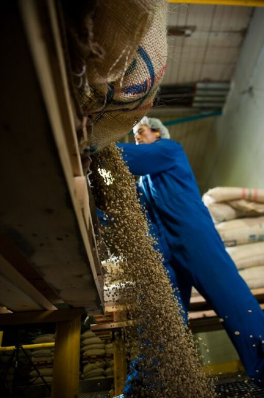
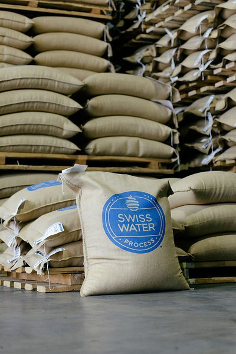
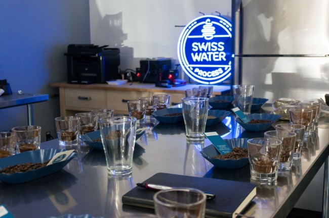
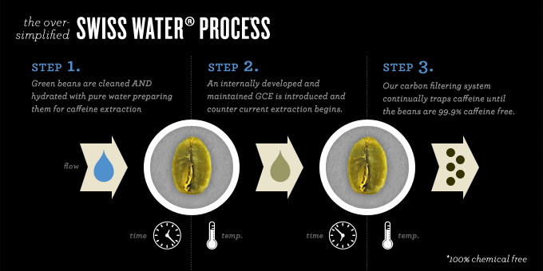
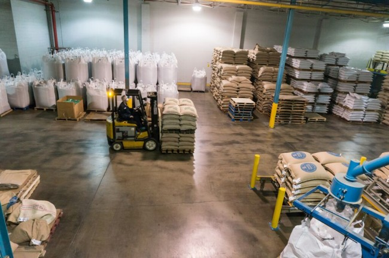
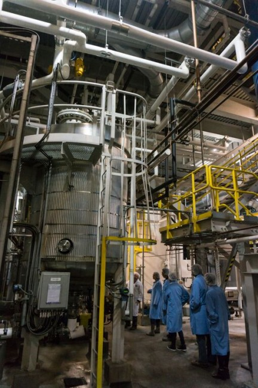
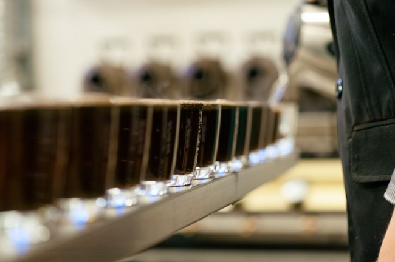
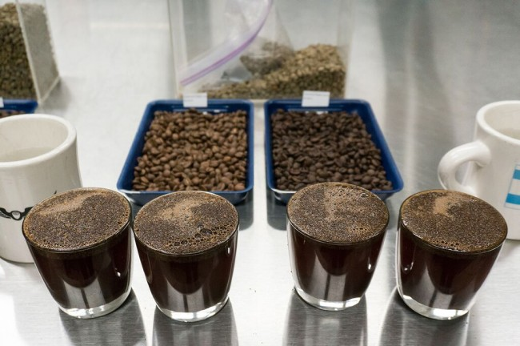

Today, I want to break some walls down and talk about ‘Decaf Coffee!’

“GASP!”

If you are like most people, you probably have a negative view of Decaf. It does, after all, carry an extensive stigma.

Upon reading the first sentence, did you scoff, raise an eyebrow in disbelief or astonishment, or think/mutter anything such as “oh heck no, who would want decaf coffee?” or “What’s the point in that?”

All I ask is that you take a little journey with me, and explore something I am certain will be fascinating and new to you.

You see, I have had a number of ‘decaf’ coffees, which I have found to be quite delicious – coffees I have enjoyed immensely. There have also been numerous times I have tasted a decaf coffee alongside a regular coffee and had no clue I was tasting decaf.

So to me, that begged the question – why is there so much negativity towards decaf? If you take a step back you can see that the stigma against decaf goes far beyond “it’s got no caffeine so what’s the point.”

First, we need to take a look back – a brief history of the decaffeination of coffee.

### History of Decaf Coffee

The origin of decaf seems like it should have a crazy story to go along with it – the story which is told is that decaf was ‘accidentally’ discovered by a German coffee merchant named Ludwig Roselius, when a shipment of green coffee got waterlogged and was ruined – upon receiving the coffee, their researchers determined that caffeine had been removed with minimal effect to the taste.

I would love to tell a more entertaining origin story, but sometimes the biggest discoveries are accidents turned into an opportunity.

In any case, someone in the late 1800s or early 1900s determined that caffeine could be removed intentionally, and thus began a long industry of brutalizing coffee.

I say ‘brutalizing’ because up until recently, the process was either really messy, toxic, and/or simply resulted in otherwise destroying the natural flavor in the coffee (which admittedly doesn’t matter much if you start with poor quality green coffee that has little flavor to begin with).

The original recorded method for decaf, invented by Ludwig Roselius in 1905, used benzene (a hydrocarbon that can be toxic) to extract caffeine from pre-moistened green coffee. This process has not been used for a long time.

### Decaf Methods

Today, there are three overall main methods.

A “direct solvent method” can be used, which will employ either Methylene Chloride or Ethyl Acetate. These chemicals are essentially circulated through the green coffee, in order to dissolve and then extract the caffeine.

A second solvent method uses “supercritical carbon dioxide” at extremely high pressures to extract the caffeine.

I can’t speak more specifically to those methods – having researched decaffeinated coffee, I discovered upon receiving a tour of the Swiss Water Process plant that much of the knowledge available about the process of removing caffeine from coffee is wrong. So I am reticent to make claims about processes to which I have not been directly educated.

The third method is what is employed by the Swiss Water Process, and another similar company called Mountain Water. This involves utilizing primarily water, green coffee solids, and carbon filters, to extract the caffeine naturally from the seeds into the liquid (more on this in a moment), and then filter it out of the liquid. Due to the lack of chemical use, this has long been a favored method.

### Decaf Stigma

Now you have a very basic overview of the methods – let’s address the stigma associated with decaf coffee.

If you look at the evolution of the coffee industry as a whole, this all starts to make a lot more sense. While coffee has long been consumed by cultures around the world, it wasn’t until the past 10 years or so that quality has really started to become a topic of interest.

Take a step back 50 years, and you will see that mass-produced coffee in cans was all the rage.

Take a step back even just 20 years, and you can start to see the surge in companies like Starbucks, which really push the cafe culture and consumption of espresso-based coffee.

The reason for this surge in quality interest over the past few years has really been a shift in two areas – a desire for higher quality in society in general, but more importantly, a greater understanding of what goes into growing and processing coffee. Many of the changes in the areas of coffee farming have really started to come online in the past 5-8 years (coffee plants take 2-3 years from seed to maturity, so you can see how changes at the farm level take a while to percolate…so to speak).

Back to decaf.

If you consider that the quality of coffee, up until 10-15 years ago, was just “fine” – and then you look at the violent and often inefficient processes for removing caffeine from coffee – it is easy to see how most decaf probably was quite undesirable, for a great many years. Not only did you not get caffeine (which automatically is a deterrent to some people), but the coffee did not taste good (and certainly didn’t taste like the non-decaffeinated versions).

Terrible!

### Swiss Water Process

Swiss Water Process was originally developed in 1933/34, as a way to remove caffeine from coffee without using chemicals. For a very long time, they remained the only company that was removing caffeine without the use of chemicals.

Unfortunately, for these many years, their process also wasn’t as efficient as it could be. While on my tour of the facility, I learned that it wasn’t all that long ago that their process would often result in inconsistent batches and coffee that was extremely difficult to roast. Even though the process uses only water, green coffee, and carbon filters – it is still a rather fascinatingly complex process that depends on some unique variables.

In 2007 – right around the surge in interest for higher quality coffee – they sought to redevelop their processes, and today they produce 99.9% caffeine-free coffee through a process that is organic and kosher certified. On top of all that, the resulting coffee without caffeine when roasted is nearly indistinguishable from the before product (a claim I am happy to attest to through experience).

They quite frankly have solved the decaf conundrum!

Let’s take a look at the basics of the process, and then we will dig in deeper for those of you interested in a bit more of the science.

The Swiss Water Process uses three main elements (alongside the green coffee that is going to have its caffeine extracted) – Water, Green Coffee Extract (GCE), and Carbon in the form of activated charcoal which has been designed specifically to catch only the caffeine molecule.

The green coffee is first polished in a big spinning drum – this removes the silverskin from the seed and any other foreign matter that might get in the way.

It is then soaked in water – fun fact: green coffee beans typically have been dried down to about 9%-13% moisture level. In order to make the process more efficient, the green coffee needs a higher moisture level, thus it is soaked and the seeds end up twice their size (think about a sponge…a dry sponge doesn’t absorb water as readily, but a damp sponge will soak up completely).

These seeds are then immersed in Green Coffee Extract (GCE), which contains no caffeine. The chemical makeup of the GCE and the green coffee seeds are so close, that the only difference is that caffeine – nature desires balance, so through osmosis some of the caffeine naturally moves from the seeds into the GCE.

Once saturated with caffeine, this green coffee extract is passed through carbon filters – which Swiss Water has designed to specifically catch the caffeine molecule. The completely caffeine-free green coffee extract comes out the other end and is then passed back through.

This process of the GCE flowing through the green coffee, naturally extracting the caffeine, and filtering it out continues for roughly 10 hours per batch of coffee.

Once the green coffee has had 99.9% of its caffeine removed, it is then transported to a special dryer, where all that extra moisture is removed such that the green coffee is returned to its original moisture level.

What you end up with is green coffee with the exact same chemical makeup, minus the caffeine.

Check out this video for an overview of the process.

*[Swiss Water® Process animation video](https://www.youtube.com/watch?v=tAEQ4G-1jTQ&feature=youtu.be&ab_channel=SwissWaterDecaf)*

The entire process is fascinatingly scientific – everything hinges on how the water balance in the coffee is handled. Our tour guide – the man in charge of establishing/managing all of their critical systems – talked mostly of ‘Water Activity Level,’ which relates to humidity. ‘Water activity level’ above a certain point means moisture will be coming out of the green coffee seeds too fast, it will essentially sit on the surface, and that will result in mold and other undesirable elements. ‘Water Activity Level’ below a certain point means the coffee is going to dry out very fast. Too much variability in this critical element means that they will lack consistency during the extraction process – in fact, green beans that have a water activity level that is too high end up with their internal structure completely distorted after the process. What was described to us was essentially a migration of moisture in the bean towards the center and solid mass towards the exterior, creating a hollow seed that does not roast properly in the slightest.

So it comes down to a matter of stability within the seed itself. Think of the water and solids within the green coffee seeds as their own ecosystem…healthy, delicious coffee has a balanced internal ecosystem – and coffee with a balanced internal ecosystem can have its caffeine removed efficiently and with minimal effect on the subtleties of that coffee’s flavor characteristics.

A fascinating point of interest is the information that they have learned and developed in terms of the best temperature/humidity for green coffee stability, which suggests an answer as to why Seattle turned into such a hotbed of growth in the coffee industry. The ideal conditions – in terms of temperature and humidity – for green coffee to remain at its most stable, happen to be the general climate conditions that are prevalent in Seattle and much of the Pacific Northwest. This is an incredibly fascinating observation and one I intend to explore more in the future. Suffice to say, for a place like Phoenix, Arizona, which is hot and dry, in order to store green coffee in a stable state, you would have to have a special climate-controlled storehouse.

Back to the Swiss Water Process for hacking perfect Decaf:

The important thing to note about everything that happens during their process is that it is designed to leave the components of the seed, which are responsible for the flavor elements, essentially untouched.

Green Coffee Extract (GCE) contains all water-soluble components of green coffee, which are common among all coffees. This means the GCE does NOT contain components of the green coffee that are responsible for the flavor characteristics – nor are those components water-soluble in the green coffee state (so they don’t factor into the chemical balance which results in caffeine being transferred by osmosis).

In other words, the GCE has no flavor, and no flavor is taken out of the green coffee during the process.

This doesn’t necessarily mean the resulting flavor is completely untouched, as the coffee is going through an extensive process, and soluble components are being moved around – some of them ending up on the surface of the seed, where originally they were within (this is actually what results in a slight color change of the seeds after processing, and what results in a darker looking roasted seed).

Variability in temperature throughout the process is also a concern – one which the team at Swiss Water has worked hard to address. Reductions in temperature variability mean they are able to process at a lower temperature, which results in less effect on the flavor components of the green coffee. They are constantly in the process of reducing variability at every step, giving them greater control over the exacting scientific process of removing a single type of molecule from the coffee.

As a side note, I am curious if some of the flavor changes in the coffee after the process are due to the seeds behaving differently in the roast. It is certainly apparent that the green coffee has a bit of a different behavior when roasting, and afterward.

### The Verdict

I’ve tasted a number of before and after coffees that have gone through this process. In all cases, one can detect a slight difference – but in most of these cases the difference is so slight that I couldn’t put a finger on what the difference was, and often that difference was elusive (such that I would go back and forth tasting before/after in cupping sips, and the ‘difference’ would fade, leaving me two different cups that tasted identical). One hypothesis is that removing the caffeine results in less discernible bitterness, as caffeine has a characteristic of bitterness – it’s a tough word to use because none of the cups we tasted were ‘bitter’ in the strictest sense of the word, but the versions without caffeine appear to be a bit smoother, or have a bit less on the trailing end of the flavor.

It is easy to say though, that was a blind tasting done with several coffees – some of them regular some decaf – I could not tell you which are regular and which are without caffeine.

A note of interest if you are buying decaffeinated coffee: it appears that once roasted, the coffee without caffeine breaks down faster than coffee that has not gone through the process. That is, you may consider being sure you use your bag of coffee within a couple of weeks instead of a few, and make sure you only grind just before you brew. I haven’t been able to confirm this, and plan to do some testing to figure out if this may be true or perhaps just a fluke.

The conclusion is simply this.

Forget about what you think you know about Decaf – these people have completely hacked Decaf coffee, down to specific molecule manipulation. Quite simply, if you love the taste of coffee, but for whatever reason need or want to reduce or remove caffeine from your daily consumption, then look no further than coffee made with Swiss Water Process.

*This article first appeared in [Extracted Magazine](https://www.extractedmagazine.com/).*

### References

[How is caffeine removed to produce decaffeinated coffee?](https://www.scientificamerican.com/article/how-is-caffeine-removed-t/) – Article from Scientific American.

[Decaf Coffee Methods](/decaf-coffee-methods/) – INeedCoffee article by Stephanie Spencer
