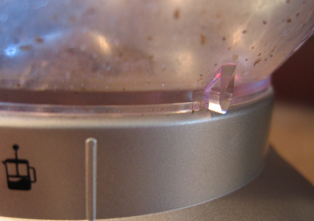
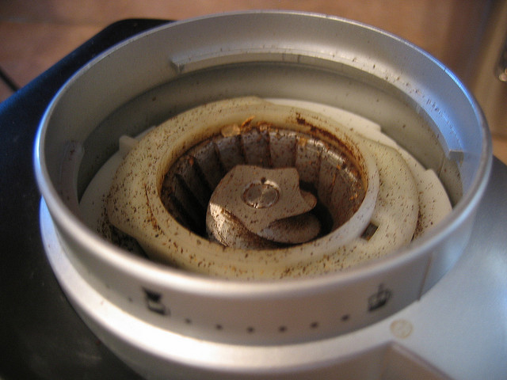
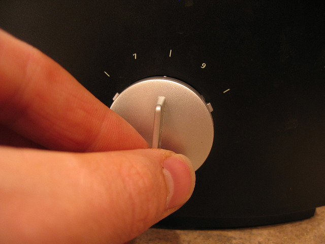
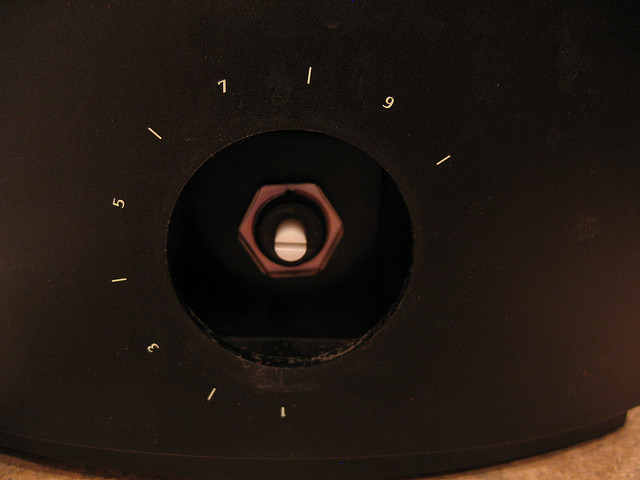
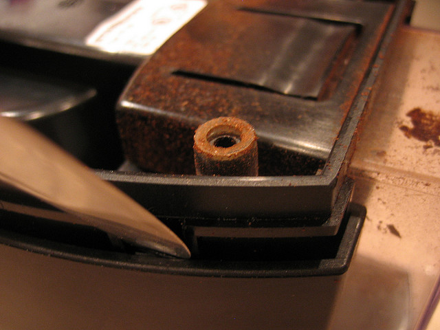
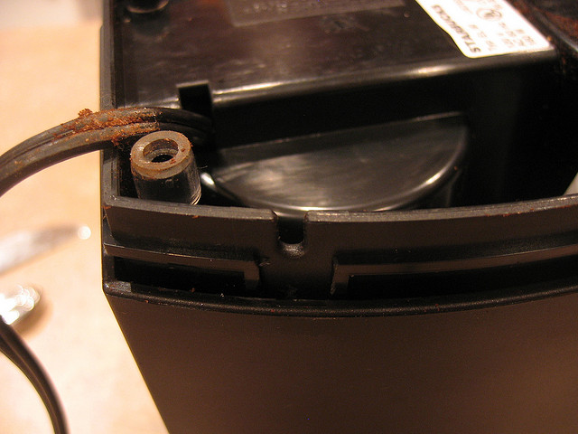
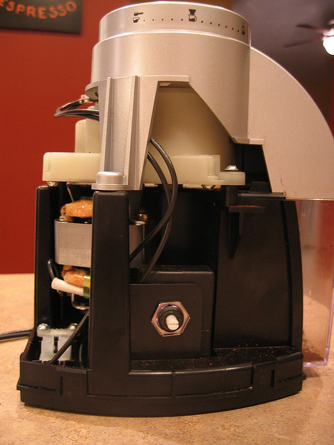
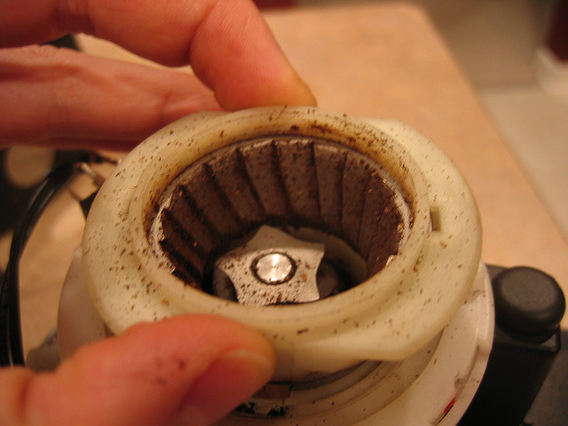
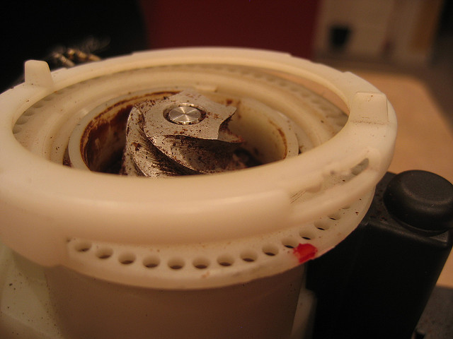

My first espresso machine was the Starbucks Barista espresso machine. It uses a pressurized portafilter which allows you to use a coarser espresso grind. For years, I used the Starbucks Barista Grinder with this machine and it worked wonderfully. Eventually the Barista espresso machine gave way to the [Rancilio Silvia](/rancilio-silvia-espresso-machine-tips/). While my grinder was able to deliver decent espresso, I never could reliably produce a great shot. Too often, the shots were pulling way too fast.

What I needed was a finer grind, but my grinder couldn’t deliver. Or could it? It turns out that this grinder was adjusted to work optimally with the Starbucks Barista machine at its finest setting. With a little work, you can adjust yours to grind coffee fine enough to yield a properly pulled espresso in the Rancilio Silvia. The adjustments I make below are specific to the Rancilio Silvia, but you should be able to get a setting that works for your espresso machine using the same technique.

Here are the steps to hack the Starbucks Barista Grinder.

### #1 Unplug the grinder

The insides of the grinder expose some electrical components. We’ll play it safe and make sure it gets no power.

### #2 Remove the Hopper

Gently twist the hopper counter-clockwise until it won’t move any further. Your arrow on the hopper should be past the line on the gray sleeve that displays the grind settings as shown in the photo. At this point, the hopper should pull straight up.

  
*Twist hopper counter-clockwise*

  
*Pull hopper straight up*

### #3 Remove the Dial

Grab the gray grind dial firmly and pull straight out away from the grinder body until it pulls off. This is similar to pulling off an oven dial.

  
*Grab grind dial firmly.*

  
*Pull off the grind dial.*

### #4 Remove the black grinder housing

Turn the grinder upside down. On the bottom, you will see 4 notches or tabs close to each corner. Insert one or two flathead screwdrivers or butter knives into a couple of the tabs. Gently lever the knives outward from the grinder in rotation on each of the notches.

Work back and forth gently until you can tell that the housing body has come away. If you have ever changed a bicycle tire with tire levers, this process is a bit similar. Do this for each of the notches. Now you can turn the grinder right side up and slide off the housing.

  
*Turn the grinder upside down.*

  
*Remove the black grinder housing.*

### #5 Remove the gray housing

This will pull straight off.

  
*Remove the gray housing*

### #6 Remove the burr assembly

This pulls straight off.

  
*Remove the burr assembly.*

### #7 Remove the wheel with tabs

I don’t know what else to call this, but it is that piece of plastic just below the burr assembly. It has 4 locations where there are notches that can be levered with the butter knives/screwdrivers. Before you begin removing these, mark your existing settings with a marker in case you need to reset things.

Gently use the knives to remove each tab. Again be patient to gently loosen each notch. You will hear a snap or click when this happens. At two of the notches, there are little posts that stick into the holes of the selection wheel below.

Once we have this removed, we will rotate it counterclockwise a few holes at a time and snap it back into place until our grind is the way we want it. I found that moving it over three holes from its default setting did the trick.

  
*Remove the wheel with tabs.*

### #8 Adjust and Test

You can put the burr assembly and hopper back on without reassembling everything in order to test your grind out. Repeat step 7 until you get it right. Then, re-assemble the grinder in reverse order based on the way you disassembled it.

### Resources

[Rancilio Silvia Espresso Machine Tips](/rancilio-silvia-espresso-machine-tips/) – Ideas on improving your espresso shots.

[Coffee Grind Chart](/coffee-grind-chart/) – A visual chart to help dial in the espresso grind.
