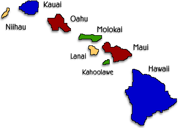
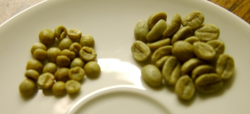
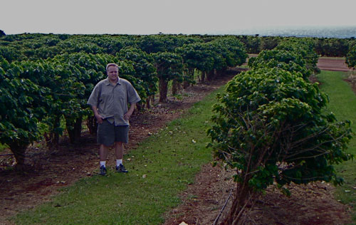

The Hawaiian islands conjure up visions of paradise. But that is not all. The coffee lover also knows that coffee from Hawaii is known for its high praise, accompanied by an equally high price. Hawaiian coffees are the only coffees grown in the United States (sorry, Puerto Rico is a territory). Although many think of Hawaiian Kona Coffee, Royal Kona Coffee, or Hawaiian Gold Kona Coffee as being the best or even the only coffee Hawaii has to offer, many do not realize that the islands of Hawaii have a lot more to offer than just pure Kona Coffee.

We will go into a brief history of how coffee got to the Hawaiian Isles, as well as the geographic layout of the islands and the varieties that are grown on each. As we get into the different flavors they bring to the cup, you will see that Hawaiian coffee beans are as varied as the islands and peoples themselves. This article will discuss Maui coffee, Kauai coffee, Molokai coffee, and Oahu coffee. The term Kona Coffee encompasses so much that we will dedicate an entire article just to Kona Coffee Beans and The Big Island of Hawaii at a later date.

### History

Coffee Trees arrived in Hawaii in the early 1800s through various means. One way was in 1825. The British ship H.M.S. Blonde brought coffee trees from Brazil. These trees were planted in Oahu and then spread to other islands. The first actual coffee plantation was on the North Shore of Kauai. As the flourishing coffee plantations of the 19th century in Hawaii gave way to the 20th century, the future of coffee in Hawaii was uncertain. Sugar tariffs were lifted on the mainland in 1900. Quickly, coffee plantations were replaced with sugar cane fields.

But in the 1960s and 1970s, coffee once again became a delicacy, and people were willing to pay more for unique coffees. As a result, the coffee plantations saw their second wind. After 100 years, the life of coffee in Hawaii has come full circle. There are now upwards of 7,000 acres producing about 7 million pounds of green coffee each year. Hawaiian Isle coffee is still one of the most expensive, relatively high-volume coffees consumed in the world, along with the likes of Jamaican Blue Mountain Coffee (JMB).

### Geography

First, here is a quick primer on the different islands of Hawaii. There are eight islands – Hawaii (called The Big Island), Kahoolawe, Lanai, Maui, Molokai, Oahu, Kauai, and Niihau. Of these, coffee (always Arabica) is only grown on five of the eight islands. Here is a map as well as a breakdown of the islands, regions, varieties, and some notes on each:

  
*Hawaii Map*

### Maui

Growing Area(s): Ka’anapali, Haleakala, Hana  
Varieties: Mokka, Yellow Caturra, Red Catuai, and Typica  
Price Range for Roasted: $14-$24/lb  
Price Range for Green: $13-$23/lb

-   The Mokka has hints of nuts and chocolate, medium acidity, medium body, and a long finish.
-   The Yellow Caturra hits you with spice, cinnamon, licorice, and allspice. It is low acid yet full-bodied, with a dry finish.
-   The Red Catuai has hints of spice, medium acidity, full body, and a wine-like finish.
-   The Typica is nutty, much like a Kona, and has medium to high acidity, medium body, and a lingering finish.

  
*The very small un-roasted Maui Mokka bean (left) compared to the Galapagos bean (right).*

### Kauai

Growing Area(s): Kalaheo  
Varieties: Yellow Catuai, Red Catuai, Typica, Mundo Novo, San Ramon, Ikatu  
Price Range for Roasted: $12-$21/lb  
Price Range for Green: $6-$8/lb

-   There are some smaller farms, but the main coffee farm on Kauai is called the Kauai Coffee Company.
-   The Yellow Catuai and Typica are sweet, nutty, low acid, full-bodied, with a medium finish.
-   The Red Catuai has hints of cardamom and spice, has medium acidity, and is a mild to medium-bodied coffee, with a sweet rounded finish.
-   The Mundo Novo, San Ramon, and Ikatu varieties have not been produced for a while, but may in the future.

### Molokai

Growing Area(s): Kualapuu  
Varieties: Red Catuai  
Price Range for Roasted: $24-$28  
Price Range for Green: Unknown (hard to find)

-   Molokai Coffee Company in Kualapuu, and The Coffees of Hawaii are the names here. There is a Co-Op system of smaller farmers, producing organic coffee in 2008.
-   Molokai coffee is pretty hard to find in most places.
-   Both the wet-processed Malulani Estate coffee and the dry-processed Molokai Muleskinner can have a floral aroma, berry and caramel notes, are mildly acidic, rich in body, and have a long-lasting chocolatey finish. Interesting herbal notes can also be noted from time to time.

### Oahu

Growing Area(s): North Shore between Wahiawa and Waialua  
Species: Typica  
Price Range for Roasted: $17-$21  
Price Range for Green: $12-$14 (hard to find)

-   Dole is one name here.
-   Oahu coffee is also hard to find.
-   Generally labeled as Waialua coffee, it is low in acidity, medium in body, and has a dry, fruity finish.

### Hawaii (Big Island)

Growing Area(s): Kona, Kau, Puna, Hamakua  
Species: Typica, Caturra, Moka  
Price Range for Roasted: $15-$40  
Price Range for Green: $10-$25

Kona is the Big Kahuna here. We will dedicate another article to this since it covers the most territory.

  
*Kauai Coffee Company Plantation*

### Conclusion

At least now you have a better idea of the flavors you can get from Hawaiian coffee and approximate costs and you appreciate how fortunate we are to have the coffees coming out of Hawaii, considering that it was near extinction not long ago. And if you are looking to buy Fair Trade coffee or Organic coffee, Hawaiian coffee is a good choice. While not all are certified organic, many are going in that direction or are organic by default. And we know that the farmers are generally paid well, so Fair Trade certification is not really too much of a concern in this situation.

If you want roasted coffee, a quick Google search will turn up an endless supply of companies willing to charge you as much as $40 for a pound of Hawaiian Isle Coffee (and it may be worth it). However, if you want to save some serious money by home roasting, there is a great opportunity to buy raw, unroasted green coffee beans at a much-reduced price and roast them yourself. It will be fresher and allow you to try a wider variety without dipping into your kid’s college fund. Hawaiian green coffee is readily available on the internet via a quick Google search.

### Resources

[Everything You Wanted to Know About Coffee From Hawaii](/everything-you-wanted-to-know-about-coffee-from-hawaii/) – Review of *The Hawai’i Coffee Book* by Shawn Steiman.

[Kona Coffee Confusion](/kona-coffee-confusion/) – An article covering Kona Blends, Kona Style, and 100% Kona labeling.
