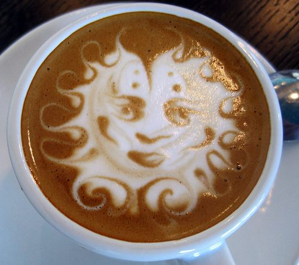

How can you know,  
unless you are addicted so.  
The smooth, velvet swish  
of liquid, brown bliss,  
coating all inner pores  
with a soothing balm of  
creamy, frothy joy.  
Ah, to savor the flavor  
of mellow, ground beans.  
There’s not enough time,  
it seems.

  
*Heavenly Coffee*

From the chapbook Sweet Aromas, Holland Writing and Publishing, (c) 1997
