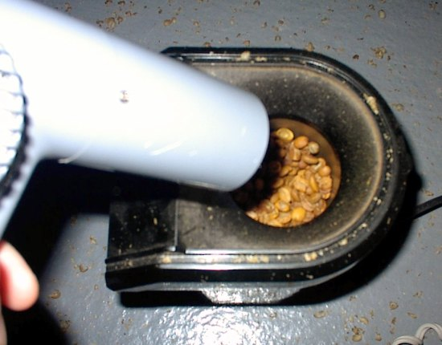

To roast your own coffee beans at home is quite simple. It is so simple that I wish I had learned it many years ago. All you have to do is measure out some green beans, throw them into a popcorn popper, stir a little, and wait. After a few minutes, you have the freshest coffee of your life. If you would like to learn more about home roasting read [Roasting Coffee in a Popcorn Popper](/roasting-coffee-in-a-popcorn-popper/). Roasting from a popcorn popper is done outside, and provided you have good weather, it isn’t a challenge.

### Roasting In a Winter Climate

There is an obstacle to home roasting in the winter. The cold wind rushing into your popper cools the beans while they roast. The beans take forever to roast, and the batch usually doesn’t roast evenly. Old Man Winter doesn’t want you to roast coffee outside. You could attempt to bring the popper inside and try and route the smoke outside. My cousin tried this at the University of Cincinnati. After the fire alarm cleared the dormitory, he assured the Fire Chief he would no longer roast coffee indoors.

I first learned to roast while living in Florida. I never really paid attention to home roasters when they discussed roasting in the winter. After all, I was living in warm, sunny weather year-round. Little did I know I’d be back north a year later.

  
*Patio Roasting Setup*

### Lesson #1 – The Hair Drier

Could I beat the cold season and continue roasting all winter? I decided to innovate. That was my first mistake. My first idea was to use a hair dryer to heat the top of the popper while roasting. It seemed like a sensible idea at the time. However, all this did was blow chaff and many beans out of the popper.

  
*Lesson #1 – Don’t use a hair dryer for home roasting*

### Lesson #2 – The Space Heater

The first idea was shaky at best, but my next idea had to be a stroke of brilliance. If I aimed a space heater at the roaster, it would simulate a warm area, and the beans would roast just as if I were back in Florida on a summer day. Carefully, I set up the space heater and started roasting. After a minute or so, the space heater shuts off. I reset the power strip and started roasting again. Another minute went by before the power strip shut down again.

At this point, I should have realized that I was witnessing some electrical problem, but I continued roasting with the heater going full blast. Then came complete darkness and silence. The power for the entire house failed. Using the space heater outside, the fuse box was blown. Sitting in complete darkness, I learned lesson #2.

  
*Lesson #2 – Don’t use a space heater outside to roast coffee.*

  
*This should never be a step in home roasting coffee.*

### Now What?

In *Home Alone*, Kevin successfully uses a winter climate to defeat the bad guys without parental guidance. I couldn’t even roast coffee, let alone fight off bad guys. Without the help of an experienced winter home roaster, I’ll be putting away my popper until next spring. Now I’m left with two choices on what to do for good coffee this winter:

1.  Buy a Dedicated Coffee Roaster – This will cost more than a popcorn popper, but I figure it’ll pay for itself by springtime with my coffee.
2.  Buy coffee on the Internet – Take the opportunity to try different roasters nationwide.

It’s more than likely that I’ll do both.

UPDATE: Tim Culver writes:

> Great article, Michael. I disagree with your “Lesson #1 – Don’t use a hair dryer for home roasting” though. I have lately found that a hair dryer helps. I set it on low aim it at the intakes at the bottom of my Proctor-Silex Popcorn Pumper. This is the only way I can get to 2nd crack (here in the frozen tundra of North Carolina).

UPDATE 2001: In the article [Winter Home Roasting](/cold-weather-coffee-roasting/), Ryan Jacobs figured out that using a cardboard box could trap and recycle heat effectively for cold weather roasting.

UPDATE 2004: Jim Liedeka wrote the article [Roasting with a Heat Gun: A Top-Down Approach](/roasting-coffee-with-a-heat-gun-a-top-down-approach/). I consider this a hair dryer on steroids. By the way, don’t ever use a heat gun to dry your hair.
