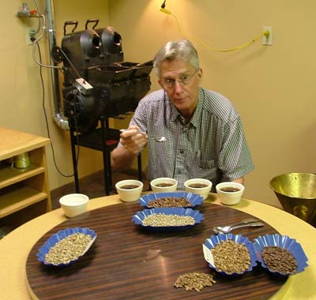

Thirty years ago, when I first watched the transformation of the little hard odorless green coffee beans go through the metamorphous of becoming that full rich dark brown aromatic delight, I was amazed. I became instantly “hooked” on roasting my own coffee and searching for an even better cup. I wasn’t alone back then when I began my coffee journey, which lead to farms, mills, and a coffee roasting business.

We, the pioneers of the Specialty Coffee Industry, were all frantically looking for better beans and ways to roast them even better. We would call each other and tell of a Sumatra that was out of this world. Only 20 bags left so hurry and get some.

  
*Jim Cupping Coffee*

Fast forward 25 years: Most of the small roasters of the past have sold their businesses, and the larger companies who are more concerned with the bottom line than the quality of the cup are the “Specialty Coffee” suppliers today. The very term; “Specialty Coffee” no longer fits. Every little gas station, convenience store, and many other un-coffee places tout “GOURMET COFFEE”. Supermarkets have 40 feet of “Specialty Coffee” and only 8 feet of R&G (that’s what we call the roast, ground, and canned stuff). The whole bean bagged and bulk coffee is now the standard. The coffee in the United States is much better than it was 30 years ago but it is in the downward cycle as the little guys have either gotten out or been pushed out by the “Big Boys”.

This opens up a market for the little guys once again to rise on the virtue of their commitment to quality and freshness. I have no doubt that this will happen and many little companies will spring up and, once again make a difference in the quality of the coffee out there.

The home roasting phenomenon is a mixture of a few things. First, people have tasted the nectar and know how good it can be. They cannot find the quality and freshness in the supermarket and Starbucks has pushed the little guy off the corner so you can’t run down to your local coffee shop and buy a pound of freshly roasted beans. The word is out and continues to reach people through articles like this one, that roasting your own coffee is as easy, fun, economical, and produces a cup as you have never tasted. Home hobbies are HOT. Saving money is HOT, and increasingly important. Freshly roasted coffee is becoming extinct. People demand good coffee. There are a number of small home roasting machines available but your oven will work just fine. Raw (green) coffee is readily available through a number of websites.

A leading homebrew (beer) magazine recently quoted in an article on home roasting that roasting your own coffee beans is the fastest growing hobby in the USA today. Nationally syndicated author Mary Hunt of cheapskate.com writes often about roasting your own coffee as a way to save money while simultaneously delivering the best cup possible. TIME magazine published an article on the home roasting phenomenon in Feb, 2005. Slowly but surely, people are catching on.

I have tried to promote home roasting for 25 years. It has just now taken off to proportions I could not foresee just a couple of years ago. The number of home roasters is still too small to put on paper, maybe 1/100th of 1 percent of coffee drinkers but I know it is multiplying rapidly and will become a household word in a short time. Thirty years ago when I was bringing people their first cup of great coffee the excitement was high. People couldn’t wait to tell their friends about this new coffee called “Gourmet Coffee”. Our business spiked tremendously at Christmas because everyone experiencing great coffee wanted to share it with his or her friends. Home roasting is just starting to go through the same phase where those who have discovered it are excited and telling and showing their friends, and the cycle continues.

Just like in the boom of the Specialty Coffee industry 25 years ago, there are pitfalls. There are many non-coffee experts looking to make a fast buck by simply buying a big bag of coffee, cutting it into small bags of coffee, and up charging. Buying, cup testing, and knowing coffee are prerequisites to being in the business of selling raw green coffee to the home roaster. You have to find a reliable source who knows coffee if you expect to get good beans. Believe me, in my 30 years in the industry I have seen some raunchy beans and some of them look really good. No one throws these beans away, they just pass them along. Find a good reliable source who knows how to cup coffee and has a good, long-standing reputation before buying your beans.

Become part of this rapidly expanding and exciting new phenomenon and start roasting your own coffee beans. You’ll be the envy of the coffee crown in your area.
