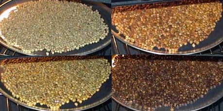

There are many ways to roast coffee at home. One of the most basic and least expensive methods is the oven. Yes, you can easily roast your own coffee at home using an oven. It doesn’t make the brightest, most flavorful coffee, but it works. You may be impressed with the outcome if you’ve never home-roasted coffee.

What supplies will you need?

1.  A decent oven capable of reaching higher temperatures (more details below).
2.  A baking tray or cookie sheet. The best kind will have small perforations, like those used for cooking pizza.
3.  Timer or stopwatch.
4.  Oven mitt. Due to the high temperatures, an Ove Glove is ideal.
5.  Wooden spatula.
6.  Metal colander(s) for cooling.
7.  Water bottle with mist spray – if you live in a hot climate
8.  Green coffee beans. Between 1/3 and 1/2 pounds works best.

### More on the Oven

All ovens are different. What the temperature says and what it really is can vary. An ideal oven will be able to reach 470°F – 500°F. It will also have a window for clear visibility during the roasting process. Test your oven to see if it has a working light. If it doesn’t, you should have a flashlight handy. You’ll need that to perform visual inspections during the roast. The time it takes to roast can vary from oven to oven and bean to bean. The last thing an ideal oven will have is excellent ventilation, as roasting coffee produces smoke.

### Preparing the Roast

While you prepare the coffee roast, turn on the oven and set it at a high temperature. I’d love to tell you the exact temperature, but it will vary from oven to oven and from gas to electric. To start, try 475F for gas and 500F for electric. I’ll discuss dialing in the temperature later in the article.

For oven roasting, I like to use a perforated baking pan. Be careful not to use one with too large holes, as some of the beans will fall into them and then expand during roasting. Spread the green beans over the holes in the pan so that they are one bean deep and touching. Don’t stack the beans on top of each other.

  
*Smooth green coffee beans over the tray. Note that the tray in this photo is not ideal. The holes turned out to be too large.*

In addition to preparing the tray, you’ll also want to be ready for the smoke produced during the roast process. The more coffee you roast and the darker the roast, the more it will smoke. Your oven ventilation may not be enough to keep your smoke detectors from going off. The last thing you want during your first oven roast is a panic attack. Open windows, turn on fans, and if you can, temporarily disable your kitchen smoke detector. Also, alert others in the house about what you are doing.

The last step in preparation is coming up with an exit strategy. When the beans come out of the oven, they will be extremely hot and still have chaff on them. Chaff is a thin tissue-like skin that you’ll want to knock off the beans as much as possible before grinding. However, the most important task after roasting is to cool the beans. Your goal is to get the beans down to room temperature as fast as possible to prevent the beans from continuing to roast. I advise creating a path from the oven to the outside or to a patio. This is where you will cool the beans and remove the chaff. More on that later.

### Monitoring the Roast

Once you’ve got your tray of beans ready and have both a ventilation and exit strategy, confirm that the oven has been pre-heated, and then place the coffee tray into the oven. Start your timer. The coffee will go from green to yellow, light brown to a darker brown. Color is very important for monitoring the roast. You don’t want to burn the coffee.

  
*Oven Roast Progression*

Since not all ovens or baking trays are equal, some beans – especially those on the outside edges – may start roasting faster than others. If you see unevenness in the roast, pull the coffee out and use your wooden spatula to stir the beans. Then quickly place the beans back into the oven. Ideally, this should be done no more than twice during a roast cycle, as each time you open the oven door, the temperature will drop. If your oven struggles to get high temperatures, you may be better off letting it go and picking out the burnt beans later.

  
*Coffee roast with uneven edges. The beans on the outside are roasting faster. If this happens, pull the roast, stir it, and return it to the oven quickly.*

### Listening to the Roast

In addition to watching the color of the coffee beans change, you’ll also be listening. Coffee produces a first crack and if you roast long enough a second crack. The first crack is a popping sound. At first, you’ll hear a few beans and then more. Then the cracks will fade and the coffee beans will be quiet for a few minutes. Then comes the second crack, which is more of a crackling sound. You may end your roast here depending on how you like your coffee. If you like darker roasts, let it go a little longer, but not too much.

*Listen to the 2nd crack of a coffee roast.*

[Oven Roasting Coffee The 2nd Crack](https://www.youtube.com/watch?v=Rp3GTQmwoP0) (YouTube 18 seconds)

### Typical Roast

The downside to roasting coffee in an oven is that you can’t quickly move the temperature up and down. A dedicated coffee roaster will usually start at a lower temperature, and then heat is increased gradually throughout the remainder of the roasting cycle. This allows the coffee to develop more complex flavors. You can’t really do that with an oven, which is why the roast temperature starts and ends high.

This means the roast will often be faster than other methods. If your oven is extremely responsive, you can start the roast at a lower temperature and then increase the temperature as the roast progresses. This will enable a longer roast cycle to develop more flavors without burning the coffee.

### Dialing in Your Oven Roasts

My roasts with an oven tend to be around 10 minutes. If you can get 15 minutes without burning, that would be great. Anything shorter than 10 minutes and I’d advise dropping the temperature. Take notes on times, temperatures, and of course, taste. Also, ensure you use the same amount of green coffee each time. After a few roasts, you should start to get a feel for your oven.

### Stopping the Roast and Cooling the Beans

Once the beans achieve your desired roast, stop the oven and remove them. Use an oven glove or a really good oven mitt. Also, be prepared to be face-to-face with a cloud of smoke. Don’t panic. Take your coffee to where you plan on cooling it. I like going straight outdoors or to a patio, but it isn’t required.

Dump the beans from the baking tray into the metal colander. If you live in a very warm climate and there is no breeze, you may need to lightly spray mist water on the beans to cool them down. Don’t drench the beans, just lightly mist the cold water over them. It should evaporate immediately and cool the coffee beans in the process. If your squirt bottle can’t mist, don’t use it. Anything more than a mist will do more harm than good. Be sure to test the mist before using it. Some home roasters disagree with this method, but I’ve used it many times when I lived in Florida and Southern California. Another idea is to roast in the early morning when it is cooler.

  
*I use two metal colanders to cool the coffee beans quickly.*

Once the beans are in the metal colander, shake them gently. I use two metal colanders and pass the beans back and forth, which also knocks the chaff off the beans.

### Oven Roasting Step-by-Step

1.  Preheat the oven to 475°F – 500°F or whatever temperature you’ve calculated works best for your oven.
2.  Spread the beans over the perforated baking pan so that they are no more than one bean deep. Make sure they are close together.
3.  Open windows, turn on vents, alert family members, and possibly disable the kitchen smoke detector.
4.  Set up a cooling station with a metal colander, preferably outdoors.
5.  (hot climates) Have a spray bottle on mist ready to go. You just want a light mist. Test spray bottle before using.
6.  Place the pan into the oven once it is preheated.
7.  Monitor the roast for color, sound, and roast evenness. The beans will take about 10-17 minutes to roast.
8.  If beans are roasting unevenly, remove them from the oven, stir with a wooden spatula, and quickly return to the oven.
9.  Once roasted, turn off the oven, remove the pan, and head to the cooling station.
10.  Place the beans into the metal colander and begin (gently) shaking to cool and knock off the chaff.
11.  (hot climates) Apply a light mist with your water bottle.
12.  Let the house be clear of smoke. Using a floor fan will accelerate this process.
13.  Apologize to any firefighters who may have arrived at your home. 
14.  Enable the smoke detector and confirm the oven has been turned off.
15.  Allow 24-48 hours for beans to degas before brewing. (Decaf coffee can be brewed immediately. It’ll also roast faster. Lighter-roasted *coffee will take longer than 48 hours to develop fully. )*

### Conclusion

How much you enjoy oven-roasting coffee will depend on your environment and how picky you are about your coffee flavors. Kenneth Davids, the author of *Home Coffee Roasting: Romance & Revival*, states that oven roasting isn’t best for very light or dark roasts.

Ovens tend not to roast the beans as evenly as other methods. When I roasted coffee from a small apartment using an electric oven, my coffee tasted flat, and my apartment was filled with smoke for 30 minutes. [My cat](/my-cat-kato-vs-the-kona-coffee-plant/) was not amused. Then, when I tried using a new gas oven in a larger kitchen, my results were much better. Will it work for you? Give it a try and find out.

### Resources

[Roasting Coffee in a Popcorn Popper](/roasting-coffee-in-a-popcorn-popper/) – A better way to roast coffee at home is with an old popcorn popper.
