*This tutorial was written in 2000. Since then there have been updates to the Fresh Roast coffee roaster.  
*

There are many ways to roast coffee at home. INeedCoffee has many home roasting tutorials using a popcorn popper, Hearthware Precision, and an oven. Now, I’m about to show the easiest method of them all: the Fresh Roast Coffee Bean Roaster. The Fresh Roast is a small-batch coffee roaster that runs off electricity. Just plug it in and roast. Is it the right roaster for you? We’ll look into that after I walk you through a roasting session.

### About the Fresh Roast

The Fresh Roast can roast 2-2.5 oz of green coffee beans per batch, which yields enough for about 10-12 cups of coffee. If you and your household consume a lot of coffee, then a larger capacity roaster may be more appropriate. The roast completes in a very fast 3-5 minutes. It is also the quietest roaster I’ve used. The pictures below were all taken from an outside patio, but this roaster can easily work indoors. As with any indoor roasting, make sure you have proper ventilation and you can disable the smoke detector.

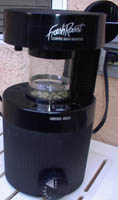  
*FreshRoast – Pre Roast*

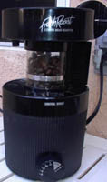  
*FreshRoast – Post Roast*

### Starting The Roast

Telling someone how to roast with a Fresh Roast is like teaching someone how to make toast. To say it is simple is an understatement. Pour in the green coffee beans, set the toggle to either “LIGHT” or “DARK”, close the lid, and turn the timer. Now, just let the roaster do its job. That’s all there is to roasting with the Fresh Roast.

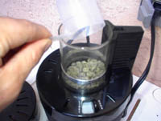  
*Add Beans*

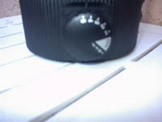  
*Set Timer*

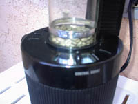  
*Start of Roast*

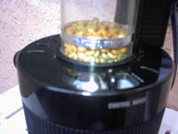  
*Early in the Roast*

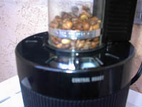  
*Middle of Roast*

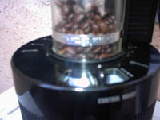  
*End of Roast*

### Ending The Roast

The one drawback I found to the Fresh Roast is that it doesn’t do a great job of cooling down. Because of this, I suggest using an oven mitt or towel to remove the lid once the roast is complete. Usually, the first roast isn’t exceptionally hot, but each subsequent roast gets hotter. Once the machine has cooled off, empty the chaff basket.

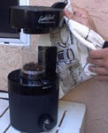  
*Remove the Lid*

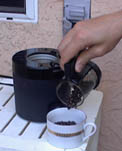  
*Pour out the Coffee*

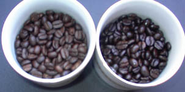  
*The coffee on the left was roasted on the “LIGHT” setting, and the coffee on the right was roasted on the “DARK” setting.*

Some roasters may desire to monkey with their Fresh Roast machine to get the roast to slow down or accelerate the cooling of the beans. That’s beyond the scope of this article, but if you are looking for an easy way to get started in home-roasting coffee, the Fresh Roast is a great product. Home roasters who prefer a more slowly roasted coffee or something that can handle a larger volume would not be ideal users of this roaster.