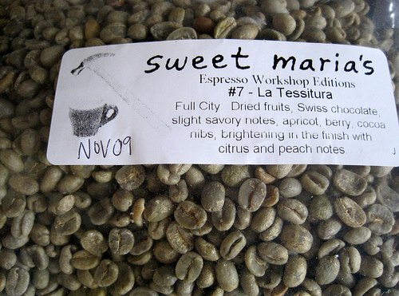
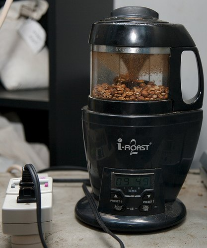

Roasting your own coffee at home can be a challenging and satisfying hobby, and getting started does not have to be expensive. First I am going to discuss some different options for acquiring unroasted coffee beans, and later I will discuss some common methods of roasting at home, everything from using your kitchen oven to the small-batch Behmor drum roaster.

Green coffee beans are imported from all over the world in large quantities to wholesalers, usually on pallets containing many 100-150 pound burlap sacks. Purchasing coffee directly from a wholesaler/importer is much cheaper than a reseller, say $1.50 per pound, but the large quantity required is usually beyond the scope of a single person, so finding a good reseller or distributor is a necessity.

The simplest way is to find a local roaster or coffee shop. There are a few local shops in Cochise County and, of course, many in Tucson. Savaya Coffee, on the southwest corner of Broadway and Craycroft, has a large selection of extremely high-quality green coffees. Since they are a coffee shop, you can also taste what they have roasted before you decide on what to buy. Green coffee prices can vary greatly depending on the quality, and at Savaya prices are in the $7.00/lb. to $10.00/lb. range.

Another option is to make your purchase from an online reseller. This could save some money, and usually, they provide plenty of information on the beans. *Sweet Maria’s* has a huge selection and also provides a wealth of information on home roasting. Their prices start at about $5.00/lb. and go down if you purchase a higher quantity. They provide detailed cupping notes on every coffee and usually notes about the farm, too. They have traveled all over the world to almost every farm they work with, just check out the “Coffee Travels” section.

  
*Sweet Maria’s Espresso Workshop #7*

Lastly, an interesting way to acquire green beans is to join an [online coffee co-op](https://ineedcoffee.com/meeting-up-with-the-green-coffee-buying-club/). A co-op is a group of people that pool their money to purchase a 100-150 pound bag and volunteer their time to separate it into smaller bags to ship to the members. In the forums, there is usually some info on the cupping profile of the beans; however, it is important to research what you are getting to make sure you get the appropriate quality for the price you are paying.

The best part of the co-op is the price of the beans – which can be as low as $1.50 or $2.00 per pound. You are paying only for the wholesale coffee, PayPal fees, bags, and shipping. The negatives with this option are, since they do not stock any coffee, new beans only become available after harvest time and there isn’t a “customer service dept,” it is a volunteer trying to do the best they can in their spare time.

After purchasing the green, unroasted coffee beans, it’s time to decide how to roast those beans. Coffee roasting can sound complicated, but really it is as simple as taking the beans to a temperature between 400°F and 480°F. You can purchase special appliances that do everything almost automatically, or you can use your kitchen oven. Coffee peaks in flavor 24 hours to 7 days after it is roasted, so roasting at home lets you enjoy the coffee when it is at its best. The majority of purchased coffee is available many days past that after it has spent that first 7 days in a freight truck or sitting on the shelf.

The least expensive way to get started is by using your [kitchen oven](http://ineedcoffee.com/home-roasting-coffee-in-an-oven/); if you happen to have a convection oven, that is even better. It does need to be an oven that cooks evenly and can really put out the heat, as you will need to preheat it to 500°F or even 530°F if it will go that high.

The beans need to be in a perforated pan, vegetable steamer, or colander/strainer, something that will allow air to flow around and through the beans. If you are using a vegetable steamer, like the ones that have the leaves that fold out, place it on a cookie sheet. Once you place the beans in the oven watch until they nearly reach the desired color and level of roast because they will continue to darken a bit after they are taken out. If this takes more than 20 minutes then the oven temperature needs to be raised.

If you are roasting in the colander, quickly open the oven and shake the beans around every few minutes while they are roasting. After removing the beans, quickly cool them down by dumping them into a strainer and then stirring them with a wooden spoon while blowing on them lightly to help remove the chaff (this is the thin, parchment-like skin that comes off of the beans during roasting). A great way to keep them fresh is in a glass jar, but leave the lid slightly loose for the first few days as they will need to vent out CO2, also keep the jar out of direct sunlight.

Another method that is very simple, not expensive, and produces great consistent results is a hot air popcorn popper such as the [West Bend Poppery](http://ineedcoffee.com/roasting-coffee-in-a-popcorn-popper/). The average price is about $30, but sometimes you can even purchase these in thrift stores for next to nothing. You will also need one or two colanders, a bowl to catch the chaff, a wooden spoon, and some oven mitts.

Set the popper in a well-lit and well-ventilated place, preferably outside if the weather permits. Put the same amount of beans in the popper that the manufacturer recommends for the popcorn, for the West Bend popper it is 2/3 to 3/4 cup. Place the hood and butter dish in place, point the chute over the large bowl, and turn the unit on. In about 3 minutes you should hear the “first crack” of the beans, closely watch the color, and smell the fragrance.

When the beans almost reach your desired roast, in approximately 4 to 6 minutes of roast time, pour them out into the colander. They will continue to darken a little as they cool off, and either stir with the spoon or toss them back and forth between the colanders to help cool them off quickly and remove the chaff. Again, put them in the glass jar, leaving the lid slightly loose, and let them rest for at least 24 hours.

To make the process and the clean-up even easier, there are nearly automatic hot air roasters like the [Hearthware iRoast 2](http://ineedcoffee.com/i-roast-2-coffee-roasting-guide/), costing about $179. Like the popcorn popper, it uses hot air to roast the beans, but it has many features that are specific to coffee roasting.

You can set the exact temperatures that you would like it to roast at and store the profiles in the unit’s memory for future use. The top lid/cover assembly contains two screens to collect the chaff, making clean up incredibly easy; just remove the screen and empty it into the trash can, no mess. The sides of the roasting chamber are glass for easy viewing of the beans, and once they reach the desired roast you press the “COOL” button, starting its cool down cycle.

At this time, I usually remove the coffee from the chamber and cool it off in a colander, which seems to be faster than the cooling cycle. Another benefit is that it can hold about 1 cup of green beans, which is slightly more than the popcorn popper.

  
*Photo [I-Roast 2 from the I-Roast 2 Coffee Roasting Guide](http://ineedcoffee.com/i-roast-2-coffee-roasting-guide/) by Chris Arnold*

The next step up would be a small batch drum roaster like the [Behmor 1600](http://ineedcoffee.com/behmor-1600-coffee-roaster-tutorial/) for about $300. Its main feature is its larger capacity, which is up to 1 lb!!!; its quietness, making it easier to hear the “first crack” and “second crack” of the beans; and smoke reducing secondary heating element. It also has the same features of programming in profiles, a cooling cycle, and a glass viewing window. It is rated for up to 900 1 lb. batches, but with good care, it is said to last much, much longer.

Roasting your own coffee can be a very satisfying hobby, and giving the gift of home-roasted coffee to your friends and family for Christmas will be something they can savor throughout the holidays.