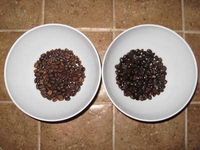
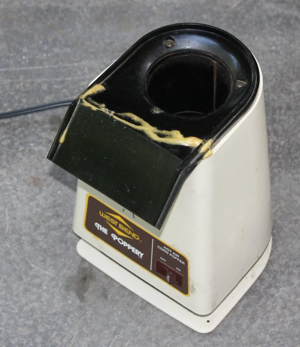

A royal screw-up led to my first major home-roasting success.

Well, I should be more specific “the right kind” of screw-up led to success. My first few home-roasting endeavors (particularly [the first](/rookie-roast-confessions-of-a-first-time-home-roaster/ "Rookie Roast")) were chock-full of screw-ups, and none of them yielded great results. On my fourth or fifth attempt, however, despite thinking I had under-roasted the beans, I experienced my first *ahhh that’s good!* batch.

  
*The light-roasted beans on the left were the result of a botched roasting operation — which proved to be a very happy accident.*

A roasting emergency forced me to prematurely halt an Ethiopian Yirgacheffe/Sidamo roast. Using the Westbend Poppery, I had placed a soup can atop the popper as a chimney (a suggestion from MAS’s [Roasting Coffee in a Popcorn Popper](/roasting-coffee-in-a-popcorn-popper/ "Roasting Coffee in a Popcorn Popper") tutorial). The problem was that the can I used was coated inside. I noticed a couple of beans sticking to the can, apparently because the heat was softening this coating and making it adhesive. I switched the power off, to end the roast and save the rest of the beans.

  
*The Poppery for Roasting Coffee*

I’ve long preferred darker roasts, so I was disappointed that this session ended with the beans just barely at a Light Roast stage. Still, I wasn’t going to let this batch go to waste.

I drip-brewed a pot, expecting mediocrity. Instead, I was blown away. For the first time, I could recognize distinct tastes in the beans I roasted (“floral, earthy”). This was the first batch I roasted that I would have been able to identify in a blind cupping. Accidentally, I roasted Ethiopian beans to perfection.

The morals of this story are twofold:

1.  The trial-and-error involved in learning home-roasting can lead to some fortuitous discoveries.
2.  Home-roasters using a soup can on the Poppery should make sure the can has no interior coating.

### Resources

[The Home Roaster Color Chart](/the-home-roaster-color-chart/) – A visual guide to coffee roasting by color.

[Rookie Roast](/rookie-roast-confessions-of-a-first-time-home-roaster/) – Alex’s first adventure with home coffee roasting.

[Roasting Coffee in a Popcorn Popper](/roasting-coffee-in-a-popcorn-popper/) – Tutorial on how to roast coffee using a Westbend popcorn popper.
