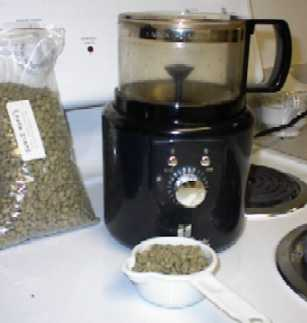
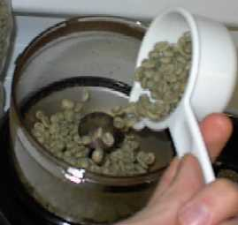
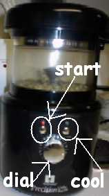
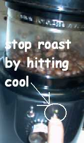

To anyone who owns a Precision Hearthware Coffee Roaster, the thought of writing a tutorial on using it will seem ridiculous. Using the Hearthware is so simple that even a caveman could figure out the basics. This tutorial is written for coffee fans who haven’t started home roasting yet or those already roasting and who know little about Hearthware.

In another INeedCoffee tutorial, we showed you [how to roast coffee using a popcorn popper](/roasting-coffee-in-a-popcorn-popper/). If using a popper is as easy as making spaghetti, then using the Hearthware Precision is as simple as using a toaster. Are you ready to see how simple it is to make the best coffee in your home?

### Disable Smoke Detector

The most difficult part of indoor roasting is disabling the smoke detector. Roasting coffee will produce smoke, and dark roasts even more so. Since the mission here is not to test your smoke detector and kitchen ventilation but to roast coffee, you will want to disable the smoke detector before roasting.

### Add Beans

The machine comes with a 1/2-cup scoop. Fill the scoop with beans and pour them into the machine.

### Start Roasting

The roaster only has three controls. One is to start, which is called “Roast.” One is to end, which is titled “Cool.” The third control is a dial that goes from 1 to 10. This will indicate the level of roasting. The higher the number, the longer the roast, and the darker the beans will get. Using the “Cool” stop will always stop a roast regardless of how high you set the roast setting dial.

I advise beginners to set the dial to 8 and use the “Cool” button to stop the roast when it reaches the desired level. Be forewarned: If you don’t hit “Cool,” the roast will roast approximately 1.5 minutes longer than the dial setting. As you get more experience with different types of beans, you will start using the dial to control the roast. To start the roast, hit “Roast.”

### Check with the Experts

Even though this machine doesn’t require “hands-on” attention, you will get the best results by monitoring the progress of each roast. When monitoring the roast, you will hear the “first crack” and, if roasted long enough, the “second crack”. How long should you roast a bean? This depends upon your taste, but consulting a cupper review is a great idea if you are open to all roasting levels. Using the cupper’s advice is optional.

A cupper is a coffee professional trained to taste and report the distinctions of each coffee. A cupper will dissect a crop of beans and find its strengths and then advise a roasting level that will best complement that bean. For example, Brazil Santos tastes great as a Full City or Vienna Roast, whereas you would roast Hawaiian Kona lighter.

I get all my cupping reviews from Sweet Maria’s—their green bean page links directly to each crop’s cupping review. The bean roasted in this tutorial is *Costa Rican Tarrazu La Minita*. Sweet Maria advises that it should be roasted “… through the first crack and NOT into or even to the first snap of the second crack. That’s where it is at its peak! ”

### Collecting The Bounty

After the time expires or the “Cool” button is hit, the roaster will undergo a cool cycle, which will take approximately as long as the roast itself. Once that has been completed, pour the beans into your storage container. They will be ready for brewing in about 12-24 hours after they have had a chance to degas. Resist the urge to brew immediately.

### Wrapping Up

The last step is to clean out the chaff collector (the lid). Precision provides a small toothbrush for cleaning out the chaff collected during the roasting process. Brush away the chaff. This is a helluva lot easier than cleaning the George Foreman Grill after cooking salmon! Don’t forget to get your smoke detector operational again after you’re finished roasting and the smoke has cleared.

### Conclusion

The Hearthware Precision Coffee Roaster is the greatest purchase I’ve ever made. The coffee I’m producing at home is on par with or superior to that of the best commercial roasters. If the $130 price tag scares some consumers, note that this machine will pay for itself.

Personally, I drink one pound of coffee a week. If green beans average $5 a pound and commercially roasted coffee averages $10 a pound, then it will take 26 weeks for the machine to pay for itself. The popcorn popper solution is still the cheapest, but if you are like me and live [in a cold winter environment,](/cold-weather-coffee-roasting/) then having an indoor roaster like the Precision is a real treat.
