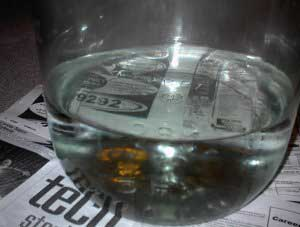

Beer has a lot in common with coffee. Both are very popular beverages. Both have the utilitarian consumers of the beverages as well as those who consider themselves connoisseurs. And both of these can be made in a fairly easy fashion at home yielding very positive results. And, interestingly enough, certain types of beers are well complemented by coffee. I will be sharing a recipe I created that is an espresso stout using home-roasted espresso.

### The Coffee/Beer Connection

As a homebrewer who also happens to be obsessed with coffee, I found that too many of the coffee or espresso-flavored stout recipes I found seemed to consider coffee more of an afterthought than an important factor in the success of the beverage. I have always found it odd that brewers would take so much time to pick out just the right hops, yeast, and perfect water chemistry, only to say something so general as, “Add a pound of cracked coffee to the brew pot.” Lightly cracking coffee is supposed to compensate for the longer extraction time in the brew, but over-extracted coffee is as undesirable in the beer as it would be on its own. Some homebrewer recipes even go as far as advising instant coffee as an ingredient. This is intolerable advice. Over a few years, I have tried several methods, and the one I most enjoyed is the one that I am about to share.

The basic ingredients for making beer are water, sugar, hops, and yeast. Varying the amounts and individual qualities of each basic ingredient will yield a different tasting beverage.

The basic equipment a homebrewer needs are:

-   Boiling Kettle
-   Fermenting Tank (Carboy)
-   Racking Equipment (Cane, Tubing, Bottle Filler)
-   Bottles
-   Caps
-   Bottle Capper

### Brewing In a Nutshell

At a very high level, these are the basics of homebrewing:

1.  **Sanitation** – Everything you touch can be contaminated with bacteria which can cause skunked beer. Sanitize everything that will come in contact with your beer before or after boiling. Using sanitary handling practices is at the top of my list for brewing. The best crafted/designed beer can be ruined by a failure to keep it clean.
2.  **Make the Wort** – In this step, you are cooking malts in order to break down their sugars and extract them to create a sweetened liquid. The sugary liquid is what will be consumed by the yeast later. This is achieved by adding water and malt/malt extract into the boiling kettle. Since most small homebrewers don’t have kettles large enough to hold five gallons, the wort is actually concentrated, which means we will add cold water later to make up for the full volume.
3.  **Add the Hops** – This is actually part of creating the wort. Depending on your recipe, you will add a series of hops at different times into the boil. Hops serve the purpose of bittering the beer to counteract the sweet taste of the sugary malt. They also are a mild astringent, which helps to keep the bacteria content low. Finally, they provide aroma and flavor to the beverage. The hop additions are generally classified as either ‘Bittering’ or ‘Aroma’ hops. The bittering hops go in earliest because the aromatic compounds of the hops will boil out. Aroma hops go in the boil last so as to preserve those compounds so they will stay in the beer.
4.  **Chill the Wort** – This is to be done as quickly as possible. The temperature of your wort should be close to the fermenting temperature listed for the yeast that you chose. Basically, we are trying to cool it to the point that it won’t kill the yeast. A trick that I use is to keep water in the refrigerator; I will be adding this water to the concentrate so that it helps to bring down the overall temperature quicker.
5.  **Pitch the Yeast** – This is simply adding the yeast to the wort. Once this step is complete, it is no longer wort, it is beer.
6.  **Primary Fermentation** – This is the process of allowing the yeast to consume the sugar in a sanitized environment. When yeast eats the sugar and metabolizes it, two very important molecules are given off: Alcohol and Carbon Dioxide. In primary fermentation, we are concerned with creating alcohol and letting the CO2 out. This is done by affixing an airlock on the carboy which lets gas escape due to pressure but doesn’t let anything in. After taking some measurements, you can find out when fermentation is complete.
7.  **Secondary Fermentation** – This step is not necessary if you keg your beer. However, if you bottle your beer, this step is important. In this step, a very calculated amount of unhopped wort is created and added back to the beer. This will create more CO2 and alcohol, but since we are bottling the beer next, the gas will be trapped in the bottle which serves to carbonate it.
8.  **Bottling** – This involves putting the beer into bottles and capping the bottles with a capper.
9.  **Consumption** – Enjoy your creation and share it with your friends.

As is true with coffee, looking past the basics of homebrewing can be very confusing indeed. If you have the patience and the initiative, it can be every bit as rewarding as your coffee hobby. For the already experienced homebrewer, tweak this recipe as much as you like and have fun. For the newbie, stick to this recipe the first time until you become familiar with the basic procedure.

### Our example: Espresso Stout

This homebrew combines the flavors of a chocolate-style stout with freshly brewed espresso to kick it up a notch. I also used espresso which I roasted and brewed myself. I fully believe that the overall fresh taste of this brew has everything to do with using quality ingredients — especially the espresso. For this recipe, I used a custom-blended espresso designed for this stout.

### The Espresso Blend

Blending coffee is not altogether different from selecting the hop additions for a beer. The goal is certainly the same: to attain a certain flavor by utilizing the different characteristics of the ingredients in specific manners. Just as bittering hops will provide the base bittering for your hops, so does select a base bean for espresso to serve the same purpose in your blend.

Beyond normal espresso blending, you should consider the purpose for which the espresso will be used. Will it be used primarily in milk-based drinks, Americanos, straight-up, or in a stout? Since the stout is a chocolate stout, it makes sense to try and complement that flavor with the espresso. You will notice that this blend isn’t extremely dark or oily for an espresso, but as far as espresso goes, I have never found extremely oily blends to be particularly good. Furthermore, this brewed espresso will be added to five gallons of beer! It turns out that excess oils added to beer kill the head retention and thus the overall body of the beer. Needless to say, a very oily stout is not very desirable.

Here is my espresso recipe:

-   **50% Brazil Cerrado** – This will be the base for our espresso. It has a wonderful body to complement the chocolate flavors in the stout, as well as is relatively low in acidity, which will help in keeping this on the palate a little bit longer. This will be roasted past the second crack or until oil shows.
-   **10% India Monsooned Malabar** – This bean will work very well to help balance the sweetness we will introduce with the Ethiopian bean. It also has some very powerful, yet quick finishing flavor characteristics which I quite like in my espresso. It is roasted to full city.
-   **10% Guatemala Huehuetenango** – Carries and brightens the other flavors. Roasting this bean just past the second crack tends to tame the more fruity characteristics of this bean. Still, the liveliness of this bean remains and it’s now relatively neutral characteristics help enhance the rest of the blend.
-   **20% Ethiopian Harrar Horse** – Provides a powerful flavor with floral and chocolatey notes. I will roast this a bit past full-city.
-   **10% Kenya AA** – Roasted full city, this coffee has extremely powerful flavor characteristics which shine through nicely in our blend. I have always thought of Kenyan AA beans as being somewhat winey and the same is true for hops. This bean, in my mind, makes the bridge between the espresso flavoring and the hop flavoring of the stout.

You should feel free to try another espresso blend after you see how this one turns out. The important thing is that by roasting it yourself, you know exactly how old and how fresh the coffee is. Just like hop varieties vary from year to year and crop to crop — so do coffees. Homebrewers love to tweak, and with coffee, there is a lot of tweaking that can be done!

If you prefer to use a pre-blended espresso to roast, I recommend the *Liquid Amber Espresso Blend* available from Sweet Maria’s. If you aren’t a home roaster, locate a good espresso blend from a local roaster.

### Ingredients

-   4# Dark Malt Extract
-   3# Light Malt Extract
-   5 oz Dark Malt Extract (for priming)
-   1# Crystal Malt 90L (Whole Grain, Crushed)
-   1/8# Roasted Barley (Whole Grain, Crushed)
-   1/8# Black Patent Malt (Whole Grain, Crushed)
-   1/4# Chocolate Malt (Whole Grain, Crushed)
-   2 oz Northern Brewer Hops
-   .5 oz Willamette Hops
-   16 shots of Fresh Brewed Espresso
-   Irish Ale Liquid Yeast

### Procedure

Add 1.5 gallons of water to the boiling kettle. Put all of the grains into a grain bag and tie it up as shown below.

Since we are using distilled water, we will adjust the water hardness by adding brewing salts. For this recipe, I have added 2 tsp. Calcium Chloride and 1 tsp. Magnesium Sulfate. This is a very important step that, if overlooked, will render your beer lifeless. The salts give body to the beer and also help to extract sugars from the grains. This partial mash should cook for 30 minutes at 160°-170°F.

After this partial mash has been completed, remove the grain bag carefully from the kettle and add the malt extract with just over a half-gallon of water, taking great care to keep stirring until fully dissolved. It is very important to pay attention to prevent a “boil-over” from occurring at this stage. At thirty minutes into the boil, we will make our first hop addition. We will add 1.5 oz of the Northern Brewer hops and continue boiling.

### Multitasking

While we are waiting for the next hop addition, we can prepare several things. First, we prepare a hop bag by placing the remaining .5 oz of Northern Brewer and the .5 oz of Willamette Hops into the bag which will make up our second hop addition. We will also sanitize the carboy. This can be done with either oxidized bleach cleaners or an iodophor solution. I prefer the iodophor as it sanitizes faster and requires no rinsing. Whichever you choose, mix the cleaner to the strength indicated on the instructions and add this to the carboy. Then, use the bottle brush to swirl the solution around and make sure all of the surfaces has been covered. You should spare no effort in sanitizing your equipment.

### Putting it all together

After we have cleaned the carboy, we add the rest of the water (3 gallons) to it. At 55 minutes into the boil, we add the second hop addition to the boil which will cook for five minutes more before we remove it from the heat. Then, try to cool the hot wort down for fifteen minutes by putting the kettle in a large body of water such as a sink or bathtub and surrounding it with cold water. While this is cooling down, we will begin brewing espresso. For this recipe, we will brew 16 shots or 16 oz of espresso. Add this to the wort.

I should mention the importance of brewing the espresso. Some recipes for so-called ‘espresso’ stouts call for adding cracked coffee to the boil, or even into the carboy during fermentation. These beers usually end up having a taste of over-extracted coffee. Brewing espresso properly, however, preserves the integrity of the espresso flavor even after weeks in the bottle. Please do not skimp on your espresso.

Next, we will funnel the wort into the carboy to mix with the cold water. After this, we will take a hydrometer reading by pouring a sample of the wort into a hydrometer jar. We will take a reading to determine the Original Gravity of the beer. Our reading shows a reading of 1.060 or a potential alcohol percent of roughly 8%.

The next step is to ‘pitch’ the yeast, and rock the carboy back and forth for a minute or two gently. This mixes the yeast throughout the beer and helps to oxygenate the beer which is helpful to the fermentation process.

### The Waiting (Hardest Part)

The next step is to put the carboy in a cool, dark place and wait while the fermentation happens. During this time, you can observe the bubbling action of your airlock as the CO2 escapes. Once this bubbling action is stopped, fermentation is generally complete. Normally, this takes between one and two weeks. At this point, it is safe to begin the second fermentation. This is done by boiling a quart of water and then adding 5oz. Dry Malt Extract or priming sugar. This should boil for at least 20 minutes so as to make sure it is sanitized. After it has cooled, it is poured into the beer. Next comes bottling.

### Bottling

After we sanitize the caps and bottles, we will sanitize the racking cane, tubing, and bottling stem. The racking cane is set in the carboy as pictured below and is used to siphon the beer out of the carboy and into the bottles. The way this works is by gravity siphoning, not by the unsanitary method of sucking out the beer manually. One small note about bottles: if you use bottles that you have saved, only save the bottles that are not twist-offs. It is difficult for a homebrewer to put a good seal on these bottles with the standard bottle capper. You can also purchase bottles at your homebrew store if you are unsure what kind to buy.

To start the siphon, we fill the tubing and bottling stem with clean water, taking great care not to touch it with our hands. Then, we attach the other end of the tubing to the racking cane. Getting a good seal between the tubing and the cane is important. Next, we will place a clean glass on the floor while the carboy is elevated on a table or counter.

We will then take the bottling stem and push it down in the glass so as to depress the valve on the bottling stem which allows liquid to flow out of it. What happens is that as the clean water exits the tubing, it creates a siphon, which will start pulling the beer out of the carboy.

As soon as the liquid in the glass becomes beer colored, pull the stem out of the glass to close the valve and stop the flow. Now we are ready to begin filling the bottles in the same manner, by pushing the bottling stem down to let the beer flow into the bottle and releasing it when it is less than full — just above the neck of the bottle.

After the bottle is filled, we will place a cap on top and use our capper to crimp the cap securely on. Once this step is complete, the beer is ready to sit for a week at a minimum. The general rule of thumb is that the stronger a beer is in terms of alcohol or hop content, the longer it should mature before drinking. This gives it an opportunity to mellow a bit.

It is good to taste your beer at several junctures to get a sense of its development. This particular brew will be optimal between 3 and 4 weeks after being in the bottle. Once this happens, store it in the coldest, darkest place you can find until you are ready to enjoy the brew.

### Conclusion

Now that the beer is complete, the only step left is to consume it. To serve the homebrew, always decant the beer into a glass slowly, and stop pouring just as the yeast sediment starts to come out. While the yeast won’t harm you, it will affect the overall flavor of the beer. Some people like the flavor, some don’t, so it is best to experiment a bit. The Espresso Stout is the perfect marriage between fresh home roasted espresso and home-brewed ale. The next time you find yourself unable to choose between coffee or beer, have both.

### Resources

[Espresso Blending Techniques](http://ineedcoffee.com/espresso-blending-techniques/) – Guidance on constructing an ideal espresso blend.

[Coffee Blending For the Home Roaster](http://ineedcoffee.com/coffee-blending-for-the-home-roaster/) – INeedCoffee article