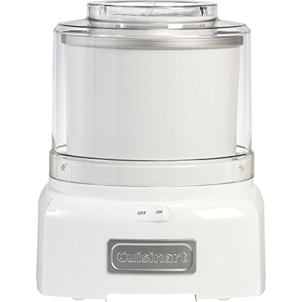
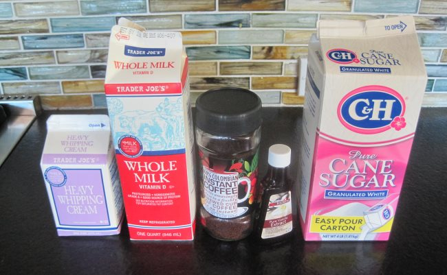
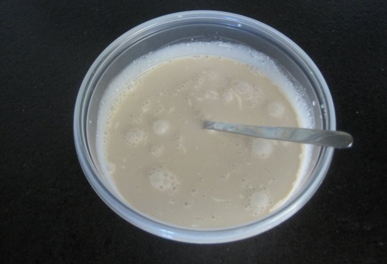
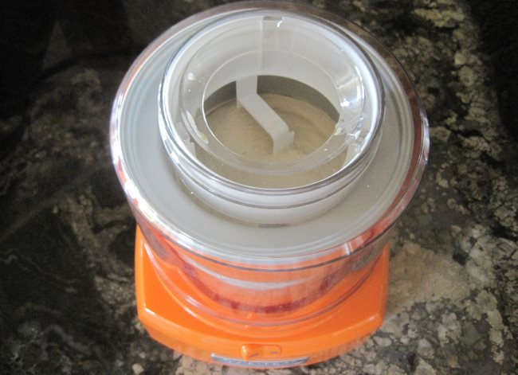
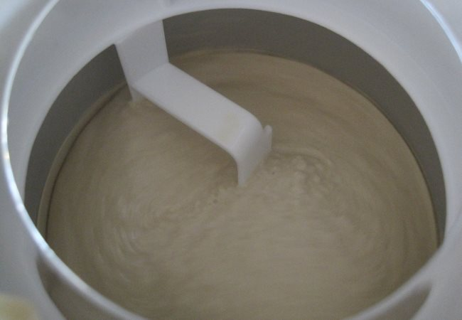
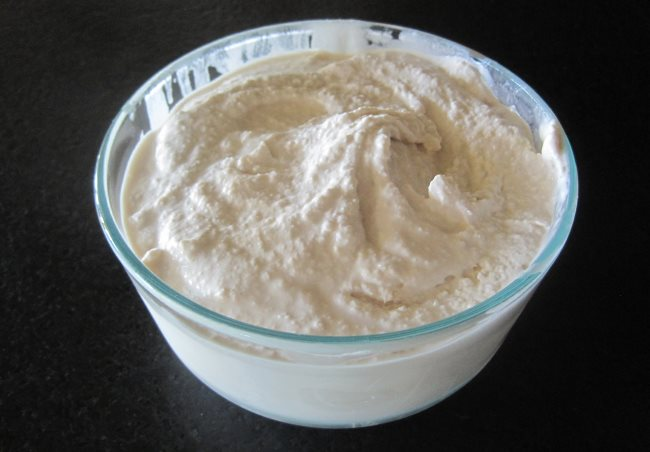

Over ten years ago, I tried to make homemade ice cream. I forgot the name of the ice cream maker, but it was terrible. It took way too long, required adding lots of ice, and the result had an awful texture. Since then, I’ve been buying all my ice cream, but recently I had a chance to play with the Cuisinart ICE-21 Ice Cream Maker. It is awesome. I expected a little learning curve, but there wasn’t one. Immediately, I was making amazing ice cream.

  
*Cuisinart Ice Cream Maker  
*

After a few batches of vanilla ice cream, I started working on coffee ice cream. Not surprisingly, coffee ice cream is my favorite flavor. But I don’t like all coffee ice creams. I like the coffee ice creams where coffee plays a supporting role and is not the dominant flavor. I also don’t like dark-roasted coffee ice creams. The reason is that it can impart an ashy, bitter flavor that distracts from the creaminess and sweetness of the ice cream.

Coffee ice cream recipes use instant coffee or concentrated brewed coffee. As someone who has been home roasting coffee since 1998 and is a huge quality coffee enthusiast, I thought I would not like instant coffee, but I did. Instant coffee is something I would never drink, but for coffee ice cream, it just works. The basic flavor of the instant coffee was ideal, and the texture of the ice cream remained perfect.

Let us make some coffee ice cream. We will be using the *Cuisinart ICE-21 Frozen Yogurt-Ice Cream & Sorbet Maker*. You can use this recipe for other ice cream makers, but you might need to adjust the recipe portions. Check your manual.

### Ingredients

-   1 cup whole milk
-   3/4 cup of granulated white sugar
-   1.5 tablespoons of instant coffee
-   2 cups heavy cream
-   2 teaspoons of vanilla extract

I used the 100% Colombian Instant Coffee sold by Trader Joe’s. I can vouch for this instant coffee. If you use Starbucks VIA, pick their Colombian instead of the French Roast. If you prefer a stronger coffee taste, double the amount of instant coffee added to 3 tablespoons.

I used regular granulated white sugar for my coffee ice cream, but there are other options. Some recipes call for splitting the amount of sugar equally between white sugar and brown sugar. And our [Coconut Milk Coffee Ice Cream](http://ineedcoffee.com/coconut-milk-coffee-ice-cream/) recipe gives the tip to use rice syrup if you find the ice cream too hard after a day in the freezer.

*Coffee ice cream ingredients*

This tutorial will use three bowls.

1.  The insulated freezer bowl that comes with the Cuisinart.
2.  A mixing bowl for all the ingredients.
3.  A storage bowl for the final ice cream. You don’t have to use a bowl here.

### #1 Freeze the Insulated Freezer Bowl

Instead of adding a bag of ice to the spinning ice cream maker, the Cuisinart ICE-21 has a double-insulated freezer bowl. No ice is needed. It just needs to spend some time in the freezer first.

From the manual:

> In general, freezing time is between 6 hours and 22 hours. To determine whether the bowl is completely frozen, shake it. If you do not hear liquid moving, the cooling liquid is frozen. Before freezing, wash and dry the bowl. Wrap it in a plastic bag to prevent freezer burn. We recommend that you place the freezer bowl in the back of your freezer where it is coldest.

If you make a lot of ice cream, you can purchase an additional freezer bowl without buying a new ice cream maker.

### #2 Mix Up Ingredients and Chill

In a mixing bowl, combine 1 cup of milk and 3/4 cup of sugar. You can use a hand blender, a whisk, or even a spoon. Once the sugar is dissolved, add the instant coffee, vanilla extract, and heavy cream. Mix everything together. Cover and refrigerate for at least 30 minutes. 

*Mix the ingredients* 

### #3 Make the Ice Cream

Take the freezer bowl out of the freezer and place it on the Cuisinart stand. Place the mixing arm inside the bowl and then cover with the easy lock lid. Once the lid is secured, turn on the ice cream maker. Take the mixing bowl out of the refrigerator and pour it slowly into the ice cream maker.

Let the machine run for about 20-30 minutes. Once the texture looks good, stop the machine. Take off the lid and the mixing arm. Transfer the ice cream to another container. I used a glass food storage container, which I kept in the freezer while the ice cream machine was working.

*Making coffee ice cream*

*Once the texture looks good, stop the ice cream maker.*

### #4 Place the Ice Cream in the Freezer (optional)

At the end of the 20-30 minute cycle, the ice cream will be soft. If you like the ice cream this way, begin eating it. However, I preferred the taste and texture after it had been in the freezer for another two hours.

*Finished coffee ice cream*

### #5 Enjoy

Serve and enjoy. I’ve had a lot of coffee ice cream, and this turned out to be one of my favorites. Unlike many of the coffee ice creams sold in the store, the ingredient list was simple. Making your own ice cream does take time, but the benefit is that you control the ingredients and their portions. Plus, it is cool.

### More Creamy!

If you prefer an ice cream that is softer and creamier, add a small amount of either vodka or rum to the mix. From the article [Tips for Making Homemade Ice Cream Softer](https://www.davidlebovitz.com/tips-for-making-1/):

> Alcohol doesn’t freeze, which you know if you’re anything like me and keep a bottle of vodka chilled and ready in your freezer. You can add up to 3 tablespoons of 40 proof liquor to 1 quart (1 liter) of your frozen dessert mixture prior to churning. I use vodka if I don’t want the taste of the liquor to intrude on the flavor, but will switch to another liquor such as Grand Marnier or Armagnac to enhance the original flavor if it’s compatible.

### Bonus: Coffee Milkshakes and Coffee Malts

Now that you have your coffee ice cream, you could make a milkshake or a malt. Add three scoops of ice cream and a few ounces of milk to a blender to make a milkshake. There is no need to add ice cubes. A milkshake can become a malt when you add malt powder to the blend.

### Resources

[Coconut Milk Coffee Ice Cream](http://ineedcoffee.com/coconut-milk-coffee-ice-cream-recipe/) – For those who want to make coffee ice cream without dairy.