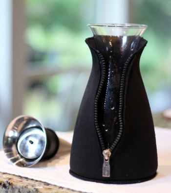
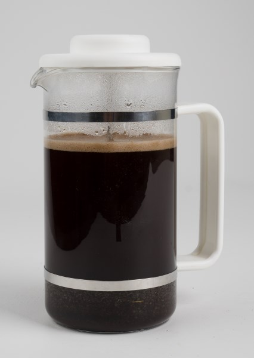

As much as I love the coffee shops in Seattle, sometimes I want to meet up with friends and family at home. I still want the coffee, though. Compared to wine or other luxury items, high-quality home coffee is inexpensive. You will need to pick the ideal coffee and brewing method for your coffee party.

What is the ideal coffee? Knowing your guests well lets you know if they prefer lighter or darker roasts. You may even know if they prefer African to South American coffees. However, if you don’t know your guests’ tastes, I would recommend going with Sumatra. I learned in Starbucks Coffee College that it is their best-selling bean. Sumatra has a bold, smooth flavor, and it pairs extremely well with food. You should also have a decaf blend option for your guests.

What about espresso? If you plan on making lattes and Americanos, then most blends from good roasters will work. I [home roast coffee](/buying-your-first-home-coffee-roaster/) and have developed many blends that work well as straight shots and inside lattes. When entertaining guests, I tend to avoid the fruity, high-note espressos.

### Picking a Coffee Brewing Method

As much as I love making espresso drinks and practicing latte art for my milk-drinking friends, it is not ideal once you get past a few friends. It is too labor-intensive and too loud. You end up spending the entire party grinding coffee and frothing milk.

Here at INeedCoffee, we know more about coffee brewing methods than most coffee drinkers. Why not show your guests something cool? Put away that drip coffee pot. Here are four coffee brewing methods to impress your guests at your coffee party.

### The Chemex

The Chemex is a glass container that uses a paper filter. It produces a cup of coffee that tastes as good as the best drip coffee makers on the market. It is simple and beautiful. My tutorial on this brewing method is [Chemex Coffee Brewing – History and Tutorial](/chemex-coffee-brewing-history-and-tutorial/).

### The Eva Solo

Years ago, someone gave me an [Eva Solo](/eva-solo-coffee-brewing-tutorial/) right before I moved to Seattle. I put the coffee brewer into a box and did not pull it out until recently. It is now my favorite coffee brewer. It is a glass container with an insulated cover. Unlike a French Press, where the filter is pushed down before pouring, Eva Solo filters on the pour. The super fine filter is attached to the top. This is an oversimplified explanation, but let me state that it makes a clean, rich cup of coffee.

  
*Eva Solo Cafe Solo Coffee Maker Designer Coffee – 1.0 L* 

### The Vac-Pot

The vacuum pot is the coffee brewing method that will draw the most attention. Water is at the bottom, and coffee is at the top. Add heat until the water makes contact with the coffee. Once it has brewed long enough, remove the heat source, and the coffee rushes into the bottom container. Read [Vacuum Pot Brewing](/vacuum-pot-brewing/) to learn more about this brewing method.

*Bodum Santos Stovetop Glass Vacuum 34-ounce Coffee Maker*

### The French Press

The French Press is the workhorse of the coffee brewers. Just make sure your press pot is large enough to make a few cups at a time. For tips on this brewing method, read [Troubleshooting French Press Coffee](/troubleshooting-french-press-coffee/).

### Final Considerations

Although I think adding milk and sugar to my excellent coffee is insanity, I try to be a good host. I will provide half-and-half and sugar. Assuming your guests are of legal drinking age, having a bottle of Baileys Irish Cream will be appreciated.
