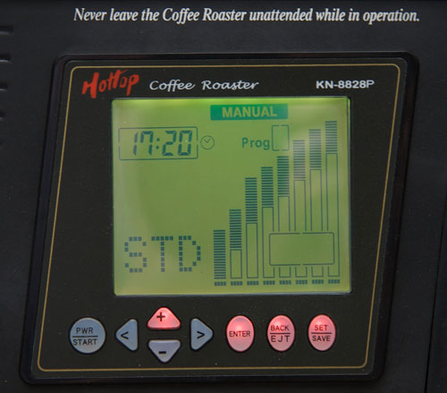
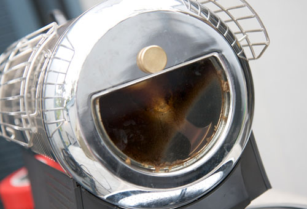
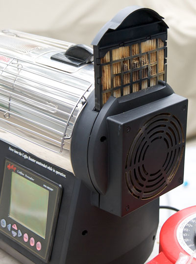
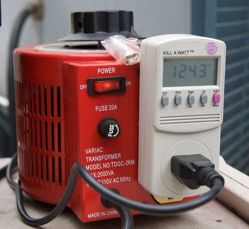

The Hottop Coffee Roaster has been around for a few years now and has proven to be a reliable coffee roaster, and the support from Michael at Hottop USA has been excellent; I have firsthand experience, as well as anecdotal 3rd party accounts. They have continued to make small, incremental improvements to the original base model, providing easy do-it-yourself upgrades along the way. In fact, even the oldest original model (KN-8828) can be upgraded to the newest, most expensive Hot top roaster (KN-8828P), completely by the end-user, and in a matter of a few minutes.

Maybe you currently have a KN-8828P Hottop Roaster and would like to get more out of it. Maybe you are thinking of upgrading from one of your simpler models like the KN8828, KN-8828D, or KN-8828B to the more advanced KN-8828P digital model. Maybe you are wondering if you should even buy one, especially considering the hefty price tag nearing $1000. Hopefully, I can point out not just basic usage, programs, and maintenance but some other finer details that might help you decide whether the KN8828P Hot Top Coffee Roaster is for you.

### Basic Usage

The KN-8828P can be used out of the box with the “AUTO” program, which is handy if you want to get started right away. While this might work for some, the real coffee geek will want to set up their own custom programs. We will touch on that later.

To get started, you can simply power it on and select the Automatic program with a couple of button presses, and the machine will begin a Warm-Up cycle, where the roaster will warm itself up to the necessary temperature of about 175 degrees Fahrenheit. This ensures that your roast always starts at the same temperature, and ensures repeatable roasts. Once ready, it will beep at you, along with a graphic on the LCD, basically asking you to dump your beans in. The recommended green coffee load is 250 grams (about 9 ounces). I have found this to be a good number, and by not straying up or down from it, I have had good results.

After dumping the beans into the unit through the top chamber, you will hear the beans being agitated vigorously. Over the next 15 minutes or so, you will see various indicators on the LCD indicating fan speed, temperature, which segment the roaster is on, and how far into each segment. The latter is accomplished using 4 little indicators for each segment: 25%, 50%, 75%, and 100% (completed).

It should be noted that there is something called “Advanced Manual Control”. It allows the user to adjust roasting parameters on the fly. I have found no need or desire to use this, but if you are interested, the PDF manual can tell you all about it. Now fast forward about 15 minutes or so. You will begin to hear the first crack. After the first crack, there should be a pause before the start of the second crack. Most users will stop the roast for a few seconds or snaps into the second crack.

  
*Hottop Color LCD Control Panel and Button*

If you were to let the roast go completely on its own, you would notice that in the last 30 seconds of the roast, the machine will beep, and flash “Plus Time”, which allows you to add time to the roast in 30-second increments (up to 6 times). If you do nothing, the beans will dump into the tray and begin cooling. Otherwise, you can add time to the end of the roast with a maximum of 24 minutes total (21 minutes max AUTO program starting time, plus 6 additional presses which are 30 seconds each).

Note that although the AUTO program only allows for a max of 21 to start within its pre-defined program, with a custom profile you can start with a max of 22 minutes, and thus the max overall time is 25 minutes for custom. Confused? Don’t be. I wouldn’t worry about the max times too much, as you typically would want to keep your roast times under 20 minutes anyway.

Another little safety feature you may notice as the roast gets near the end is the high temp warning. If the temperature reaches 414 degrees Fahrenheit, the unit will beep, prompting you to hit enter to allow the roast to continue. This is just to ensure that a fire does not break out. If you do nothing, the beans will dump into the tray and begin cooling. Before you start the next roast, the machine will beep to prompt you to empty the chaff tray, along with a graphic on the LCD. This ensures the user will not leave too much chaff in the tray, increasing the chance of a fire.

### Custom Programs (Profiles)

The Hottop KN-8828P can hold 10 Profiles (called “Programs”). One is already pre-set, and cannot be deleted, so that leaves 9 for the user. Each Program can have eight segments. Each segment can be up to 3 minutes long (with a minimum of 10 minutes and a maximum of 22 minutes). Within each segment, you can specify the time, a target temperature (within a specific range of course), and the fan speed. The fan is mainly used to evacuate smoke from the beans to minimize the beans’ taking on a smokey flavor. See my base profile for a better understanding of what a program consists of.

Entering a program is a little involved, but once you get your first program in, the rest becomes easier. This is because programs can be copied from one program to another program slot with a couple of button presses. I suggest mapping out a base program on paper (or using my base program) before you sit in front of the roaster. This will make it easier to enter. Trust me on this one.

### Flavor

One of the things a lot of home roasters try to do is stretch the time between 1st crack and 2nd crack (2 minutes is a nice round number), with a total roasting time of about 14-19 minutes. Well, I am here to tell you that this roaster can meet these conditions fairly easily. I cannot say the same thing about many of the home electric coffee roasters I have had over the past few years. Some are one or the other extreme, and sometimes too extreme (sour or baked).

I found that with the Hottop, I could achieve fairly bright, shorter roasts for my drip, vac pot, and French Press coffee needs, but also get sweeter, mellower, longer roasts for my espresso needs. While I really like the Fluid Air Bed method of roasting (found in roasters like the Sonofresco), the Hottop provides a slightly different flavor across the board. It is capable of slightly less bright roasts, but still provides a roast adequate for drip, vac pot, French Press, etc. On the espresso end of things, it really does an excellent job. Of all the roasters I have owned or used, this one consistently provides, for my taste, some of the best espresso shots ever pulled in my house. What I am saying, is that for me, I don’t currently feel the need for more than the Hot Top Roaster.

### Cleaning and Maintenance

After every roast, I find it necessary to use compressed air to blow the large amounts of chaff out of the roasting chamber, chaff tray slot, and all connecting airways. This is probably the biggest annoyance of all, so factor in another $100 for a decent compressor to keep around.

The viewing window can easily become obscured with coffee oils. The cleaning is simple. Loosen the big brass screw, and remove the cover that includes the glass window. A little solution of Cafiza in hot water and a rag, a quick rinse, and the job is complete. I find I have to do this every 2 to 3 roasts, which I find a little annoying, but I’m not sure if there is anything that could have been done differently in the design.

  
*The glass viewing window is excellent for watching the development of the roast. It gets dirty easily but is also easily cleaned.*

The drum itself is recommended to be removed every 5-10 roasts and cleaned with Cafiza solution, as well as any other debris like bits of coffee beans, chaff, etc.

The chaff tray can get some muck on it, but it too can be cleaned with a Cafiza solution and a rag, but probably every 50 roasts would be adequate.

Interior cleaning is recommended every 3 months. The steps are fairly involved, so please see the manual for full details. Mainly, it involves cleaning the circuit board and rear fan areas of dust and debris.

The Rear filter is recommended to be changed every 20 roasts. Many have found that soaking the entire filter (including the plastic holder and filter materials) in a cleaning solution like Cafiza, can extend the life of the filter. If you try to remove the paper filter component, it can be very difficult to get it back in, so that is why I recommend keeping it all together when cleaning. Please note the manufacturer does not recommend this, so please do so at your own risk.

The top filter is recommended to be changed every 100 roasts. Not sure how critical this is, but it probably wouldn’t hurt to follow this recommendation, since every 100 roasts for most people works out to about once or twice a year.

  
*The main rear filter can get blocked quickly, and replacement is recommended every 20 roasts.*

The rest of the machine can be wiped with a soft cotton cloth and water if necessary.

### Tips and Comments

For those who have an adequate household voltage of 120VAC or above, the following may not make a difference. Nonetheless, I recommend the use of a high amperage Variac (to always provide the same, adequate voltage on every roasting session), and a Kill-a-Watt, which we will just use as a fancy digital voltage meter, that allows us to accurately read and set voltage with the Variac on the fly. 20 AMP Variacs can be purchased brand new for a little over $100 on the net.

  
*Variac and Kill-a-Watt provide adequate and consistent voltage, which results in repeatable roasts.*

For all operations, each button is backlit, and only buttons that are applicable at that time will light up. Very nice touch. The LCD itself will be backlit with different colors depending on what the roaster is doing. Again, good use of technology, actually telling us something useful.

The cooling happens outside the roasting chamber, which means that when you decide to stop the roast, the beans do not continue to roast very much. The cooling cycle on the Hottop is 4 minutes, but the beans are usually cool within about 2 minutes.

Many other roasters on the market have cool-down cycles that take upwards of 10 minutes, which means you have a lot more guessing to do, so as to “coast” into the desired roast level. Or you have to bypass the manufacturer’s design, by pulling the beans and cooling them externally, thus risking damaging internal components. I like the Hottop way much better, and other manufacturers should take note of this very crucial weakness in many other home coffee roasters.

### Conclusion

Why do I prefer the KN-8828P Hottop bean roaster over other Hottop models? Simply put, I am a coffee geek. I love being able to have a big color-coded LCD readout. I love being able to program and save 9 programs and have 8 segments for each program, and tweak it down to the last detail.

But more than anything, I can confidently share programs with other KN-8828P users. Every part of the equation can be quantified – Ambient Temperature, Household Voltage (when using a Variac), Green Bean Load Size, and most important: the EXACT program that another KN-8828P user can punch into their own unit. I don’t think you can easily do this with other Hottop roaster models, simply because they lack the specific programming capabilities that this unit has.

At nearly $1000, the Hottop KN-8828P will not be in everyone’s budget. I think its reliability is what appealed to me first and foremost. Add the advanced programmability, and a cooling mechanism outside the roasting chamber, and I was sold into trying it. Of course, it is about how the coffee tastes, so after developing a profile that seemed to work on just about every green bean in my stash, I determined this guy a keeper. Check out the pros and cons listed below, which may help you further in your decision.

### Pros and Cons

PROS

-   Digital Programmability
-   Can confidently share programs with other KN-8828P owners
-   Proven track record (excellent reliability & factory service)
-   Quiet Operation (easy to hear 1st and 2nd crack)
-   Excellent bean agitation, resulting in a very even roast
-   Cooling happens outside of the drum (very important to get the desired roast level)
-   Viewing window for easy view of beans
-   The warmup cycle ensures repeatable consistent coffee roasting
-   The cooldown cycle ensures that back to back roasts will not prematurely wear out the machine
-   Capable of both bright and sweet roasts (drip and espresso from a single roaster)

CONS

-   Viewing window easily gets dirty, requiring frequent cleaning
-   Leaks smoke in several places
-   Chaff collection is poor
-   Somewhat confusing control panel
-   Some Poor choices on what the LCD readout displays
-   Somewhat expensive filter (though you can clean it yourself)
-   The drum can be noisy, even after the “brass screw adjustment”
-   Roast capacity is a little small at 9 ounces (250 grams)

### Base Profile

Voltage when heating element on – 120VAC (124VAC at idle)  
Ambient Temperature – 65-75 degrees Fahrenheit  
Green Coffee Load Size – 9 ounces (250 grams)  
Total Roast Time – 18 Minutes (sometimes cut short or extended, but usually not by much)  
Segment 1 – FAN 0 – TEMP 235 – TIME 2:00  
Segment 2 – FAN 0 – TEMP 295 – TIME 2:00  
Segment 3 – FAN 1 – TEMP 320 – TIME 1:00  
Segment 4 – FAN 1 – TEMP 340 – TIME 1:00  
Segment 5 – FAN 2 – TEMP 360 – TIME 3:00  
Segment 6 – FAN 2 – TEMP 380 – TIME 3:00  
Segment 7 – FAN 3 – TEMP 400 – TIME 3:00  
Segment 8 – FAN 3 – TEMP 420 – TIME 3:00

[Hottop Coffee Roaster](http://ineedcoffee.com/hottop-coffee-roaster/) – INeedCoffee article by Phil Jordan