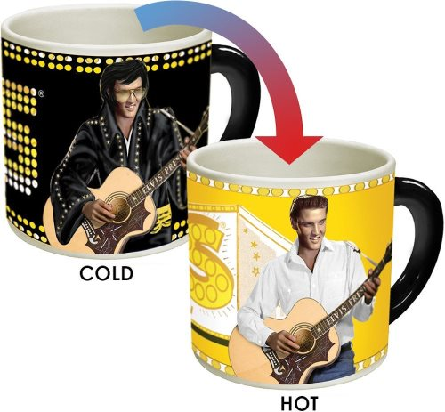
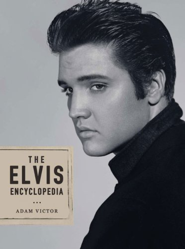

Even though Elvis was better known for his love of Pepsi, he was a coffee fan. In 2008, Elvis researcher Adam Victor came out with The Elvis Encyclopedia. It could very well be the definitive Elvis research book. So, how did Elvis take his coffee? According to the book (p 172 Food):

> At breakfast time he drank orange juice and coffee (served with half & half and as a concession to his diet, Sweet ‘n’ Low).

Speaking of sweeteners, here is another interesting tidbit from the Food section:

> In *Double Trouble*, Elvis’ character claims to take 418 lumps of sugar in his tea!

*Timeless Elvis Presley Heat Changing Coffee Mug – Add Hot Liquid and Watch Elvis go from Vegas to Memphis  
*

The section on Drugs (p121) tells us that by the mid-1970s, Elvis was stacking his coffee with other things.

> According to Dr. Nichopoulus, Elvis’ daily regiment was coffee, vitamins and an appetite suppressant (sometimes amphetamine-based) to start the day; he’d also take a decongestant and blood pressure medicine soon after waking up.

If you are an Elvis fan, *The Elvis Encyclopedia* by Adam Victor is a must-own book for your library.

*The Elvis Encyclopedia*

### Resources

[Frank Zappa: Coffee Achiever](http://ineedcoffee.com/frank-zappa-coffee-achiever/) – Another musician who loved coffee.

[Bill Clinton: Coffee Achiever](http://ineedcoffee.com/bill-clinton-coffee-achiever/) – President Clinton enjoyed coffee as well.