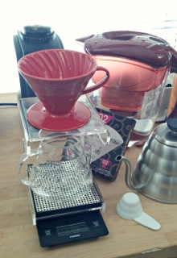
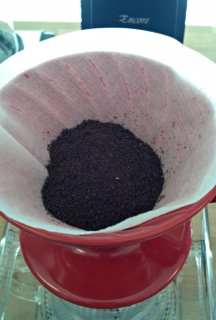
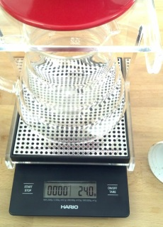
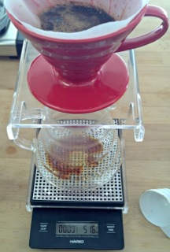
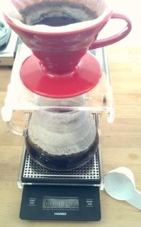

We’ve all heard the rumors that the Hario V60 has a reputation for being a difficult brew method. On a recent visit, Jeff Babcock, the owner of Zoka Coffee in Seattle, told me that a Hario pour-over was his preferred brew method. He is a judge in the *Cup of Excellence*, so I trust him as an authority on taste.

I decided to break out of my daily Chemex coffee routine and try Hario. Compared to a French press, the Hario brews a clear cup of coffee with no sediment. Compared to Chemex, the thinner paper filter of a Hario allows more of the natural coffee oil and flavor to be present in the finished cup. Is it worth the fuss, though?

Equipment list:

-   Hario V60 Ceramic Dripper 02-Medium (comes with plastic coffee measuring scoop)
-   Hario V60 Coffee Paper Filters 02-Medium
-   Hario V60 Glass Server
-   Hario V60 Drip Station
-   Hario V60 Drip Scale
-   Hario Buono Coffee Drip Kettle
-   Baratza Encore burr grinder
-   Mavea Water Filtration Pitcher
-   Equator Coffee Mocha Java Organic Fair Trade Blend

Brewing steps for the Hario V60 Pour Over Station:

1\. Place the stand on the scale. Place the dripper on the stand and the carafe under the stand.

2\. Pre-rinse the paper filter in place in the dripper with boiling water. Don’t skip this step. This also serves to warm up your dripper and carafe. Discard this water from the carafe below.

3\. Grind fresh whole-bean coffee in a fine drip setting. Particle consistency is very important for an even extraction. Use a burr grinder or purchase pre-ground coffee. Do not use a blade grinder.

4\. Re-set the tare weight for the completed setup so that it reads zero. Add two level Hario measuring scoops of coffee into the pre-moistened filter. This equals about 24 grams of coffee. Depending on your coffee and taste preference you may like to experiment with this dosage. Re-set the tare weight again.

5\. Add about 50 grams of water just to evenly moisten the grounds. Depending on the coffee varietal you select, the water temperature needs to be around 97C/206F for proper extraction. A variable temperature gooseneck kettle makes this step easier. The precision offered by the gooseneck is almost mandatory to get the water to the right location.

6\. Pause. Take a deep breath. Inhale the aroma. You can do this!

7\. Start in the center and in small concentric circles. Work your way out but not to the point of watering around the edges. Continue the pour until the scale reads a total of 390 grams of water added.

8\. This takes about two minutes. Don’t rush it. If you do not have a scale, you can slowly add 12-14 ounces of water using a measuring cup with a good pour spout.

The cup that I brewed today was lovely and took care and concentration. I’m sure over time my directional pouring skills will improve and I will feel more comfortable. I once saw a barista at Coava Coffee Roasters in Portland make two pour-overs at once with a Hario Buono kettle in each hand! I was in awe.

Hario pour-overs don’t deserve to be labeled difficult. The right equipment makes it very easy for anyone to prepare. Due to the initial costs, the precise measurements used, and the small yield produced, it may not be everyone’s first choice brew method. However, if the taste is your main concern, then a Hario V60 is a time-tested prep to add to your arsenal of coffee accouterments.

### Resources

[How Make V60 Coffee](/how-to-make-v60-coffee/) – INeedCoffee tutorial.

[Coffee Brewing Guide](/coffee-brewing-guide/) – INeedCoffee’s collection of coffee brewing tutorials.
