Each morning always starts with a hot cup of coffee. Recently, I was reminded of family memories from the 1980s of chicory in coffee. I was curious about the role of chicory in coffee, so after doing some research within our family, I learned we drank a blend of 70% Arabica and 30% roasted chicory.

Today, 40 years later, I decided to recreate the taste of my family’s coffee and chicory blend. This time I wanted to start from scratch using freshly grown chicory from our own backyard.

Roasted Chicory coffee tastes similar to coffee but has a flavor that’s commonly described as slightly nutty or woody, depending on the plant variety, there can be a predominant bitter taste. When roasted Arabica coffee is mixed with Chicory in a cup taste proportion of 70:30 it tastes as close as possible to the smell of roasted coffee.

### What is Chicory?

The Plant Variety I used is “Spadona Chicory”, which is botanically classified as “Cichorium intybus”. The leaves are used raw in salads or cooked as a vegetable. The root can be roasted and used as a coffee substitute in a blend. Both have a bitter taste. It takes around 2-1/2 months for the root to be fully formed and requires adequate water twice a week.

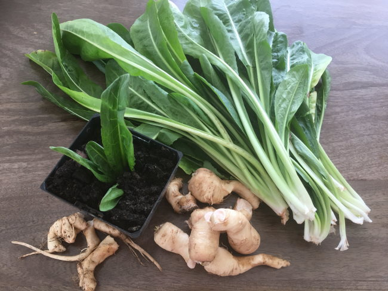

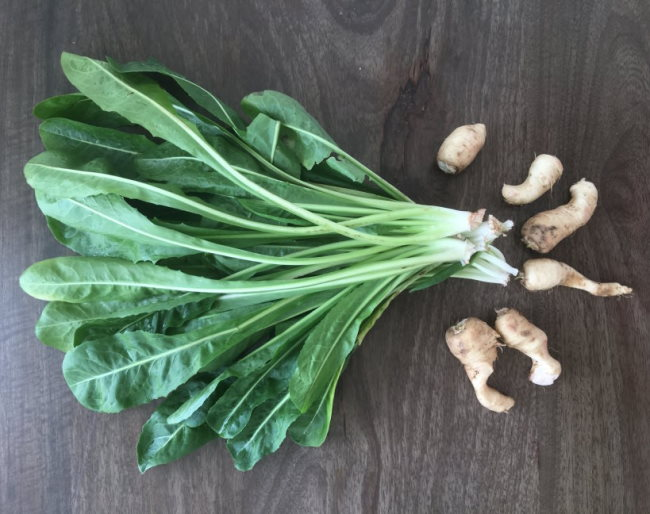

### #1 Remove the Roots and Wash the Plant

After 2-1/2 months, uproot the plant and remove the roots, carefully wash the roots until the surface of the root is smooth. Then dry the roots in the sun for a day to remove the moisture contents.

One plant will give around 100 grams of roasted chicory, sufficient for 7 cups of coffee, each cup will require approximately 10 to 15 grams of roasted chicory powder.

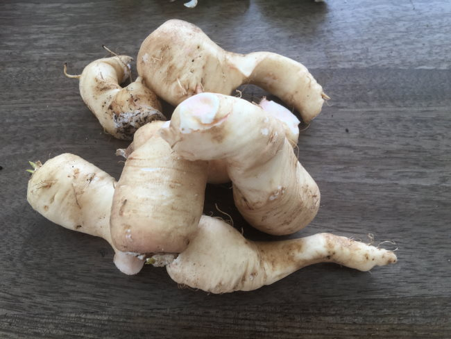

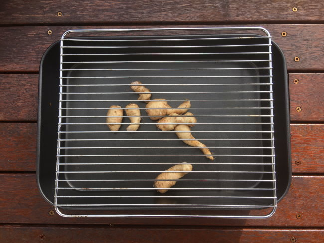

### #2 Slice the Chicory Root and Sun-Dry

The next day cut the dried roots into thick 5mm slices and sun-dry them a full day to get rid of any remaining moisture.

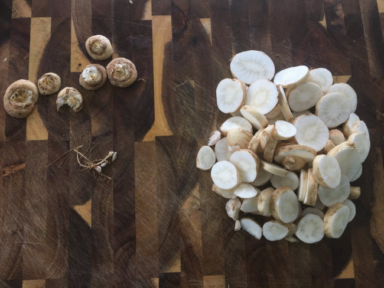

### #3 Roast the Chicory

Place the sliced and dried chicory root on a baking tray with a sheet of baking paper. Roast the dried roots in a preheated oven at 220°F for 30 minutes. Watch the roots closely, as they may burn due to their quality or moisture content.

After 30 minutes, turn down the temperature to 180°F and roast for another 10 to 15 minutes. The root slices will have a dark brown color. There may be a few slices underdone but not a worry. Remove the roasted chicory slices and let them cool down.

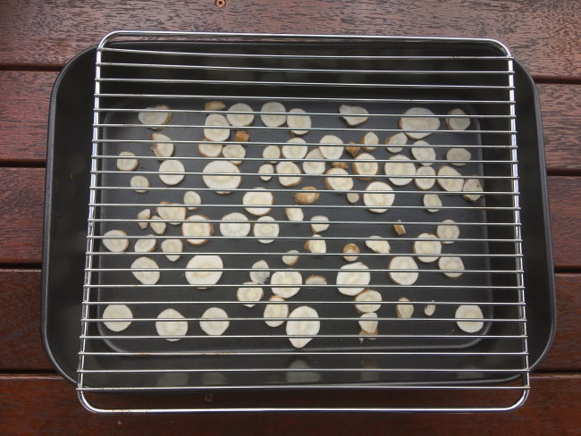

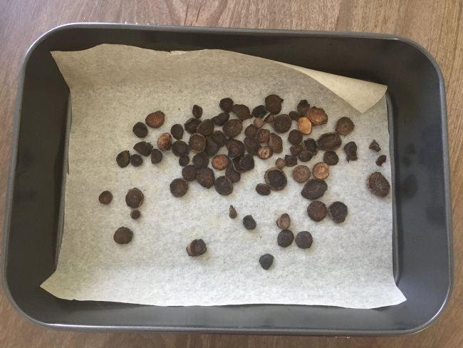

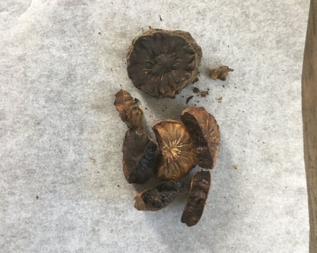

### #4 Grind the Chicory

Use a Coffee grinder or a Mortar & Pestle to grind the roasted chicory root to a fine medium coarse powder.

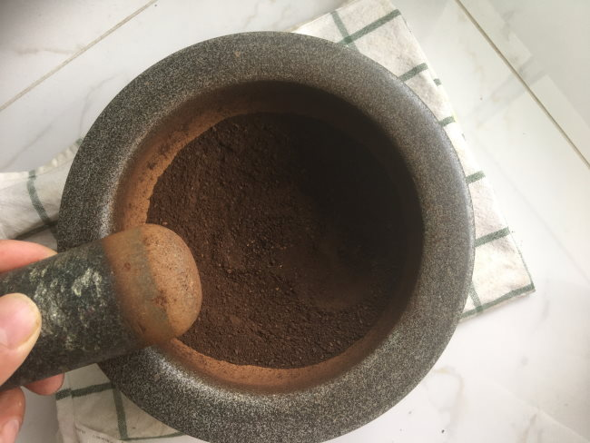

### #5 Grind the Coffee

Grind the medium-roasted Arabica coffee beans to a coarse grind and add a bit more to a fine powder.

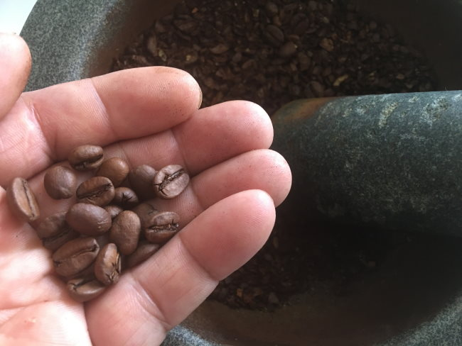

### #6 Blend the Chicory with the Coffee

Use a stainless steel filter coffee drip-over method or a pour-over filter method to brew the coffee. Use 70% coffee and 30% roasted chicory for your blend.

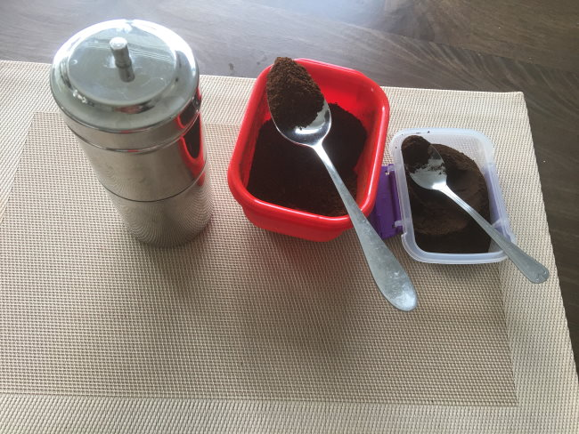

### #7 Serve and Enjoy

Pour the filtered hot Arabica Coffee blended with Chicory into a cup. Add milk and sugar as required. The lovely blend of roasted Arabica coffee with Roasted Chicory is ready for you to enjoy.

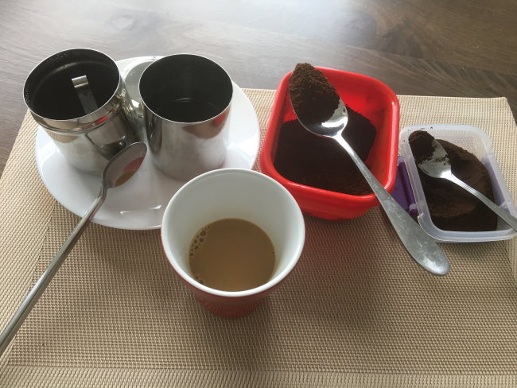

### Article Video

View the video tutorial on YouTube: [How To Roast Chicory Root & Brew Coffee](https://www.youtube.com/watch?v=xw27EkaI4FQ).

This article is dedicated to the Lions Club of Warner-QLD Group members, Australia.

### Resources

[How to Brew Fine Drip Over Coffee With a Stainless Steel Filter](/how-to-brew-fine-drip-coffee-over-with-a-stainless-steel-filter/) – This is the coffee brewer used in this tutorial.

[How to Brew Vietnamese Iced Coffee](/brew-vietnamese-coffee/) – Vietnamese Coffee often uses chicory in the blend.
