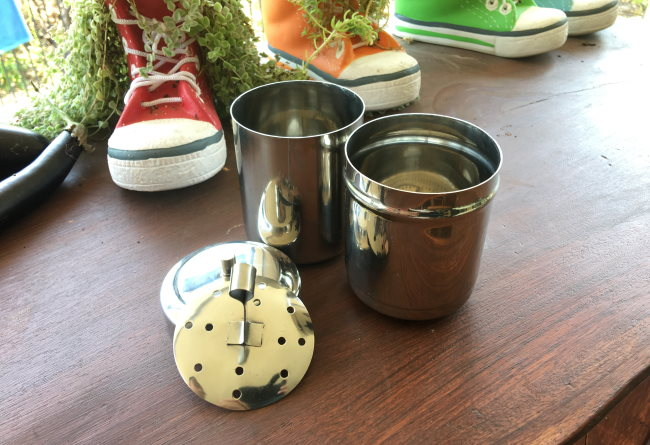
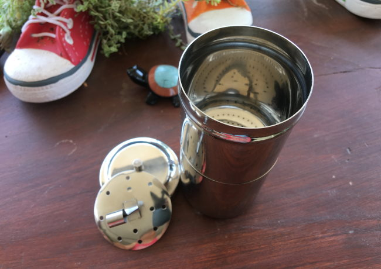
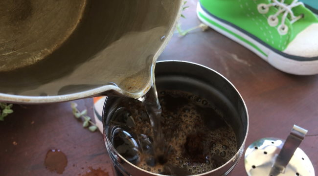
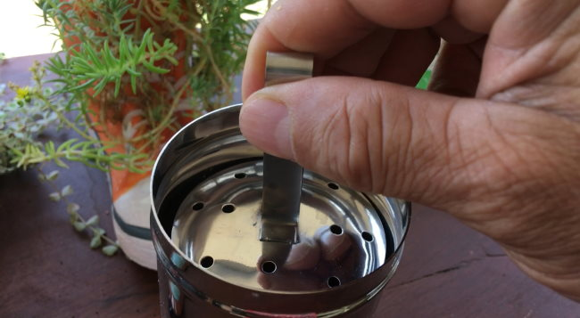
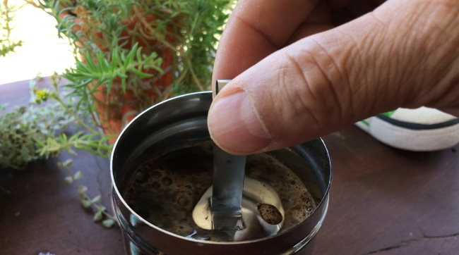
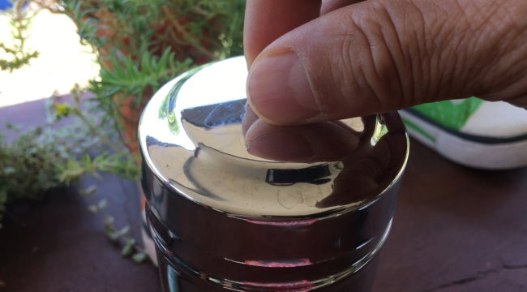
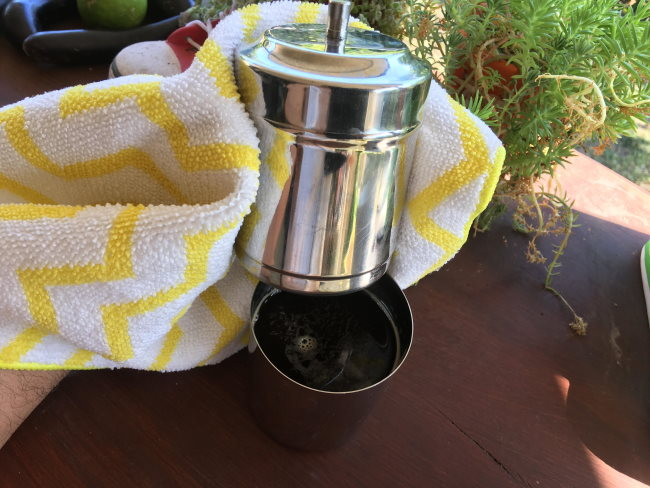
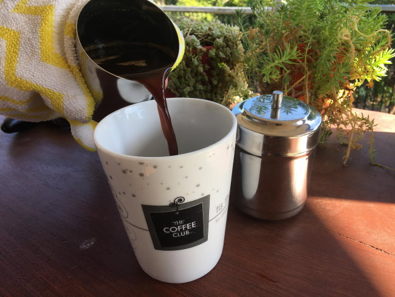

Having been raised in the South of India, it was always a privilege to have a cup of coffee in neighboring houses or in the market coffee shops. Every occasion at a gathering started with a cup of “Filter Coffee”.

The Filter Coffee brewing method has changed over time with various devices, but it has been constant with the stainless-steel “Filter Coffee” device for four decades in my eyes.

The fine drip Filter Coffee is a specialty of South India and is still practiced today. It can be brewed mild or strong depending on the amount of ground coffee used. One tablespoon can make 1 cup of coffee with 100 ml of hot water, however, you can always add an additional tablespoon to make the coffee stronger.

Let’s make some filter coffee.

### #1 Set up the Stainless Steel Coffee Filter device

Prepare the “Filter Coffee“ Stainless Steel device. It will consist of four parts.

-   lower settling tumbler
-   perforated upper brewing tumbler
-   perforated upper plunger
-   a lid

*Filter Coffee setup*

Attach the perforated upper brewing tumbler on top of the lower settling tumbler, by sliding the upper with the lower. The coffee brewer is a push-fit attachment.

*Attach the two chambers.*

### #2 Add Ground Coffee

Add the ground coffee to the top perforated brewing tumbler. Use one tablespoon of medium ground coffee to make 100 ml of coffee. The settling tumbler has a capacity of 250 ml. You can make an additional cup by adding one more tablespoon of coffee grinds with an addition of 100 ml of hot water.

### #3 Add Hot Water

Add 100 ml of hot water from a boil into the upper perforated tumbler. If you are making 2 cups, add twice as much hot water.

*Add hot water to the coffee brewer.*

### #4 Place the Plunger into the Brewer

Place the perforated upper plunger into the coffee brewer. It will sink into the hot water, pushing the coffee grounds down. Then cover the brewer with the lid.

*Place the plunger into the brewer.*

*The plunger will sink into the water until it rests on the coffee grounds.*

*Place the lid on the brewer.*

### #5 Brew For 10-15 Minutes

Close the lid and wait 10-15 minutes.

### #6 Remove Top Chamber From the Lower Steel Tumbler

The upper and lower tumbler can be now detached gently as they are hot, using a kitchen towel or cloth. The lower settling tumbler will be hotter than the upper brewing tumbler after brewing. It is important to take care of it while detaching.

****

*When the coffee settles into the lower steel tumbler, it is known as a coffee decoction.*

### #7 Serve

It is now time to relish a finely brewed Drip over “Filter Coffee”. This coffee may be strong and require the addition of water with milk depending on one’s taste.

*Serve and enjoy!*

### Video Tutorial

[How to Brew a Fine Drip Over Filter Coffee](https://youtu.be/pSuMGAFoZ0c) (YouTube 6 minutes)

### Resources

[How To Make Coffee Using A Thermos Flask](http://ineedcoffee.com/how-to-make-coffee-using-a-thermos-flask/) – Coffee brewing tutorial.

[Indian filter coffee](https://en.wikipedia.org/wiki/Indian_filter_coffee) – Wikipedia page on the milk version of this recipe.