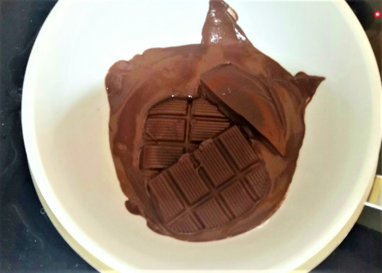
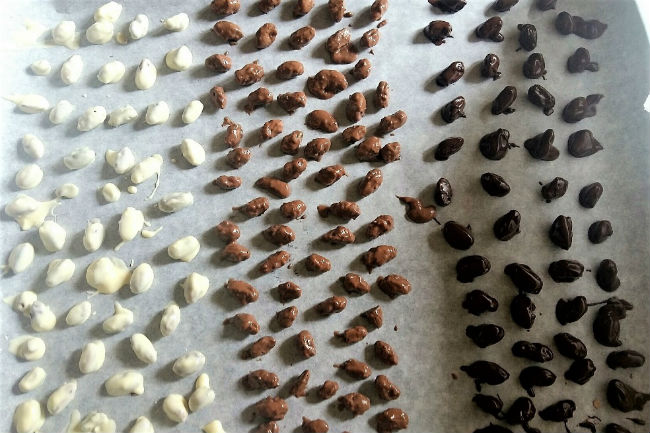

Homemade chocolate-covered coffee beans are a great treat to share with friends at a simple dinner or a special occasion. This recipe will really impress your guests because it uses three different types of chocolate: dark chocolate, milk chocolate, and white chocolate. These mini snacks have a wonderful combination of flavors, sweet on the outside and bitter on the inside.

As a bonus, we are going to add a little spicy chili powder to give a boost to the dark chocolate as well as pair grated coconut for a more exotic taste. The possibilities with chocolate-covered coffee beans are endless, so give free rein to your imagination and invent your unique combinations.

### Chocolate Covered Coffee Beans Recipe

Cooking time: 4 hours (+ 1 night in the fridge before consumption)

#### Ingredients:

-   110 gr (4 oz) dark chocolate
-   110 gr (4 oz) milk chocolate
-   110 gr (4 oz) white chocolate
-   85 gr (3 ½ oz) coffee beans
-   15 gr (3/4 oz) grated coconut
-   1 tsp chili powder

#### Step by Step Preparation:

**#1** Separately melt the three chocolate bars in a bain-marie or double boiler (using a saucepan placed above another pan filled with boiling water).

**#2** Add chili powder to melted dark chocolate.

**#3** Add 2/3 grated coconut to melted milk chocolate.

**#4** Divide your coffee beans into three groups (one for each kind of frosting) and immerse them in hot melted chocolate.

**#5** Delicately remove them with a pair of tongs and place them on a baking sheet.

**#6** Put your coffee beans in the fridge for about 30 minutes (or until the frosting has completely hardened).

**#7** Immerse your coffee beans in melted chocolate again and repeat the whole procedure.

**#8** After another 30 minutes in the fridge, repeat the procedure one more time.

**#9** Sprinkle milk chocolate coffee beans with the remaining grated coconut and place them all back in the fridge.

**#10** Let the chocolate-covered coffee beans rest in the fridge for one night (or at least 6/7 hours) before consumption, to make sure the chocolate frosting has properly hardened.

### Best Coffee for Chocolate Covered Beans

You might wonder what kind of coffee beans are best for making these original sweets. Let’s explore the different possibilities.

#### Coffee Roast Level

When making chocolate-covered coffee beans, aim for a medium to medium-dark roast. Lighter roasts can taste acidic, whereas darker roasts can taste bitter. Aim for the middle.

*Use beans in the 2 to 5 range for best results—chart courtesy of INeedCoffee contributor Len Brault.* 

#### Coffee Varietals

**Coffee Arabica:** Arabica is native to Ethiopia and it produces small and flattened beans. Despite their size, they’re very aromatic and fragrant. This is the most common varietal in specialty coffee and is likely what you will use for this recipe.

**Coffee Robusta:** Robusta is native to Congo and its beans are round-shaped and very rich in caffeine. For this reason, they are also very bitter, so they are not a good choice for this recipe. It is preferable to taste this variety of coffee as a drink when blended with Arabica.

**Coffee Liberica:** Liberica is native to Liberia and it has big and well-shaped beans. It is not a prized variety, but it is well-suited for this preparation.

**Coffee Excelsa:** Excelsa is a recent variety (it was only discovered in 1904) native to Northern Africa. Its beans have a medium size and their aroma is very similar to the Arabica ones so they are the perfect choice for this recipe.

### Conclusion

There are many recipes online for making chocolate-covered coffee or espresso beans that are more basic. This recipe combines the strengths of three different forms of chocolate along with the heat from chili powder and the sweetness of coconut to make something special. Enjoy!

### Resources

[Bain-marie](https://en.wikipedia.org/wiki/Bain-marie) – Wikipedia page on this cooking technique.

[Chocolate Covered Espresso Beans](/chocolate-covered-espresso-beans/) – INeedCoffee recipe.
