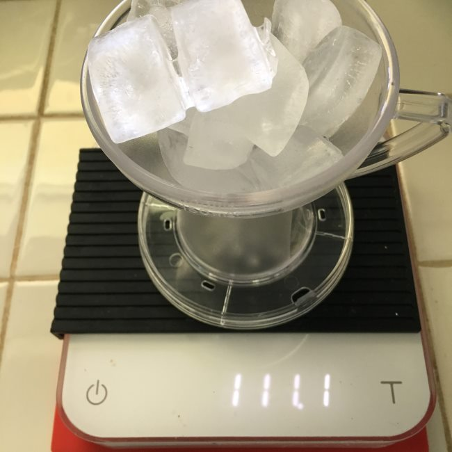

In my previous article, [How to Make Pour-Over Coffee With the Gabi Drip Master](http://ineedcoffee.com/make-pour-coffee-gabi-drip-master/), I showed you an innovative coffee dripper that simplified pour-over coffee in a few ways.

Besides the cool waterspout, which controls the flow of water over the grounds in a slow, controlled manner, the Gabi Drip Master’s top chamber was designed to hold exactly 150 grams of water. This means you don’t need to weigh the water or babysit the pour-over. Just fill the chamber twice.

A few weeks ago, I got the idea that the Gabi has the perfect design for making iced coffee.

### Iced Coffee

Iced coffee is different from the more popular cold brew. Cold Brew takes hours to make, whereas Iced Coffee takes minutes.

From the tutorial [A Clever Way To Make Iced Coffee](http://ineedcoffee.com/clever-way-make-iced-coffee/):

> Iced Coffee, which is also referred to as Japanese Iced Coffee, is made by brewing coffee directly over ice. This instantly chills the coffee, while preserving the flavor. To avoid having a watery coffee, the amount of water used when brewing is split between the hot water and the ice. Many coffee aficionados prefer iced coffee to cold brew as it tends to taste like a chilled refreshing version of that hot coffee. Whatever acidity level or flavor notes the hot version has will remain. And if you get the water ratio right it won’t taste weak.

### The Ratio

A typical ratio for iced coffee is 60% hot water and 40% ice by weight. I placed the Gabi on my digital scale, zeroed it out, and loaded it with ice cubes. The ice cubes were heaping above the top of the brewer. The scale showed 111 grams. If the hot water is 150 grams, that works out to 57% hot water. Perfect!

Let’s brew some iced coffee.

### #1 Fill the Gabi Top Chamber with Ice Cubes

You won’t need a scale. Just pile ice cubes into the top chamber of your Gabi until they look like this photo. If your ice cubes are smaller, they will take up more space in the chamber, so use a little less.

### #2 Move the Ice to a Glass

We only used Gabi’s top chamber to measure the ice. Transfer the ice to a glass since the brewed coffee will land on the ice.

### #3 Add Ground Coffee and Place Over Mug

Place 20 grams of medium-ground coffee into the filter. Place the filter into the Dripper and then set the Dripper over the glass holding the ice.

### #4 Place the Connected Water Bottle / Waterspout Over the Dripper

Place the connected Water Bottle and Waterspout onto the Dripper. Now the brew stack is complete.

### #5 Add Water

Heat water to 200° F. Fill the Water Bottle to the top **just once**.

### #6 Remove Brewer and Enjoy!

That is it—a super-easy way to make iced coffee.

### Conclusion

My hunch that the Gabi Dripper would be the perfect way to make Iced Coffee without doing math was correct. When filled with ice, the top chamber holds about 40% of the water weight for a brew, which is ideal for iced coffee.

The flavor was light and refreshing, exactly what I want from iced coffee. If you desire a stronger iced coffee, look into using a Clever, as you can extend the length of the brew with that dripper.

### Resources

[How to Make Pour-Over Coffee With the Gabi Drip Master](http://ineedcoffee.com/make-pour-coffee-gabi-drip-master/) – Tutorial and review of the Gabi Dripper.

[A Clever Way To Make Iced Coffee](http://ineedcoffee.com/clever-way-make-iced-coffee/) – How to make a full-immersion iced coffee with the Clever.