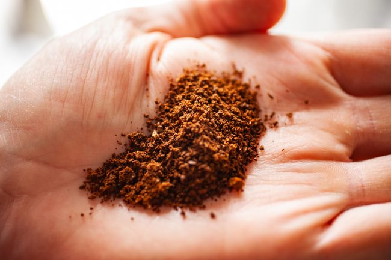
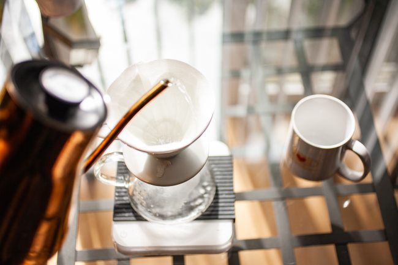
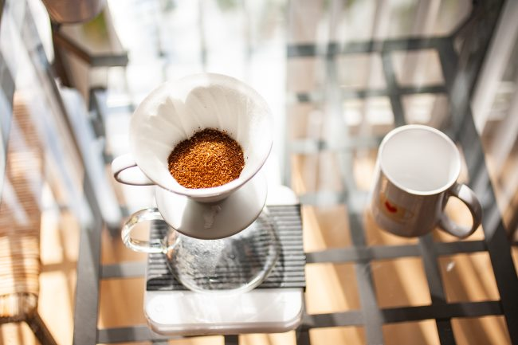
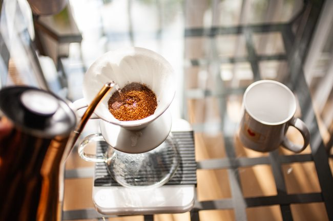
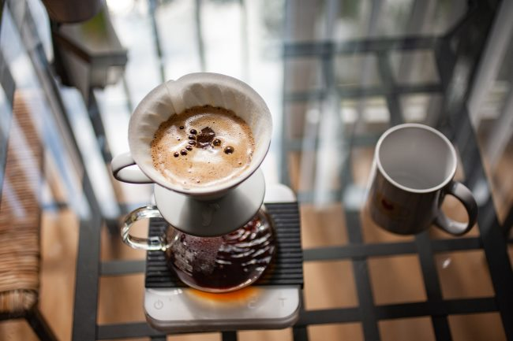
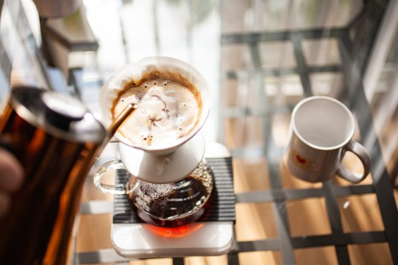
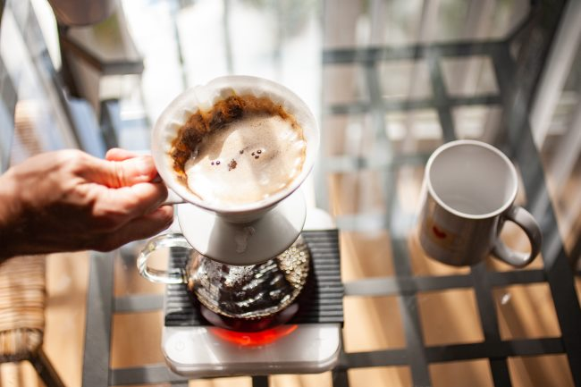
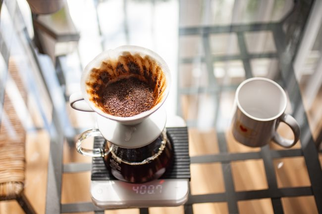

One of the things I love about crafting a great cup of coffee is just how easy it actually can be to make a good one consistently.

But most of the time, this rules out certain brewing methods.

I used to recommend the V60 as a great beginner brewing method. It looks so simple, doesn’t it? It’s a cone, you add coffee, you pour water—what’s so complicated?

Unlike most pour-over brewing methods, the entire brew of the coffee is completely in your hands. You control every key variable – and you probably don’t realize that.

Coffee brewing using pour-over methods is all about getting the water to extract the coffee as it passes the grounds. Most of the time, the main variable you control is the grind size. So if you want to adjust how your coffee tastes, you adjust the size of your grind and that’s it.

With the V60, it is built such that there is no restriction on the flow of water by the vessel. You have control over this flow. It means when you change your grind size it not only changes the surface area the water has available to extract coffee, it also changes how much time that water is in contact with the coffee.

In short, it’s easy to dive in, but difficult to master. Understanding the extraction variables of brewing on a V60 is a deep rabbit hole, filled with timers, spreadsheets, and tons of videos of people doing all sorts of fun things.

I’m here to give you an easy process to brew a great V60, consistently. Let’s give you the tools to dive in. If you want to explore the rabbit hole further, that will be up to you…

### Things You Will Need:

#### A Gooseneck Kettle

For brewing on the V60, you must have a slow-pouring Kettle, typically a gooseneck. The speed and delicacy with which you add water to the coffee are critical. If you have a typical water kettle, you are only going to be sloshing water into the brewer. This imprecision will lead to inconsistent coffee brewing. I am a big fan of Fellow’s Kettle.

#### A Scale

You can’t brew a consistent V60 if you aren’t weighing your coffee and your water.

#### The V60, Filters, Etc

This is probably obvious, but you need a V60, the filters, and something to brew into. There are several different V60s, and the material version you get is a personal preference. The only thing it will impact (aside from how you feel about using it) is the temperature. More solid material V60s like porcelain or copper will require more attentive preheating so that they don’t drop your brew temperature when you start brewing (some would argue these brewers also hold brew temperature better, but I haven’t verified this).

#### The Coffee

If you are going to take the time to brew such a handcrafted brew, you might as well get yourself some great coffee. One of my top recommendations is Conduit Coffee – grab one of their single origins.

Let’s Get Brewing

### #1 Grind Coffee

Using the Coffee Grind Chart, find yourself a [medium-fine grind](http://ineedcoffee.com/coffee-grind-chart/). The V60 will brew well from fine all the way to coarse depending on methods, but to start out, we’ll use a traditional medium-fine grind.

*Coffee grind size for V60 Coffee*

### #2 Rinse Your Filter

It’s important to rinse your filter when brewing on the V60 – both to remove paper taste and also to preheat the brewing vessel (there’s also an argument to be made about how the filter gets to set the brewer as it’s rinsed – but I don’t have any testing to back up the importance of this aspect).

On preheating, different V60 brewing methods will interact with the heat of the brew in different ways. It is possible to have a brewer pull so much heat out of the brew that you dip too low and end up with a poor extraction. In short, just preheat your brewer with near-boiling water.

*Rinse paper filter*

### #3 Add Your Grounds

I like a standard 16:1 (water to coffee) ratio for brewing on the V60. All the steps below will be the same regardless of how much coffee you use. For this example, I used 25 grams of coffee brewing with 400 grams of water.

*Add coffee grounds*

### #4 The Bloom

The first pour will give us our ‘bloom’ – the water contacts the grounds, releasing gases, and puffing up the brew bed, making the appearance of blooming. This is important for getting those gasses out of the way of the brewing process and preparing the grounds for full extraction.

Extracting coffee is all about water pulling the soluble compounds out of the coffee grounds. Saturated grounds will more readily release these compounds. Think about it like pouring water on a flower bed that’s dry vs wet. In the dry flower bed, the water will just run off. In the moist flower bed, the water becomes absorbed. This is a similar interaction.

For the bloom, I add 1.5-2x the grams of water as there are coffee grounds. So, for 25 grams of coffee, I’ll add 40-50 grams of water to bloom (just make sure you cover the grounds and nothing appears dry). Then wait 30-45 seconds (I wait until the ground bed stops moving).

*The Bloom #1*

*The Bloom #2*

*The Bloom #3*

### #5 The First Pour

I tend to split my pouring of the V60 into 2 to 4 sets of pours. I like to take this more casual approach because it requires less mental energy to process, yet I still get a consistently good-tasting brew. I think it’s a good place to start. You’ll find other methods which have very strict pour measurements.

After the bloom is completed, start the first pour. I pour slowly using concentric circles to evenly distribute water over the grounds. If you were to just pour straight into the middle, you’d have an uneven flow of water through the grounds, which would reduce the quality of your brew. Just pour in circles and evenly cover everything with water.

In the first pour, I’ll pour until about 2/3 of the brewer is filled – I like to leave a bit of space towards the top for the next step.

When brewing with 25 grams of coffee, this step usually takes me from 100-150 grams of water, depending on how fast I pour.

*The First Pour #1*

*The First Pour #2*

### #6 The Spin

After the first pour, I pick the V60 just off the carafe and give it a little spin, knocking grounds off the side of the brewer. This also helps make sure that all the grounds and water are evenly saturated. I find doing this early on leads to a sweeter and better-tasting coffee (due to more even extraction throughout the brew).

*The Spin*

### #7 Pours 2-4

After the first spin, I’ll allow the water to ‘draw down’ more through the coffee before I continue pouring. From here I and mostly eyeballing, but I make sure to start pouring a little bit before the water level meets the ground level.

When you do start pouring again, do so gently. You want to disturb the grounds as little as possible.  
In each of these continued pours, I’ll pour right up to the previous pour level, let the water brew down, and then continue until I’ve reached my final weight of 400 grams.

*Additional Pours*

### #8 The Final Spin

I’ll add one more final spin after adding the last bit of water, just to make sure there’s a full, even extraction going through to the end.

*The Final Spin*

*Finishing*

### #9 Finished

Serve and enjoy.

### Resources

[How to Brew V60 – A Coffee Lovers Brewing Guide](https://youtu.be/bZ9eJ4D0vbo) (Video tutorial of this article on YouTube)

For a more detailed article on the V60, check out issue [#59 of Extracted Magazine](https://www.extractedmagazine.com/brewing-on-the-v60-issue-59/). 

*Title photo background by [Ben Kolde](https://unsplash.com/@benkolde).*