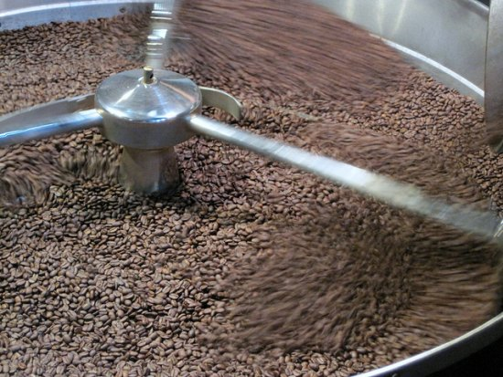

In the spirit of [Stereotyping Coffeehouses](/coffee-house-stereotyping/), I’ve decided that learning how to distinguish good roasters from the bad is just as crucial without trying the wares. Stereotyping a roaster is relatively easy once you know how to size up an operation. Let’s look over some clues indicating that a coffee roaster is turning out a poor product.

  
*Coffee Roaster*

### Flavored Focus

Just like a cafe, any roaster who lists flavored coffee above varietals is sure to suck. Selling flavored coffee is something that many roasters do out of financial necessity. They do it to please the bottom rung customer – like a microbrewery that grudgingly keeps bottles of Bud for customers who refuse to expand their beer palate. The good roasters aren’t proud of their flavored coffees and would never display HAZELNUT or SNICKERDOODLE over one of their creative blends. A bad roaster won’t care. If the roaster places the flavored coffees in a selling location that is too prominent, don’t buy anything from them.

### Crop and Roast Descriptions

A good roaster knows the difference between the characteristics of a good crop and a cheap one and, like a proud father, they want you to know everything about the bean. A great roaster will never describe a bean merely by country of origin. They will go into the region and mark. For example, a poor roaster will sell “Costa Rican”, and a better roaster will sell “Costa Rican Tarrazu La Minita”. Some roasters will stop at the regional level. You don’t have to know which regions are good or not; that is the roaster’s job. If the roaster hides that information from you, it doesn’t speak well of what they are trying to sell.

### No Cafe Correlation

Unfortunately, we can’t use the Coffee House stereotypes against the roaster. Some of the best roasters I can think of operate the worst cafes. These roast masters devote so much effort to the bean that they neglect the cafe.

### Fooling the Customer

A bad roaster will try to make money by exploiting the ignorance of their customers. If some roaster is trying to sell Hawaiian Kona Blend for $17 a pound, they are trying to capitalize on the fact you won’t recognize the last word that says “Blend”. Blend means that there is probably very little Kona in the mix. If a roaster uses the term “Style”, as in “Hawaiian Kona Style” then they are out to pull the wool over your eyes. “Style” means there is no Kona in the blend, and cheaper beans are roasted as if they were Kona. A good roaster will not tack on “Blend” or “Style” to Hawaiian Kona. Their reputation is worth more to them than any possible misunderstanding. Also, beware of roasters that try this trick with Jamaican Blue Mountain.

### 2 Grinders or 1?

If the roaster does sell flavored coffee along with the good stuff, how many bean grinders do they have? Flavored coffee should not be ground in the same grinder as non-flavored coffee. Those flavors will drift into the next bean ground in the machine. I don’t want the taste of AMARETTO coffee inside my Kenyan AA. Even if you plan to grind at home, use this test to stereotype the quality of the entire coffee operation.

### Same Style Of Roasting

Does every coffee bean at the roaster look like a French roast? A skilled roaster will know that every crop has a sweet spot; some beans are best when roasted lighter, and some are best when roasted dark. A Colombian may excel at a Vienna Roast, but roasting Ethiopian Yirgacheffe that dark is a crime. One arrogant roaster with a big name believes that there is a magical dark roast level perfect for all beans. In actuality, there is no “one roast fits all” solution.

### Ability to Share Knowledge

Can the roaster articulate how great their product is? Is the staff able to answer questions about the bean selection? Are the bins marked clearly and with verbose descriptions? Does the roaster provide detailed literature for the customer to take home and read? Ask them to recommend a good coffee and watch how they sell it. A quality roaster will be able to share knowledge about their product. A lesser roaster cannot make a convincing case for any bean.

### In Summary

Stereotyping the quality of a given coffee roaster without trying their beans will save your money and taste buds. By using the rules listed above, you will be able to spot a lousy roaster in minutes. These techniques work well if you are physically inside the coffee roaster’s shop.
