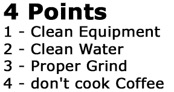

Coffee lovers are snobs, to a point. Once the brewing is complete they can’t refuse a good cup of coffee. They will however argue endlessly as to what technique is best for getting to the cup. There are more brewing methods than we have time, or space, to discuss here. We favor [French Press](/press-pot-tutorial/), but again admit that admirable results are possible with the Drip, Percolator, Turkish, [Vacuum Pot](/vacuum-pot-brewing/ "Vac-Pot articles"), and of course, Espresso methods to name only the most common. What’s the difference? Don’t be offended, but the difference is often how well prepared you are in the first place. Even brewing methods that have been passed from generation to generation will fail if the pot is dirty, the water less than desirable, and the grind uneven.

Start of course with the best, and freshest roasted beans. If you can’t be sure of the quality and freshness of your beans, then everything that follows is pointless. Next grind those beans to proper consistency. Ready to go? Is your equipment scrupulously clean? Soaking a glass flask in soapy water overnight should remove most of that haze, and if not, perhaps you should replace it. Crisp, clean, spring-quality water is also a must. It is surprising how many coffee lovers will buy the most expensive equipment and the rarest beans and yet use foul-tasting tap water to make their coffee every morning.

So you’ve controlled all the variables, and that first cup of coffee is fabulous… well don’t just sit there with that goofy look on your face, get that coffee off the burner and into a thermos or insulated carafe. Just a few minutes sitting there can ruin your efforts.

  
*4 Points to great coffee.*

Sticking to these four points will make your coffee better: clean equipment, clean water, proper grind, and don’t cook your coffee. Ah, but it’s worth it, isn’t it?
