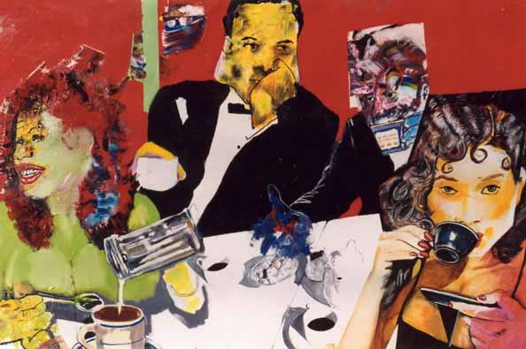

I have been trying to wean myself off of coffee lately. I thought it might be a good time to replace my morning cup ‘o’ joe with a nice healthy cup of tea now that the weather has cooled. The only problem is that I LOVE COFFEE! I love the aroma of fresh brewed coffee, the taste but especially the smell of fresh whole beans. I LOVE COFFEE.

I was an early coffee drinker. My family saw nothing wrong with giving a child a cup of java in the morning, rich with chicory, lightened with Pet evaporated milk and thick syrup made from spoonfuls of sugar that settled in the bottom of the cup. C’est bon!

  
*by Mike J. Singletary*

I am sitting here now, sipping a cup of green tea trying to devise a plan to make a detour to Starbucks for some liquid crack. I woke up this morning with what felt like a hangover, only I hadn’t been drinking any alcohol, just water and tea. I think it might have to do with the fact that I haven’t sipped on coffee in any form in over two days. That is typically when the withdrawal symptoms begin – the headaches, the grogginess, and the crankiness. So, like any other addiction one must ride it out or satisfy it.

There is no coffee in my apartment – no cans of Maxwell House, no hardened orange packets of instant decaf in my condiments drawer, and no fragrant whole beans ready to be ground and brewed. Maybe going cold turkey isn’t the right way to do this…maybe another cup will help me finally break free of the hold of the sweet, pungent aroma of my old friend. I am truly a coffee connoisseur preferring a steamy cup of fresh ground Kenya coffee. But, when times are hard, a sip or two of any liquid courage will get me through. I’ve had some pretty bad coffee in my day, namely the office coffee that tasted like brown water, burnt urine or a horrible combination of the two. But a good, fresh brewed cup of coffee is like joie de vivre!

Despite my best attempts to replace my old friend with a less stimulating, less exciting alternative, once again coffee has won out over the competition. I can’t wait for that first sip to hit my lips. Ummmmm, good to the last drop!
