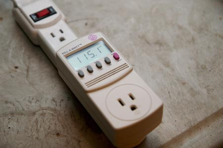
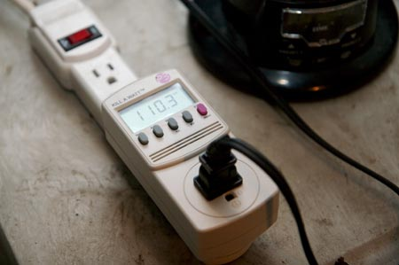
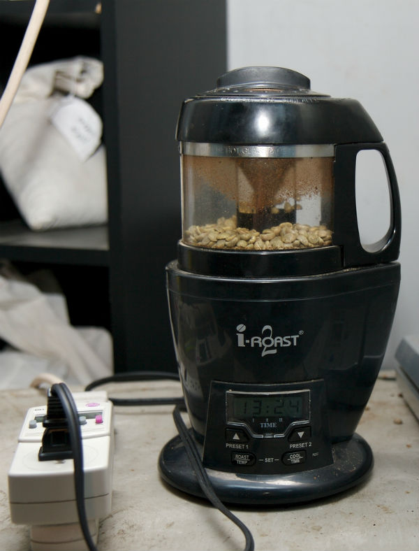
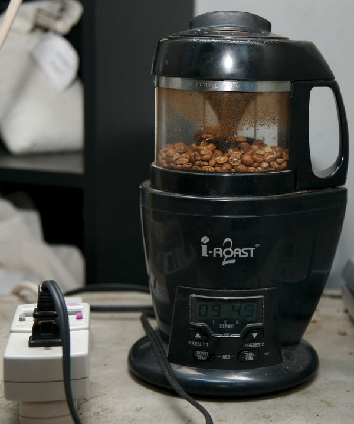
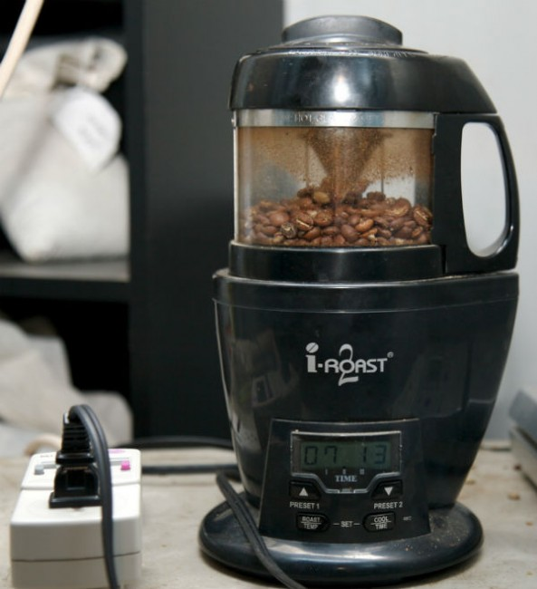

So you bought an iRoast2, and your roasts are coming out too dark or too light, or you feel the flavor could be better. Maybe you are generally happy, but think you could get more from the iRoast 2. Or maybe you just want to see how others use theirs. Hopefully, we can give you some tips to help you get more from the ever-popular Hearthware i-Roast2. Please note that although this article is written specifically for the i-Roast 2, many of the principles apply equally well to the original iRoast 1 models.

First, we should say that these Hearthware units are actually quite cheap in the grand scheme of things, and as such, have fairly wide variances between units. Basically, this means that if your buddy buys an iRoast2, and you buy an iRoast2, a given profile on your machine will likely not produce the same roast as a given profile on his machine.

Not only that, but the voltage coming out of the wall at your house can have a moderate effect on how your roast turns out. And since the voltage in most homes fluctuates on an almost minute-by-minute basis, your roast success can depend in some part on keeping that in check and trying to compensate if possible. More on that later.

### A Word About Profiles

A profile is simply a list of instructions (called stages) programmed into the iRoast2 unit. It tells the unit what temperature you want it to run at, and for what length of time. The original iRoast allows for 5 profiles with 3 stages each, whereas the iRoast2 allows for 10 profiles with 5 stages each. Another small note: The iRoast 1 will lose any programming you enter when unplugged. This was fixed in the iRoast 2, which alone is reason enough to upgrade to the i-Roast2.

Here is an example of a typical 5 stage profile just to give you an idea of what a profile might look like. This profile also includes good notes from previous roast experiments. (HINT: Take good notes!) You do not need to use all of the stages available, although you might as well if they are there, as it will make for a smoother profile.

### Sample Profile 1

Brazil Poco Fundo 115 VAC 5.3 Ounces (150 Grams)

Stopped at Stage 5 with just 30 seconds left About 15 seconds into 2nd crack  
Stage 1 370F 5 Minutes 15 min left  
Stage 2 390F 4 Minutes 10 min left  
Stage 3 405F 3 Minutes 6 min left  
Stage 4 420F 2 Minutes 3 min left  
Stage 5 440F 1 Minute 1 min left  
COOLING NA 4 Minutes 0 min left

Note that the temperatures listed above do not indicate the actual temperature of the bean. Don’t worry. We will give you some sample profiles to get you started.

### A Word About Voltage

WARNING – YOU CAN DIE IF YOU DO NOT KNOW WHAT YOU ARE DOING. IF IN DOUBT, CALL A LICENSED ELECTRICIAN.

You can use a simple AC Volt Meter to check the AC Voltage. Please see manufacturer instructions for safe use. Better yet, you can also use a device that tells you a little more info, and just plugs right in.

One such device is branded as Kill-a-Watt. Although originally designed to show you how much energy and money you are using on a given electrical device, the Kill a Watt works great for this application. The main advantage is that it just plugs into the wall outlet and your roaster plugs into the Killawatt. Now you can monitor the voltage in real-time, and see the actual voltage as your roaster is operating.

  
*Voltage before Roasting*

  
*Voltage while Roasting*

Now you know the voltage, what can you do about it? Well for one thing you can know that a given profile at a given voltage works for a given bean. Next time you go to roast that same bean with that same profile, but with a different voltage, it will likely result in a less than perfect roast. A higher voltage usually means a faster/darker roast, and a lower voltage a slower/lighter roast. There are two solutions to this problem.

The first solution involves the use of something called a Variac. We will not go into detail in this article, but a Variac can make the voltage output run at a steady output, regardless of the input voltage (within a range, of course). Please stay tuned for an upcoming article on Variacs and coffee roasters.

The second solution involves simply having three or more profiles to account for voltage fluctuations. Since my voltage fluctuates between 110 and 120 volts, I picked 115 as my baseline and developed a profile for that voltage. I then made one that was slower and ended with a lower final temperature for the days when the voltage was high and one that was faster and ended with a higher final temperature for the days when the voltage was low. Of course, this eats two additional slots in my 10 profile capacity iRoast2, but I found it was worth it. You may also find that different outlets have different voltages. Sometimes, it is just a matter of finding an outlet that gives you the voltage you are seeking.

  
*Start of Roast*

  
*Roast underway*

  
*1st Crack*

  
*2nd Crack – Roast ready to end. Can you see what went wrong here?*

Notice in the last picture how there is 5:30 left and yet I am already in the second crack? That means we have a roast that is less than 10 minutes. Ideally, you want about 12-15 minutes of total roast time. Why did I have a problem? Because I had not used this particular bean with this particular profile. So I have some work to do! See, it is OK to fail. You are going to have a lot more failures than successes, at least in the beginning.

### Top Ten Tips To Successful Roasting With the IROAST

1.  Monitor the roast from start to finish as fires can break out.
2.  Be ready to hit the cool button if the roast is getting too dark or is producing too much smoke.
3.  After every roast, empty the chaff collector very well and make sure the screen is completely free of debris (use a soft brush if necessary).
4.  A dark roast is not usually a flavorful roast, as many of the nuances are killed if taken too far into the second crack.
5.  Trying to stretch the first crack and the second crack can result in a sweeter roast, which may be ideal for espresso.
6.  Trying a shorter/faster roast will result in a brighter roast, which may be ideal for drip or even French Press (Press Pot).
7.  Both second and first crack can be hard to hear with the “I-Roar”. You may need to get close and move your head in order to hear the cracks.
8.  Always use the same amount of green coffee (5.3 ounces or 150 grams is suggested). Get a digital scale if necessary.
9.  Stick with one green coffee varietal until you get it right. Buy 5 pounds or more to ensure you do not run out before dialing in a given bean.
10.  Keep voltage monitored and in check, adjusting your roast profiles or using a Variac to compensate.

Remember to experiment, and keep good notes on all aspects of the process. And don’t forget to have fun!

### Some Profiles To Get You Started

SAMPLE PROFILE 1A (For Low Voltage Days ~110 VAC)  
Stage 1 380F 5 Minutes 15 min left  
Stage 2 400F 4 Minutes 10 min left  
Stage 3 420F 3 Minutes 6 min left  
Stage 4 440F 2 Minutes 3 min left  
Stage 5 460F 1 Minute 1 min left  
COOLING NA 4 Minutes 0 min left

SAMPLE PROFILE 1B (For Regular Voltage Days ~115 VAC)  
Stage 1 370F 5 Minutes 15 min left  
Stage 2 385F 4 Minutes 10 min left  
Stage 3 400F 3 Minutes 6 min left  
Stage 4 415F 2 Minutes 3 min left  
Stage 5 430F 1 Minute 1 min left  
COOLING NA 4 Minutes 0 min left

SAMPLE PROFILE 1C (For High Voltage Days ~120 VAC)  
Stage 1 360F 5 Minutes 15 min left  
Stage 2 370F 4 Minutes 10 min left  
Stage 3 380F 3 Minutes 6 min left  
Stage 4 390F 2 Minutes 3 min left  
Stage 5 400F 1 Minute 1 min left  
COOLING NA 4 Minutes 0 min left

### Resources

*iRoast 2 (no longer available)*