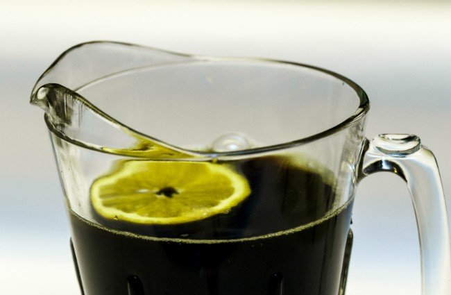

Coffee in the Summer? You might be thinking that your coffee drinking is over for a few months, right? Hopefully, I can give you some ideas to still incorporate gourmet coffee into your hot and humid summer routine.

You have probably had Iced Coffee before, but did you ever felt like it didn’t really quench your thirst? We have a little twist on the whole iced coffee vs. iced tea debate. Can’t make up your mind? No problem, we will combine them, and hopefully mix your summer up a bit.

  
*Iced Coffee Tea*

### Backwoods Twisted Palm Tree

-   1/2 Portion Brewed Coffee
-   1/2 Portion Brewed Tea
-   Lemon Juice, Lime Juice, Orange Juice (optional)
-   Refined or Raw Sugar or sweeteners like Nutrasweet, Splenda, or Stevia (optional)

### Step By Step

1.  Brew a pot of your favorite coffee. I like the bold East African coffees such as Ethiopian Harrar, Ethiopian Yirgacheffe, Kenya, Malawi, etc.
2.  Brew your favorite tea (yes, you can use your coffee maker for this if you use teabags). We also like to throw in a bag of fruit tea (5 bags of Lipton Tea to 1 bag of Stash Mango Tea, for instance).
3.  Combine them at a 50-50 ratio in a plastic or metal pitcher and refrigerate for at least 2 hours. If using a glass pitcher, be VERY cautious as temperature extremes can cause the glass to break or shatter, causing injury and almost assuredly a slow and painful death.
4.  Serve over ice. Adding Lemon, Lime, or Orange Juice and Sweetener is optional.

Remember, the recipe above is a guideline. Don’t be afraid to experiment with other ingredients like mint, vanilla bean, pureed strawberries, or orange juice. Get Creative, and don’t forget to Share and Enjoy!
