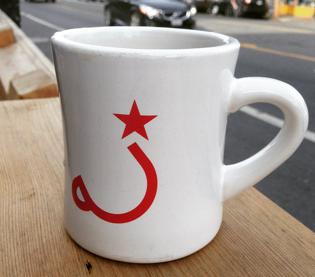
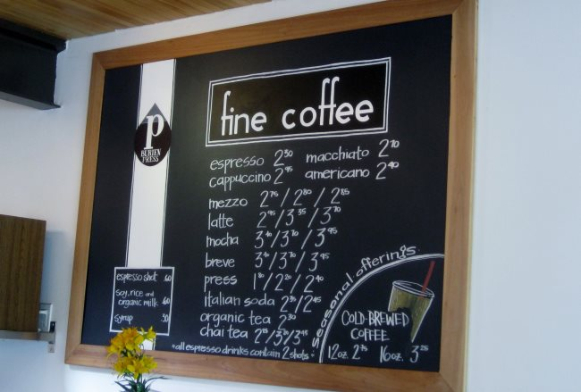

Before I go into what I see as the problems with specialty coffee, I will provide some background on myself. In addition to being the publisher of INeedCoffee, I am a huge fan of going to coffee shops. In the last ten years, I have been to several hundred different cafes, mainly in Seattle but also in the San Francisco Bay Area, Portland, Vancouver, and Victoria.

I’ve seen the rise of third-wave coffee and loved the journey. In Seattle, I organize a Meetup group that does nothing but explore the coffee scene. We’ve had over 1,000 Meetups in the last 11 years, visiting over 350 coffee venues.

In other words, I am a huge fan. Although I do not work directly in the coffee industry, I consider my role as an ambassador both here on INeedCoffee and with the Coffee Club of Seattle. I want to help coffee fans discover more about coffee.

As much as the coffee industry has improved in the last decade, I feel there is room for improvement. Here are a few ideas.

### #1 What’s in the Hopper?

As an espresso drinker, I think the greatest thing to happen to coffee shops in the last decade has been the rise of “the choice”. Many coffee shops now carry more than one espresso option or do a rotating single-origin espresso. Maybe even both. The offerings could change daily or weekly. The cafe might even be a multi-roaster, where not only does the region of coffee change but so does the roaster.

This has changed the way I experience coffee. I’ve become a novelty seeker. I almost never go to places that don’t offer a choice or never change their espresso offerings, and this is a great thing.

**The problem is the signage that was prominent just a few years ago is mostly gone or hidden.** I would say half the coffee shops in Seattle that offer more than one espresso have no information on their website, social media, or even at the counter. You have to ask. You have to know to ask. The second espresso has become a big secret. Not in every cafe, but far too many. Coffee shops are doing a much better job detailing their pour-over offerings.

The few times I’ve mentioned this, the pushback I’ve received is that the customer doesn’t care. To which I have three responses:

1.  I’m a customer, and I care.
2.  Why are you offering an espresso choice if the customers don’t care?
3.  How should customers care about something they don’t know is available?

One cafe in Seattle removed its single-origin espresso offering because no one was ordering it. I pointed out that they never listed their single-origin espresso on their sign or menu, so how was the customer expected to know it was available? They listened to me, and the second espresso offering is now on the menu and being ordered by customers.

Recently, I bumped into two friends from the coffee industry at a cafe near where I live. I asked which espresso they tried. They didn’t know there was an option, so they received a mediocre blend instead of a featured single-origin espresso. When it came time to order, they didn’t dig through the pages of menu items to read that they had a choice. It was their first visit. How were they to know? They seemed disappointed in the cafe. I doubt they will be back, which is a shame. There was no problem with the coffee. The problem was communication.

I advise cafe owners to walk into their shop as if they know nothing about the coffee being served and see if they can figure out what is in the hopper before the barista asks for their drink order.

*I took this photo in 2012 at Victrola Coffee in Seattle. Signs like these have become a rarity.* 

### #2 No Bus Tray

This is a minor issue and easy to remedy. Some coffee shops have begun removing bus trays. They want to be more restaurant-like and offer bus tables for customers. This has good intentions, but unfortunately, it doesn’t work well at the times it most needs to.

What happens when a coffee shop experiences a rush? All resources go to making drinks, not busing tables. Customers who are leaving their seats see new customers ready to take their spots. They would like the opportunity to be respectful and clean their area before they leave, but there is no bus tray, and due to the rush, there is no one there to clean the table. So the dirty dishes remain on the table. It makes the person leaving feel like a jerk, and the person sitting down feels like the cafe is a mess. Cafe employees never see this side because that is when they are focused on making drinks.

Also, other coffee shops have trained us to place our dishes in a bus tray. We aren’t inconvenienced. We love our coffee shop and want the opportunity to help out, especially when the shop is busy.

### #3 Poor Web and Social Media Skills

I could probably write a small book on this topic, so I will keep it brief. Customers primarily want to know three things:

1.  Where are you?
2.  Are you open?
3.  What can I buy?

Post your address and hours on your website and social media profiles. Maintain your Google and Yelp listings. Share your holiday schedules and any early closings. And finally, tell us about the coffee. Why should I go to your coffee shop and not another one? Everything else is a bonus.

I’ve been told what I listed above is too much work. That is nonsense. Payroll, taxes, permits, and dealing with vendors are work. Sharing an Instagram photo a few times a week with menu information and the store hours on Twitter and Facebook takes seconds. Brewpubs are doing a much better job of showcasing their offerings and communicating with their customers online.

### #4 Mugs Without Handles

Specialty coffee shops are now paying attention to every aspect of the coffee experience. Recently, there has been a lot of focus on improving the beverage glassware. One of the hip trends is to serve coffee in mugs without handles. That works fine for milk-based espresso drinks like lattes because they aren’t too hot. However, serving piping hot brewed coffee into a mug without a handle is a dumb idea.

Have you ever tried to carry a no-handle mug of hot coffee from the counter to your seat without burning your hand? You grab a fistful of napkins or whatever else you can find to cover that beautiful mug so you don’t injure yourself. And if your customer is focused more on avoiding injury than the craft coffee beverage he just purchased, then that lovely mug failed your mission as a coffee shop to sell a better coffee experience.

The end result is that customers will ask for to-go paper cups with sleeves, which increases the cost to the cafe and the environment. Not every mug without handles will have a heat issue, so be sure to test before purchasing a case.

*When Ritual Coffee in San Francisco updated their flagship cafe, they, fortunately, kept the handles on their mugs.*

### #5 Dressing Like Bums

This doesn’t bother me, but I do find it puzzling. The trend in modern coffee shops is to have sleek, beautiful designs. Gone are the days of dark wood, wobbly tables, and old couches. Cozy has been replaced with clean. I’ve been told new cafe buildouts can cost $50,000 to $100,000, possibly more.

I’ve seen many cases where the cafe is stunning, the equipment is new, the website and social media images are professional, and the employees dress like they are homeless. If your employees represent the quality image that your cafe is trying to project, why is there no basic dress code? Matching aprons or solid-color shirts are small steps that work.

I’ve talked to baristas who stepped up their cafe dress code. Tips went up, morale went up, and customer satisfaction improved, all of which led to an increase in business. Of course, this point is specific to the more modern cafes and not the old-school dark-roasted grunge coffee places born in the 1990s.

*In 2016,, La Marzocco built an amazing cafe in Seattle. The baristas’ professional dress complimented instead of distracting from the cafe’s beauty.*

### #6 What is the Price?

The trend in specialty coffee has been to remove the big menus with clearly marked prices and instead place the prices on menus near the register or not list the prices at all. I understand the motivation. Big menus with prices are a fast food staple, and quality coffee shops do not see themselves as fast food—and rightfully so. They see themselves more like nice restaurants.

The thing is nice restaurants post menus with prices on their website and on their window near the door. They also have menus to preview before you even decide to take a seat. Many coffee shops glossed over that part and the customer often won’t discover the price until they’ve worked their way up to the front of the line.

**In an industry that champions price transparency at the farm level, they’ve moved toward price obfuscation at the cafe level.** Another trend is how prices have been removed from many pastry cases. The only way to discover the price is to pay whatever they charge you or hold up the line asking. Some of my fellow coffee explorers have told me they get a condescending response at times when they inquire about a price. My policy is I won’t hold up a line asking about prices. I won’t buy unmarked items.

The solution here is to be more like fast food or more like a fine restaurant. Pick one. Hiding your prices until the last second is not a way to build trust with that huge market of coffee drinkers looking to explore higher-end coffee shops.

*I took this photo in 2011 at The Burien Press. Prices were marked and visible as you walked into the coffee shop. Signs like this in newer coffee shops are becoming rarer. Look for the clipboard on the counter. Please put on your glasses and read the 12-point font and do it quickly because a line is forming behind you.* 

### Last Words

This post has gotten long enough, so I’ll end it here. Again, I want to repeat that I am a huge fan of specialty coffee shops. I’ve seen tremendous improvement in the last decade, yet in the last few years, I’ve seen that progress stall and even regress. Maybe one or two ideas from this article will be of value to even one coffee shop.
