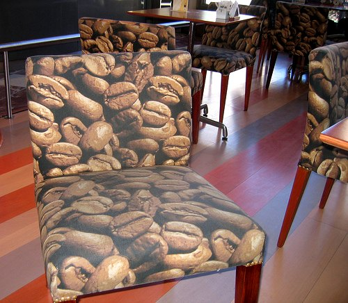

Is infrared roasting superior to conventional roasting?

A few coffee companies are saying yes, and now many are enjoying coffee without stomach sensitivity due to their low acid coffee.

As most coffee connoisseurs know, the most important part of the coffee process is roasting. During the coffee-roasting process, natural coffee acids form which can lead to heartburn, indigestion, and upset stomach. Reducing these irritants can allow coffee drinkers with sensitive stomachs to enjoy coffee.

Standard Commercial roasting puts the beans on a flat-screen conveyor which roasts the beans by blowing flame heated hot air from below. Another method is to place the beans in a tumbler and then blow the flame heated, hot air through as they tumble. Both methods, however, have a tendency to allow the flame to burn the beans and not cook them evenly and all the way through. Also, acidic compounds are still present in the beans, and at a much higher content.

  
*Coffee Bean Chair – Buenos Aires, Argentina*

However, a few companies are now using infrared roasting to bring out the desired flavor and aroma. In the process, they discovered that the best coffee is custom-roasted in small batches to guarantee smooth, controlled flavor. Commercial coffees are usually hot air-roasted with unevenly cooked “acidic” beans. Only an exclusive 2% of coffee beans are specialty roasted using Infrared technology. This type of roasting leads to lower acidity levels and an evenly roasted bean, and it completely eliminates a burnt or bitter coffee taste.

By specialty roasting, the beans increase in temperature quicker than those roasted by hot air. Studies have shown that compared to conventional roasting, infrared roasting showed less increase in radicals on the bean during and after the roasting process. Highly noticeable was the consistent formation of brown-colored compounds, which showed that the bean was uniformly heated and never burned. The infrared roasted beans had a quick increase in the internal temperature and thus suffered less damage on the surface. The study also revealed a uniform and quick decrease in moisture and showed the beans undergo uniform heating even at the core. Hence, a perfectly roasted, never burned, and very delicious coffee bean that is always available to the consumer with no variation in the taste from bag to bag.

Even more note worth was the changes in the contents of citric acid, malic acid, and formic acid that are naturally found in the bean. When monitored and compared to conventional roasting, infrared roasted coffee beans showed changes from an earlier stage. As the roasting proceeded, the infrared roasted coffee beans contained these acids in a smaller amount!

Not surprisingly, the content of aroma compounds was found to be 25% more than that of conventional roasting, and when tested was found to carry the same standard to the cup. The taste from the extract of hot air roasted coffee beans was similar to most conventional roastings, while the extract of the infrared roasted coffee beans was different from theirs (i.e., weaker acidity) leading to a better coffee without a bitter taste.

The conclusion of the study was this… “From the viewpoint of taste, the extract of the infrared roasted coffee beans is distinguishable from the existing \[convention roasting\], since it is rich in aroma components and shows a ‘light’ acidity.”

### Sources

[asic-cafe.org](https://www.asic-cafe.org/), 2008

Angelascoffeeshop.com, 2008